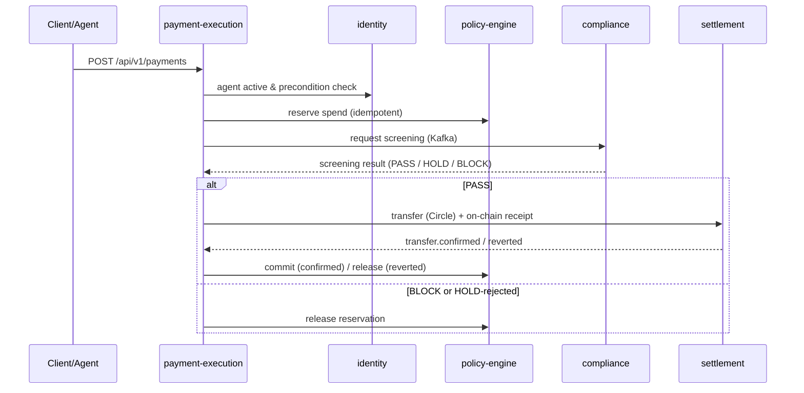

<div align="center">

# ArcPay

**Policy-controlled USDC payments for autonomous AI agents, on Circle's Arc L1.**


[Why](#-why-does-this-exist) · [Architecture](#️-architecture) · [Services](#-the-services) · [Payment flow](#-the-payment-flow) · [On-chain](#-on-chain) · [Run locally](#-run-the-stack-locally) · [Config](#️-configuration) · [Design decisions](#-design-decisions)

</div>

---

## 🤔 Why does this exist?

An AI agent that can spend money needs two things that pull in opposite directions:
**autonomy** (act without a human in the loop) and **control** (never exceed the
limits its owner set). ArcPay is the backend that reconciles them — an agent gets a
custodial USDC wallet on Arc, and every payment it initiates is checked against the
owner's policy, screened for compliance, settled on-chain, and recorded as a
tamper-evident identity projection.

It's built as **five independently-deployable Spring Boot services** that coordinate
over Kafka (transactional outbox) and Temporal sagas — not a monolith.

## 🏛️ Architecture

Hexagonal (ports & adapters) per service — `application → domain ← infrastructure`,
with the domain holding zero infrastructure dependencies. Services own their data
(a Postgres database each) and communicate **only** via Kafka events and
internal REST.

```
                              ┌──────────────────────────┐
   client / agent  ───────▶   │   payment-execution      │  :8083
                              │   (Temporal saga)         │
                              └───┬─────────┬─────────┬───┘
              reserve/commit ─────┘         │         └───── transfer
                    ▼                       ▼                  ▼
            ┌───────────────┐      ┌────────────────┐   ┌──────────────┐
            │ policy-engine │:8081 │  compliance    │   │  settlement  │:8084
            │ (reservations)│      │  (screening)   │   │ (Circle + on │
            └───────────────┘      └────────────────┘   │  -chain rcpt)│
                    ▲                       ▲            └──────────────┘
                    └───────── agent identity ──────────────────┘
                              ┌──────────────────────────┐
                              │   identity               │  :8080
                              │   (AgentRegistry on Arc)  │
                              └──────────────────────────┘

   Postgres (db-per-service) · Kafka (outbox events) · Temporal (sagas)
```

## 🧱 The services

| Service | Port | Implemented surface |
|---------|------|---------------------|
| **identity** | 8080 | Owner & agent registration; agent lifecycle (`deactivate`/`reactivate`/`update`/`update policy`); API-key-hash lookup. `AgentProvisioning` saga (DB → Circle wallet → on-chain register) and `AgentOnChainSync` workflow. Writes the on-chain **AgentRegistry**. |
| **policy-engine** | 8081 | Policy CRUD + `/evaluate`; atomic spending **reservations** (`reserve` → `commit`/`release`/`ops-release`); per-agent spending summary. |
| **compliance** | 8082 | Kafka screening consumer with a **dead-letter topic**; watchlist management; **hold review** (`approve`/`reject`); `SanctionsIngestion` scheduled Temporal workflow; on-chain interaction screening (web3j `eth_getLogs`, bounded window). |
| **payment-execution** | 8083 | Payment create/get; the **`PaymentExecution` Temporal saga** orchestrating precondition → policy reserve → compliance screen → settlement transfer → commit/release; idempotent on duplicate requests. |
| **settlement** | 8084 | Signature-verified **Circle webhook**; internal transfer/receipt APIs; wallet balance; web3j on-chain **`PaymentReceipts`** writer. |

## 🔁 The payment flow

What actually happens when an agent requests a payment (mirrors the
`PaymentExecution` saga and its E2E tests):



Events flow through a **transactional outbox** (namastack) → Kafka, each carrying an
`X-Event-Id` header for consumer-side idempotency. Long-running coordination
(provisioning, payment) runs as **Temporal** workflows.

## 🔗 On-chain

PostgreSQL is the source of truth; the chain is a **verifiable projection**.

- **`AgentRegistry.sol`** (`identity/identity/contracts/`) — registrar-gated registry
  binding each agent to its wallet + identity/policy hashes; emits events on every
  state change; `getAgentByWallet` / `isWalletActive` let anyone resolve an on-chain
  wallet back to a registered, active agent. **Deployed on Arc testnet** at
  `0x8A3A6E9825A2b7A6fAe65ebcC8cD95C33327f3Ba` (see `identity/identity/contracts/DEPLOY.md`).
- **`PaymentReceipts.sol`** (`settlement/`) — on-chain receipt of each settled payment.

Both are hand-encoded via web3j (`FunctionEncoder`) — no generated wrappers.

## 🚀 Run the stack locally

Brings up Postgres (a database per service), Kafka (KRaft), Temporal, and all five
services — health-gated.

**Prerequisite:** Docker (Compose v2).

```bash
docker compose up --build
```

First run builds each service image from the multi-stage `Dockerfile`
(Temurin 25 JDK → JRE); subsequent runs are cached. Verified: all five report
`{"status":"UP"}`.

| Service | Health |
|---------|--------|
| identity `:8080` | http://localhost:8080/actuator/health |
| policy-engine `:8081` | http://localhost:8081/actuator/health |
| compliance `:8082` | http://localhost:8082/actuator/health |
| payment-execution `:8083` | http://localhost:8083/actuator/health |
| settlement `:8084` | http://localhost:8084/actuator/health |

Infra: Postgres `5432`, Kafka `9092`, Temporal `7233`.

```bash
docker compose ps                 # health status
docker compose logs -f identity   # tail a service
docker compose down -v            # stop + drop the Postgres volume
```

## 🎛️ Configuration

The compose file ships **local-dev placeholder** values for Circle/blockchain
secrets so the stack boots self-contained. To run against real endpoints (Arc
testnet, your deployed `AgentRegistry`, real Circle keys), drop a **gitignored
`.env`** at the repo root — Compose auto-loads it and overrides the placeholders:

```dotenv
AGENT_REGISTRY_ADDRESS=0x8A3A6E9825A2b7A6fAe65ebcC8cD95C33327f3Ba
ARC_TESTNET_RPC_URL=https://rpc.testnet.arc.network
PLATFORM_WALLET_PRIVATE_KEY=...   # never commit
CIRCLE_API_KEY=...
```

See `.env.example` for the full list. Infra URLs (Postgres/Kafka/Temporal) are pinned
to compose service names and are **not** taken from `.env`. Per-service config lives
in each `*/src/main/resources/application.yml`; every environment-specific value is
env-overridable. **Never commit secrets.**

## 🧪 Build & test

```bash
./gradlew build                          # compile + unit/ArchUnit tests + spotlessCheck
./gradlew spotlessApply                  # format (palantir-java-format)
./gradlew :<svc>:<svc>:integrationTest   # Testcontainers (Postgres/Kafka/Temporal/EVM)
./gradlew :<svc>:<svc>:businessTest       # business / E2E
```

Tests: AssertJ + BDD Mockito, `usingRecursiveComparison`, Testcontainers (including a
ganache EVM node for the on-chain registry round-trip). Five ArchUnit rules enforce
the hexagonal boundaries.

## 🧠 Design decisions

| Decision | Why |
|----------|-----|
| **Domain models are Java records** (`@Builder(toBuilder=true)`, immutable) | State transitions return new instances; no shared mutable state |
| **Repository adapters are package-private**, exposed only via domain ports | Keeps infrastructure out of the domain's public surface |
| **Transactional outbox → Kafka** (namastack) | At-least-once events committed atomically with state; `X-Event-Id` for dedup |
| **Temporal sagas** for provisioning & payment | Durable, retryable multi-step coordination across services |
| **PostgreSQL is source of truth; chain is a projection** | On-chain `AgentRegistry` is verifiable, not authoritative |
| **Per-service database** | Service ownership of data; independent migrations (Flyway) |

## 📦 Tech stack

Java 25 · Spring Boot 4.x · Spring Cloud 2025.1 · PostgreSQL + Flyway · Kafka via
Spring Cloud Stream + namastack outbox · Temporal · web3j (Arc L1) · MapStruct ·
Lombok · Gradle (Kotlin DSL) · palantir-java-format (Spotless).

## 📜 License

Apache-2.0 (see SPDX headers in the Solidity sources).

---

See `CLAUDE.md` and `docs/standards/` for full architecture, coding/testing standards, and ADRs.
