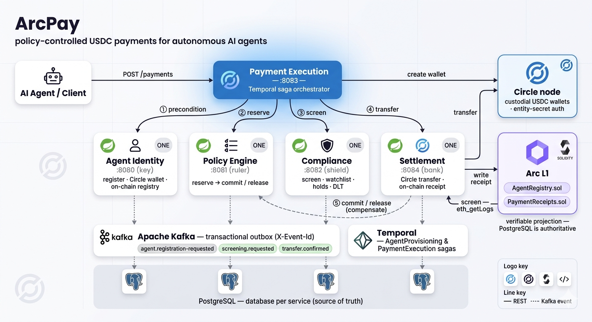
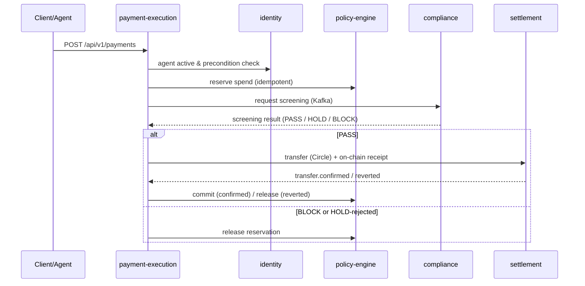

<div align="center">

# ArcPay

**Policy-controlled USDC payments for autonomous AI agents, on Circle's Arc L1.**


[New here? Start with the 60-second tour ↓](#-the-60-second-tour) · [Concepts](#-core-concepts-the-4-nouns) · [The two flows](#-the-two-flows-that-matter) · [Services](#-the-services) · [Secrets & wallets](#-key-custody--the-critical-secrets) · [Run it](#-run-the-stack-locally)



</div>

---

## 📚 Table of Contents

**Start here (newcomers):**
- [🤔 Why does this exist?](#-why-does-this-exist)
- [⏱️ The 60-second tour](#-the-60-second-tour)
- [🧩 Core concepts (the 4 nouns)](#-core-concepts-the-4-nouns)
- [🔁 The two flows that matter](#-the-two-flows-that-matter)

**Go deeper:**
- [🏛️ Architecture](#️-architecture)
- [🧱 The services](#-the-services) — Identity · Policy · Compliance · Payment Execution · Settlement
- [📜 The payment flow (sequence)](#-the-payment-flow-sequence)
- [🔗 On-chain](#-on-chain)
- [🔐 Key custody & the critical secrets](#-key-custody--the-critical-secrets)

**Run & build:**
- [🚀 Run the stack locally](#-run-the-stack-locally)
- [🧭 Explore the APIs (Swagger)](#-explore-the-apis-swagger)
- [🎛️ Configuration](#️-configuration)
- [🧪 Build & test](#-build--test) · [📦 Tech stack](#-tech-stack) · [📜 License](#-license)

---

## 🤔 Why does this exist?

An AI agent that can spend money needs two things that pull in opposite directions:
**autonomy** (act without a human in the loop) and **control** (never exceed the
limits its owner set). ArcPay is the backend that reconciles them — an agent gets a
custodial USDC wallet on Arc, and **every payment it initiates is automatically
checked against the owner's policy, screened for compliance, settled on-chain, and
recorded as a tamper-evident identity projection.**

The agent *feels* autonomous; the owner stays in control. It's built as **five
independently-deployable Spring Boot services** coordinating over Kafka (transactional
outbox) and Temporal sagas — not a monolith.

## ⏱️ The 60-second tour

```
A human OWNER registers ─▶ gets an API key
        │
        ▼ creates an AGENT
   ArcPay provisions it: custodial Circle USDC wallet + on-chain identity ─▶ agent is ACTIVE
        │
        ▼ the agent asks to pay someone
   ┌──────────────── every payment runs this gauntlet ────────────────┐
   │  policy check ─▶ compliance screen ─▶ settle on-chain ─▶ commit  │
   │  (within budget?) (recipient ok?)   (move the USDC)   (finalize) │
   └──────────────────────────────────────────────────────────────────┘
        │ any check fails                       │ all checks pass
        ▼                                       ▼
   REJECTED / FAILED                          COMPLETED
   (money never moved)                        (USDC moved, receipt on-chain)
```

That's the whole product. The rest of this README explains the nouns, the two flows,
and the moving parts.

## 🧩 Core concepts (the 4 nouns)

If you learn these four, the codebase reads easily:

| Noun | What it is | Key facts |
|------|-----------|-----------|
| **Owner** | A human or org | Registers once, gets an **API key**. Owns agents and sets their policies. Has their *own* external `walletAddress` (their identity anchor — **not** where the agent spends from). |
| **Agent** | An autonomous spender | Belongs to one owner. Gets its **own custodial Circle USDC wallet** + an on-chain identity. Lifecycle: `PROVISIONING → ACTIVE → SUSPENDED`. |
| **Policy** | The owner's spending rules for an agent | A list of typed rules — `PER_TX_LIMIT`, `DAILY_LIMIT`, `RECIPIENT_ALLOWLIST`, `VELOCITY`, time windows… Enforced as money (reserve/commit), not advice. |
| **Payment** | One USDC transfer the agent requests | Walks the saga and ends `COMPLETED`, `REJECTED`, or `FAILED`. Idempotent on its `idempotencyKey`. |

> 💡 **The single most-confused point:** the owner's wallet, the agent's Circle wallet,
> and ArcPay's platform wallet are **three different wallets**. See
> [Key custody](#-key-custody--the-critical-secrets).

## 🔁 The two flows that matter

### Flow 1 — Provisioning an agent

```
POST /api/v1/owners/register  { email, walletAddress }   → 201  { apiKey: "ak_test_…" }

POST /api/v1/agents
   Authorization: Bearer ak_test_…
   Idempotency-Key: <a UUID>                              ← must be a valid UUID
   { name, purpose }
        │  DB save → outbox → Kafka → Temporal provisioning saga
        ▼
   create real Circle wallet  →  register on-chain (AgentRegistry)  →  status ACTIVE
```

Real run: this produces a real Circle wallet (e.g. `0x6a83…63fe`) and a confirmed
Arc-testnet registration tx. If any step fails, the agent ends `FAILED` — never
half-provisioned.

### Flow 2 — A payment (the headline)

```
POST /api/v1/payments
   Authorization: Bearer ak_test_…
   { agentId, recipientAddress, amount, currency: "USDC", idempotencyKey }
        ▼  Temporal saga:
  POLICY_CHECK  → policy-engine reserves the funds          (sync REST)
  SCREENING     → compliance screens the recipient via Kafka (async round-trip)
  EXECUTING     → settlement submits the USDC transfer to Circle
        ▼  Circle confirms on-chain → signature-verified webhook → transfer.confirmed
  COMPLETED     → policy commits the reservation; on-chain receipt written
```

**Failure at any gate → the saga *releases* the reservation and the payment ends
`REJECTED`/`FAILED`. Money never moves unless every check passed.** Real run: a
`0.01 USDC` payment went `PENDING → SCREENING → EXECUTING → COMPLETED` with an actual
on-chain settlement tx.

> Want to try it yourself in a browser? See [Explore the APIs (Swagger)](#-explore-the-apis-swagger).

---

## 🏛️ Architecture

Five independently-deployable services, each owning its own Postgres database and
coordinating over **Kafka events + internal REST** (no service touches another's data).
Long-running, multi-step processes are **Temporal sagas** — durable workflows that
survive restarts and *compensate* (undo) when a later step fails.

- **identity** provisions an agent — persists it, creates its custodial Circle USDC
  wallet, and registers it on-chain in the `AgentRegistry`.
- **policy-engine** holds each agent's spending policy and runs atomic
  reserve → commit/release accounting so a payment can't exceed its owner's limits.
- **compliance** screens the recipient (watchlist + on-chain interaction checks) and
  manages holds that need human review.
- **payment-execution** orchestrates a payment end-to-end as a Temporal saga:
  precondition → reserve → screen → settle → commit/release.
- **settlement** moves the USDC via Circle and writes an on-chain payment receipt.

## 🧱 The services

### 🪪 identity · `:8080`

*Gives an agent a verifiable identity and a wallet to spend from.*

Registration kicks off a Temporal **provisioning saga** — and if any step fails, the
agent ends up `FAILED`, never half-provisioned:

```
POST /api/v1/agents
        │   DB save → outbox event → Kafka
        ▼
   ┌── AgentProvisioning saga ─────────────────────────────────────┐
   │  1. persist agent  ─▶  2. create Circle USDC wallet  ─▶  3. register on-chain │
   │      (Postgres)             (custodial)                  (AgentRegistry.sol)   │
   └───────────────────────────────────────────────────────────────┘
        │ any step fails                         │ all steps ok
        ▼                                        ▼
   agent → FAILED                            agent → ACTIVE
```

Later lifecycle changes (`deactivate` / `reactivate` / `update` / `update policy`)
run through the `AgentOnChainSync` workflow so the chain stays in step. Other
services authenticate an agent's owner via the API-key-hash lookup.

### 📏 policy-engine · `:8081`

*The owner's spending rules — enforced as money, not suggestions.*

It doesn't just say yes/no; it **reserves** funds up front so two concurrent payments
can't both slip under the limit, then settles the reservation based on the outcome:

```
   reserve(payment, amount)                 commit(paymentId)   ← payment confirmed
     │  checks daily / total limits             │  spend becomes final
     ▼                                          ▼
  [ RESERVED ] ──────────────────────────▶ [ COMMITTED ]
     │
     │  release(paymentId)   ← payment blocked / failed
     ▼
  [ RELEASED ]   (the hold is freed; nothing was spent)
```

Also serves policy CRUD (`POST /api/v1/agents/{agentId}/policies`), `/evaluate`, and a
per-agent spending summary.

### 🛡️ compliance · `:8082`

*Decides whether a payment's recipient is allowed — fail-closed.*

It consumes screening requests off Kafka, checks the recipient against the watchlist
**and** the recipient's on-chain interactions (web3j `eth_getLogs` over a bounded
block window), and returns a verdict:

```
screening.requested ─▶ ┌─ watchlist + on-chain interaction screen ─┐
                       │                                           │─▶ PASS  ─▶ screening.completed
                       │   (bounded block window, web3j)           │─▶ BLOCK ─▶ screening.rejected
                       └───────────────────────────────────────────┘─▶ HOLD  ─▶ human review
                                                                                  approve / reject
   ✗ un-deserializable / failed  ─────────────────────────────────────────────▶ dead-letter topic (.dlt)
```

A `SanctionsIngestion` Temporal workflow refreshes the sanctions set on a schedule;
held payments wait for an officer's `approve`/`reject`.

### 💸 payment-execution · `:8083`

*The conductor — turns one API call into a safe, multi-service payment.*

`POST /api/v1/payments` starts a **Temporal saga** that walks the payment through
every guardrail and compensates (releases the reservation) on any failure. It's
idempotent — a duplicate request rides the same workflow:

```
POST /api/v1/payments
        │
        ▼
  precondition ─▶ reserve ─▶ screen ─▶ settle ─▶ commit          (happy path)
   (identity)    (policy)  (compliance)(settlement)(policy)
                              │ BLOCK / revert / review-rejected
                              ▼
                           release (policy)                      (compensate)
```

### 🏦 settlement · `:8084`

*Where USDC actually moves, and where it's proven on-chain.*

It executes the transfer via Circle, then reconciles asynchronously from Circle's
**signature-verified webhook**, and writes a tamper-evident on-chain receipt:

```
internal transfer request ─▶ Circle (USDC transfer) ─▶ on-chain PaymentReceipts.sol
                                       │
        Circle webhook (signed) ─▶ transfer.confirmed   ─▶ (saga commits)
                                └▶ transfer.reverted    ─▶ (saga releases)
```

Also serves wallet-balance and transfer-status reads.

> **Heads-up for local runs:** the `transfer.confirmed` step depends on Circle being
> able to reach settlement's `/api/v1/webhooks/circle` endpoint. On a laptop that
> means exposing it via a tunnel (e.g. `cloudflared`) and setting
> `CIRCLE_API_WEBHOOK_SUBSCRIPTION_ENDPOINT`. Without it, a real payment parks in
> `EXECUTING` (the transfer still happens on Circle's side).

## 📜 The payment flow (sequence)

What actually happens when an agent requests a payment (mirrors the
`PaymentExecution` saga and its E2E tests):



Events flow through a **transactional outbox** (namastack) → Kafka, each carrying an
`X-Event-Id` header for consumer-side idempotency. Long-running coordination
(provisioning, payment) runs as **Temporal** workflows.

## 🔗 On-chain

PostgreSQL is the source of truth; the chain is a **verifiable projection** (a public,
tamper-evident mirror).

- **`AgentRegistry.sol`** (`identity/identity/contracts/`) — registrar-gated registry
  binding each agent to its wallet + identity/policy hashes; emits events on every
  state change; `getAgentByWallet` / `isWalletActive` let anyone resolve an on-chain
  wallet back to a registered, active agent. **Deployed on Arc testnet** at
  `0x8A3A6E9825A2b7A6fAe65ebcC8cD95C33327f3Ba` (see `identity/identity/contracts/DEPLOY.md`).
- **`PaymentReceipts.sol`** (`settlement/`) — on-chain receipt of each settled payment.

Both are hand-encoded via web3j (`FunctionEncoder`) — no generated wrappers.

## 🔐 Key custody & the critical secrets

ArcPay talks to **two separate trust systems**, each with its own credentials. This is
the part worth slowing down for.

| Trust system | What it is | ArcPay's role |
|---|---|---|
| **Circle** | An off-chain custodian that holds private keys and moves USDC | **Custody** — holds each agent's USDC and executes transfers |
| **Arc L1** | The blockchain (EVM, USDC-native) | **Verifiable identity** — the public registry of agents + payment receipts |

### The three wallets (don't confuse them)

| Wallet / address | Whose | What it's *for* | Who holds the private key |
|---|---|---|---|
| **Owner `walletAddress`** | the human owner | The owner's **own external wallet** — identity anchor, validated unique at registration | **The owner** (ArcPay never sees this key) |
| **Agent's Circle wallet** (e.g. `0x6a83…63fe`) | the agent | The **custodial USDC wallet the agent spends FROM** | **Circle** (ArcPay authorizes ops via the entity secret) |
| **Platform wallet** (`PLATFORM_WALLET_PRIVATE_KEY`) | ArcPay | **Signs on-chain registry txs + pays gas**; never holds agent funds | **ArcPay** |

> The owner's wallet is **not** where the agent spends from. The agent gets its own
> brand-new Circle custodial wallet; the owner's address is just the owner's identity.
> On-chain, `registerAgent` records `agentId`, `ownerId`, the **agent's** wallet
> address, and a metadata hash.

### What each secret/config is, and why it exists

| Variable | System | What it is | Why it's needed | Secret? |
|---|---|---|---|---|
| `CIRCLE_API_KEY` | Circle | Identifies ArcPay to Circle's API | Authenticate every Circle call | 🔒 |
| `CIRCLE_WALLET_SET_ID` | Circle | The "keychain" agents' wallets are created under | Wallet creation must target a wallet set | id |
| `CIRCLE_ENTITY_SECRET` | Circle | Master secret authorizing fund operations; **RSA-encrypted per request** into a one-time `entitySecretCiphertext` | Even with the API key you **cannot** create a wallet or move USDC without it — it's the second factor on every fund movement | 🔒🔒 |
| `ARC_TESTNET_RPC_URL` | Arc | The node endpoint to talk to the chain | web3j needs a node to read/write | url |
| `AGENT_REGISTRY_ADDRESS` | Arc | Deployed address of `AgentRegistry.sol` | Tells web3j **which contract** to write agent identity to | address |
| `PLATFORM_WALLET_PRIVATE_KEY` | Arc | Private key of ArcPay's EOA "registrar" | **Signs** every `AgentRegistry` tx and **pays gas** — no signature, no on-chain write | 🔒 |
| `GAS_WALLET_PRIVATE_KEY` | Arc | settlement's signer for `PaymentReceipts.sol` | Same idea, for writing payment receipts | 🔒 |

**The crown jewel is `CIRCLE_ENTITY_SECRET`** — compromise ≈ ability to move all agent
funds. It must live in a secret manager, never committed (the compose `.env` value is a
dev placeholder; `.circle/` is gitignored). The two EVM private keys are next-most
sensitive (forge the registry / drain gas). Everything else (set ID, registry address,
RPC) is non-secret configuration.

## 🚀 Run the stack locally

Brings up Postgres (a database per service), Kafka (KRaft), Temporal, and all five
services — health-gated.

**Prerequisite:** Docker (Compose v2). OrbStack also works (and is more stable for the
image pulls).

```bash
docker compose up --build
```

First run builds each service image from the multi-stage `Dockerfile`
(Temurin 25 JDK → JRE); subsequent runs are cached. All five report `{"status":"UP"}`.

| Service | Health | Swagger UI |
|---------|--------|-----------|
| identity `:8080` | http://localhost:8080/actuator/health | http://localhost:8080/swagger-ui.html |
| policy-engine `:8081` | http://localhost:8081/actuator/health | http://localhost:8081/swagger-ui.html |
| compliance `:8082` | http://localhost:8082/actuator/health | http://localhost:8082/swagger-ui.html |
| payment-execution `:8083` | http://localhost:8083/actuator/health | http://localhost:8083/swagger-ui.html |
| settlement `:8084` | http://localhost:8084/actuator/health | http://localhost:8084/swagger-ui.html |

Infra: Postgres `5432`, Kafka `9092`, Temporal `7233`.

```bash
docker compose ps                 # health status
docker compose logs -f identity   # tail a service
docker compose down -v            # stop + drop the Postgres volume
```

The stack ships **local-dev placeholder** secrets so it boots self-contained. To run
against real Circle / Arc endpoints, add a gitignored `.env` (see [Configuration](#️-configuration)).

## 🧭 Explore the APIs (Swagger)

Every service exposes interactive **Swagger UI** at `/swagger-ui.html` and its OpenAPI
spec at `/v3/api-docs`. Fastest way to see the product end-to-end without writing code:

1. **identity** → `POST /api/v1/owners/register` → copy the `apiKey` from the response.
2. Click **Authorize**, paste `Bearer <apiKey>`, then `POST /api/v1/agents`
   (set an `Idempotency-Key` — any UUID). Watch the agent go `PROVISIONING → ACTIVE`
   with a real wallet.
3. **policy-engine** (`:8081`) → `POST /api/v1/agents/{agentId}/policies` to give it a
   spending limit.
4. **payment-execution** (`:8083`) → `POST /api/v1/payments` and watch it walk the saga.

## 🎛️ Configuration

The compose file ships placeholder values so the stack boots self-contained. To run
against real endpoints, drop a **gitignored `.env`** at the repo root — Compose
auto-loads it and overrides the placeholders:

```dotenv
# Arc L1 (on-chain identity)
AGENT_REGISTRY_ADDRESS=0x8A3A6E9825A2b7A6fAe65ebcC8cD95C33327f3Ba
ARC_TESTNET_RPC_URL=https://rpc.testnet.arc.network
PLATFORM_WALLET_PRIVATE_KEY=...     # never commit

# Circle (custody)
CIRCLE_API_KEY=...
CIRCLE_WALLET_SET_ID=...
CIRCLE_ENTITY_SECRET=...            # crown jewel — secret manager only
CIRCLE_USDC_TOKEN_ADDRESS=0x3600000000000000000000000000000000000000   # Arc USDC

# Service-to-service auth (shared secret across all services)
SERVICE_AUTH_TOKEN=...

# Local webhook tunnel for settlement (so Circle can deliver transfer confirmations)
CIRCLE_API_WEBHOOK_SUBSCRIPTION_ENDPOINT=https://<your-tunnel>/api/v1/webhooks/circle
```

See [Key custody](#-key-custody--the-critical-secrets) for what each one does. Infra
URLs (Postgres/Kafka/Temporal) are pinned to compose service names and are **not**
taken from `.env`. Per-service config lives in each `*/src/main/resources/application.yml`;
every environment-specific value is env-overridable. **Never commit secrets.**

## 🧪 Build & test

```bash
./gradlew build                          # compile + unit/ArchUnit tests + spotlessCheck
./gradlew spotlessApply                  # format (palantir-java-format)
./gradlew :<svc>:<svc>:integrationTest   # Testcontainers (Postgres/Kafka/Temporal/EVM)
./gradlew :<svc>:<svc>:businessTest       # business / E2E
```

Tests: AssertJ + BDD Mockito, `usingRecursiveComparison`, Testcontainers (including a
ganache EVM node for the on-chain registry round-trip). Five ArchUnit rules enforce
the hexagonal boundaries.

## 📦 Tech stack

Java 25 · Spring Boot 4.x · Spring Cloud 2025.1 · PostgreSQL + Flyway · Kafka via
Spring Cloud Stream + namastack outbox · Temporal · web3j (Arc L1) · Circle
Developer-Controlled Wallets · springdoc-openapi (Swagger) · MapStruct · Lombok ·
Gradle (Kotlin DSL) · palantir-java-format (Spotless).

## 📜 License

Apache-2.0 (see SPDX headers in the Solidity sources).

---

See `CLAUDE.md` and `docs/standards/` for full architecture, coding/testing standards, and ADRs.
