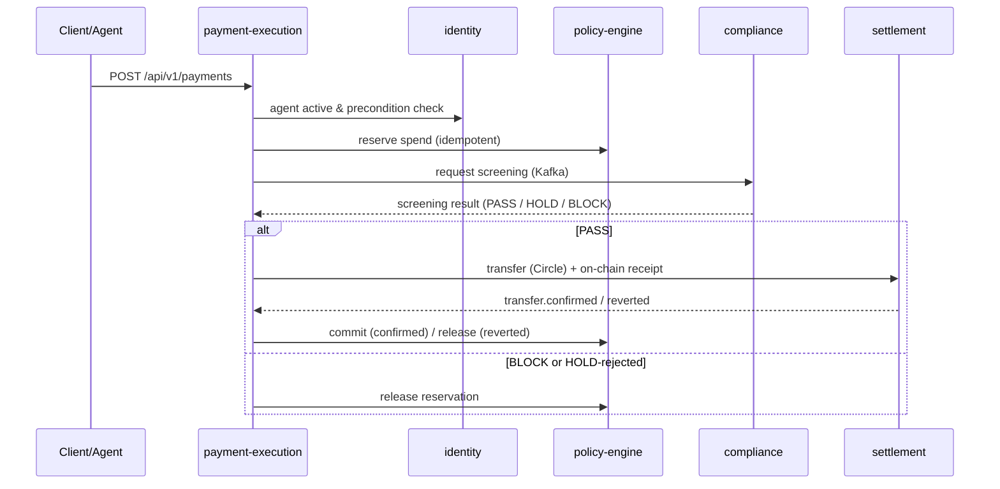

<div align="center">

# ArcPay

**Policy-controlled USDC payments for autonomous AI agents, on Circle's Arc L1.**


[Why](#-why-does-this-exist) · [Architecture](#️-architecture) · [Services](#-the-services) · [Payment flow](#-the-payment-flow) · [On-chain](#-on-chain) · [Key custody](#-key-custody) · [Run locally](#-run-the-stack-locally) · [Config](#️-configuration)

</div>

---

## 🤔 Why does this exist?

An AI agent that can spend money needs two things that pull in opposite directions:
**autonomy** (act without a human in the loop) and **control** (never exceed the
limits its owner set). ArcPay is the backend that reconciles them — an agent gets a
custodial USDC wallet on Arc, and every payment it initiates is checked against the
owner's policy, screened for compliance, settled on-chain, and recorded as a
tamper-evident identity projection.

It's built as **five independently-deployable Spring Boot services** that coordinate
over Kafka (transactional outbox) and Temporal sagas — not a monolith.

## 🏛️ Architecture

Five independently-deployable services, each owning its own Postgres database and
coordinating over Kafka events + internal REST (no service touches another's data):

- **identity** provisions an agent — persists it, creates its custodial Circle USDC
  wallet, and registers it on-chain in the `AgentRegistry`.
- **policy-engine** holds each agent's spending policy and runs atomic
  reserve → commit/release accounting so a payment can't exceed its owner's limits.
- **compliance** screens the recipient (watchlist + on-chain interaction checks) and
  manages holds that need human review.
- **payment-execution** orchestrates a payment end-to-end as a Temporal saga:
  precondition → reserve → screen → settle → commit/release.
- **settlement** moves the USDC via Circle and writes an on-chain payment receipt.

```
                              ┌──────────────────────────┐
   client / agent  ───────▶   │   payment-execution      │  :8083
                              │   (Temporal saga)         │
                              └───┬─────────┬─────────┬───┘
              reserve/commit ─────┘         │         └───── transfer
                    ▼                       ▼                  ▼
            ┌───────────────┐      ┌────────────────┐   ┌──────────────┐
            │ policy-engine │:8081 │  compliance    │   │  settlement  │:8084
            │ (reservations)│      │  (screening)   │   │ (Circle + on │
            └───────────────┘      └────────────────┘   │  -chain rcpt)│
                    ▲                       ▲            └──────────────┘
                    └───────── agent identity ──────────────────┘
                              ┌──────────────────────────┐
                              │   identity               │  :8080
                              │   (AgentRegistry on Arc)  │
                              └──────────────────────────┘

   Postgres (db-per-service) · Kafka (outbox events) · Temporal (sagas)
```

## 🧱 The services

### 🪪 identity · `:8080`

*Gives an agent a verifiable identity and a wallet to spend from.*

Registration kicks off a Temporal **provisioning saga** — and if any step fails, the
agent ends up `FAILED`, never half-provisioned:

```
POST /api/v1/agents/register
        │   emits agent.registration-requested
        ▼
   ┌── AgentProvisioning saga ─────────────────────────────────────┐
   │  1. persist agent  ─▶  2. create Circle USDC wallet  ─▶  3. register on-chain │
   │      (Postgres)             (custodial)                  (AgentRegistry.sol)   │
   └───────────────────────────────────────────────────────────────┘
        │ any step fails                         │ all steps ok
        ▼                                        ▼
   agent.provisioning-failed                 agent → ACTIVE
```

Later lifecycle changes (`deactivate` / `reactivate` / `update` / `update policy`)
run through the `AgentOnChainSync` workflow so the chain stays in step. Other
services authenticate an agent via the API-key-hash lookup.

### 📏 policy-engine · `:8081`

*The owner's spending rules — enforced as money, not suggestions.*

It doesn't just say yes/no; it **reserves** funds up front so two concurrent payments
can't both slip under the limit, then settles the reservation based on the outcome:

```
   reserve(payment, amount)                 commit(paymentId)   ← payment confirmed
     │  checks daily / total limits             │  spend becomes final
     ▼                                          ▼
  [ RESERVED ] ──────────────────────────▶ [ COMMITTED ]
     │
     │  release(paymentId)   ← payment blocked / failed
     ▼
  [ RELEASED ]   (the hold is freed; nothing was spent)
```

Also serves policy CRUD, `/evaluate`, and a per-agent spending summary.

### 🛡️ compliance · `:8082`

*Decides whether a payment's recipient is allowed — fail-closed.*

It consumes screening requests off Kafka, checks the recipient against the watchlist
**and** the recipient's on-chain interactions (web3j `eth_getLogs` over a bounded
block window), and returns a verdict:

```
screening.requested ─▶ ┌─ watchlist + on-chain interaction screen ─┐
                       │                                           │─▶ PASS  ─▶ screening.completed
                       │   (bounded block window, web3j)           │─▶ BLOCK ─▶ screening.rejected
                       └───────────────────────────────────────────┘─▶ HOLD  ─▶ human review
                                                                                  approve / reject
   ✗ un-deserializable / failed  ─────────────────────────────────────────────▶ dead-letter topic (.dlt)
```

A `SanctionsIngestion` Temporal workflow refreshes the sanctions set on a schedule;
held payments wait for an officer's `approve`/`reject`.

### 💸 payment-execution · `:8083`

*The conductor — turns one API call into a safe, multi-service payment.*

`POST /api/v1/payments` starts a **Temporal saga** that walks the payment through
every guardrail and compensates (releases the reservation) on any failure. It's
idempotent — a duplicate request rides the same workflow:

```
POST /api/v1/payments
        │
        ▼
  precondition ─▶ reserve ─▶ screen ─▶ settle ─▶ commit          (happy path)
   (identity)    (policy)  (compliance)(settlement)(policy)
                              │ BLOCK / revert / review-rejected
                              ▼
                           release (policy)                      (compensate)
```

(Full cross-service sequence below.)

### 🏦 settlement · `:8084`

*Where USDC actually moves, and where it's proven on-chain.*

It executes the transfer via Circle, then reconciles asynchronously from Circle's
**signature-verified webhook**, and writes a tamper-evident on-chain receipt:

```
internal transfer request ─▶ Circle (USDC transfer) ─▶ on-chain PaymentReceipts.sol
                                       │
        Circle webhook (HMAC-verified) ─▶ transfer.confirmed   ─▶ (saga commits)
                                       └▶ transfer.reverted    ─▶ (saga releases)
```

Also serves wallet-balance and transfer-status reads.

## 🔁 The payment flow

What actually happens when an agent requests a payment (mirrors the
`PaymentExecution` saga and its E2E tests):



Events flow through a **transactional outbox** (namastack) → Kafka, each carrying an
`X-Event-Id` header for consumer-side idempotency. Long-running coordination
(provisioning, payment) runs as **Temporal** workflows.

## 🔗 On-chain

PostgreSQL is the source of truth; the chain is a **verifiable projection**.

- **`AgentRegistry.sol`** (`identity/identity/contracts/`) — registrar-gated registry
  binding each agent to its wallet + identity/policy hashes; emits events on every
  state change; `getAgentByWallet` / `isWalletActive` let anyone resolve an on-chain
  wallet back to a registered, active agent. **Deployed on Arc testnet** at
  `0x8A3A6E9825A2b7A6fAe65ebcC8cD95C33327f3Ba` (see `identity/identity/contracts/DEPLOY.md`).
- **`PaymentReceipts.sol`** (`settlement/`) — on-chain receipt of each settled payment.

Both are hand-encoded via web3j (`FunctionEncoder`) — no generated wrappers.

## 🔐 Key custody

An agent's **USDC wallet is custodial via Circle Developer-Controlled Wallets** —
Circle generates and holds the wallet's private key in its own infrastructure.
ArcPay never sees or stores it; the agent record keeps only `walletId` + `walletAddress`.

ArcPay's authority to operate those wallets is its **entity secret** (a 32-byte
secret): `EntitySecretCiphertextProvider` fetches Circle's public key and sends an
RSA-encrypted ciphertext of the entity secret with every request, alongside the API
key. That entity secret is the crown jewel — it must live in a secret manager, never
committed (see [#200]; the compose `.env` value is a dev placeholder).

Separately, ArcPay holds two raw EVM keys used only to sign on-chain transactions and
pay gas — **not** for agent USDC custody.

| Key | Holder | Purpose |
|-----|--------|---------|
| Agent wallet key | **Circle** (custodial) | Holds & spends the agent's USDC |
| Entity secret | **ArcPay** (secret-managed) | Authorizes ArcPay to operate Circle wallets |
| `PLATFORM_WALLET_PRIVATE_KEY` | **ArcPay** | Registrar/gas key signing `AgentRegistry` txs |
| `GAS_WALLET_PRIVATE_KEY` | **ArcPay** | Signs `PaymentReceipts` txs |

## 🚀 Run the stack locally

Brings up Postgres (a database per service), Kafka (KRaft), Temporal, and all five
services — health-gated.

**Prerequisite:** Docker (Compose v2).

```bash
docker compose up --build
```

First run builds each service image from the multi-stage `Dockerfile`
(Temurin 25 JDK → JRE); subsequent runs are cached. Verified: all five report
`{"status":"UP"}`.

| Service | Health |
|---------|--------|
| identity `:8080` | http://localhost:8080/actuator/health |
| policy-engine `:8081` | http://localhost:8081/actuator/health |
| compliance `:8082` | http://localhost:8082/actuator/health |
| payment-execution `:8083` | http://localhost:8083/actuator/health |
| settlement `:8084` | http://localhost:8084/actuator/health |

Infra: Postgres `5432`, Kafka `9092`, Temporal `7233`.

```bash
docker compose ps                 # health status
docker compose logs -f identity   # tail a service
docker compose down -v            # stop + drop the Postgres volume
```

## 🎛️ Configuration

The compose file ships **local-dev placeholder** values for Circle/blockchain
secrets so the stack boots self-contained. To run against real endpoints (Arc
testnet, your deployed `AgentRegistry`, real Circle keys), drop a **gitignored
`.env`** at the repo root — Compose auto-loads it and overrides the placeholders:

```dotenv
AGENT_REGISTRY_ADDRESS=0x8A3A6E9825A2b7A6fAe65ebcC8cD95C33327f3Ba
ARC_TESTNET_RPC_URL=https://rpc.testnet.arc.network
PLATFORM_WALLET_PRIVATE_KEY=...   # never commit
CIRCLE_API_KEY=...
```

See `.env.example` for the full list. Infra URLs (Postgres/Kafka/Temporal) are pinned
to compose service names and are **not** taken from `.env`. Per-service config lives
in each `*/src/main/resources/application.yml`; every environment-specific value is
env-overridable. **Never commit secrets.**

## 🧪 Build & test

```bash
./gradlew build                          # compile + unit/ArchUnit tests + spotlessCheck
./gradlew spotlessApply                  # format (palantir-java-format)
./gradlew :<svc>:<svc>:integrationTest   # Testcontainers (Postgres/Kafka/Temporal/EVM)
./gradlew :<svc>:<svc>:businessTest       # business / E2E
```

Tests: AssertJ + BDD Mockito, `usingRecursiveComparison`, Testcontainers (including a
ganache EVM node for the on-chain registry round-trip). Five ArchUnit rules enforce
the hexagonal boundaries.

## 📦 Tech stack

Java 25 · Spring Boot 4.x · Spring Cloud 2025.1 · PostgreSQL + Flyway · Kafka via
Spring Cloud Stream + namastack outbox · Temporal · web3j (Arc L1) · MapStruct ·
Lombok · Gradle (Kotlin DSL) · palantir-java-format (Spotless).

## 📜 License

Apache-2.0 (see SPDX headers in the Solidity sources).

---

See `CLAUDE.md` and `docs/standards/` for full architecture, coding/testing standards, and ADRs.
