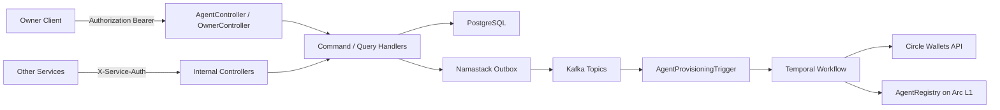
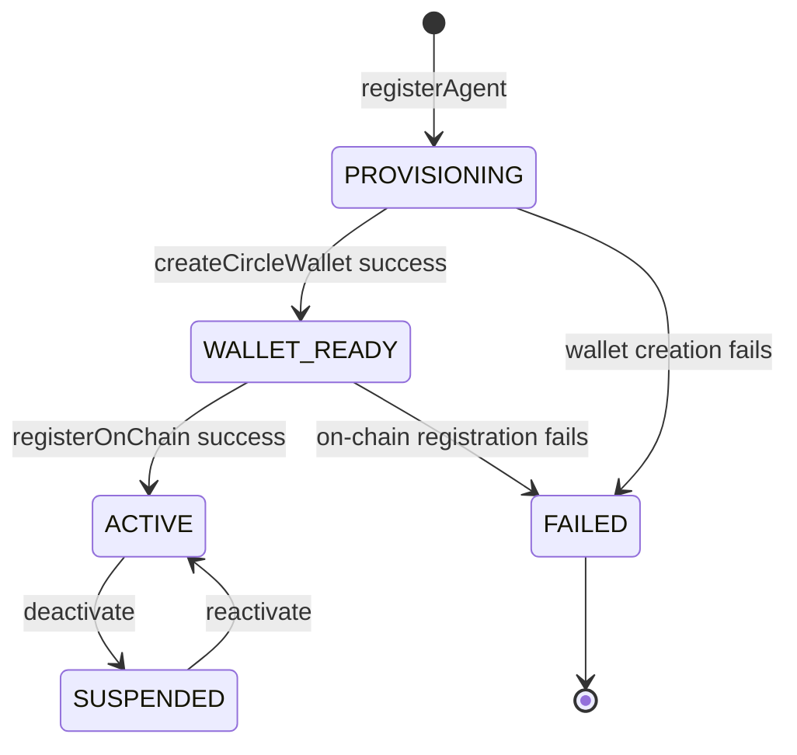
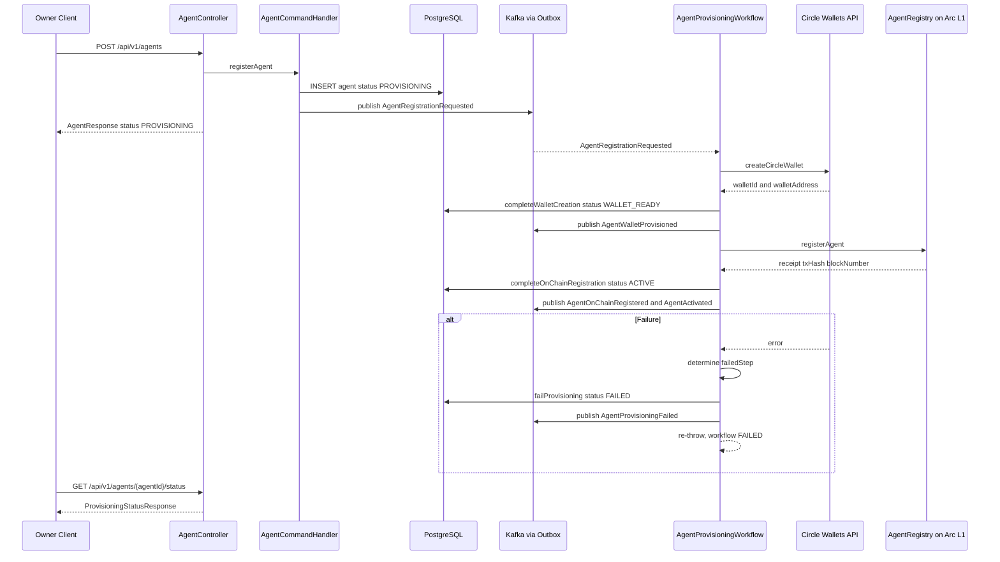
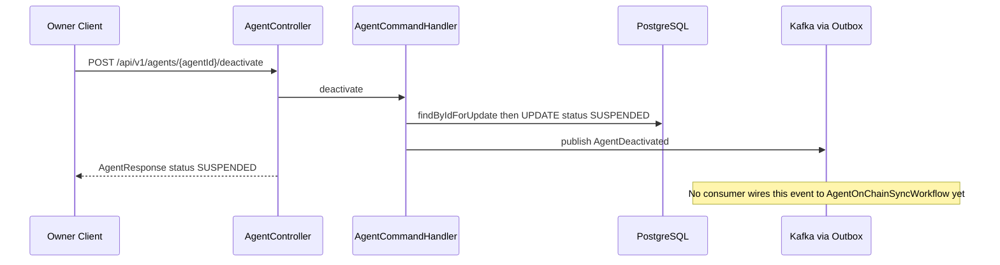

# Agent Identity Service

The Agent Identity Service (`:8080`) is the front door of the ArcPay protocol: it is where a human **owner** registers, mints **AI agents**, and gives each agent a real, policy-aware identity backed by a custodial USDC wallet on Circle and a verifiable record on the Arc L1 `AgentRegistry` smart contract. PostgreSQL is the source of truth; the on-chain registry is a tamper-evident projection. Agent provisioning — born, funded with a wallet, registered on-chain, activated — is driven by a Temporal saga, persisted transactionally, and broadcast to the rest of the platform as Kafka events via a Namastack transactional outbox. No private keys are ever stored: Circle holds the custody, and ArcPay authenticates to it with a per-request entity-secret ciphertext.

---

## Responsibilities

- **Owner management** — self-service registration with an email and an on-chain wallet address; issues an API key (only its SHA-256 hash is stored).
- **Agent lifecycle** — create, fetch, list, update metadata, deactivate, reactivate, and poll provisioning status.
- **Custodial wallet provisioning** — Circle developer-controlled wallets created with entity-secret authentication.
- **On-chain identity** — publishes agent registration to the Arc L1 `AgentRegistry` contract during provisioning.
- **Provisioning orchestration** — a multi-step Temporal saga (wallet creation → on-chain registration, with compensation).
- **Event publishing** — domain events emitted over Kafka through the transactional outbox.
- **Idempotency** — request deduplication for agent registration with a 24-hour window.

**Stack:** Java 25 / Spring Boot 4, PostgreSQL + Flyway, Kafka (Namastack outbox), Temporal, web3j to Arc L1, REST client to Circle.

---

## Architecture at a Glance

---

## REST API

### Owner Endpoints

| Method | Path | Auth | Purpose |
|--------|------|------|---------|
| `POST` | `/api/v1/owners/register` | permitAll | Register a new owner with email and wallet address; returns the issued API key (rate-limited to 10/hour per client IP) |

### Agent Endpoints (Owner-authenticated via `Authorization: Bearer <api-key>`)

| Method | Path | Auth | Purpose |
|--------|------|------|---------|
| `POST` | `/api/v1/agents` | Bearer API key (OwnerPrincipal) | Register an agent and trigger provisioning; **requires** an `Idempotency-Key` header (a UUID); replays return the stored response |
| `GET` | `/api/v1/agents/{agentId}` | Bearer API key (OwnerPrincipal) | Fetch agent details (owner-scoped) |
| `GET` | `/api/v1/agents` | Bearer API key (OwnerPrincipal) | List agents, optionally filtered by `status`, paginated (default page size 20) |
| `PUT` | `/api/v1/agents/{agentId}` | Bearer API key (OwnerPrincipal) | Update name and/or purpose; recomputes `metadataHash` |
| `POST` | `/api/v1/agents/{agentId}/deactivate` | Bearer API key (OwnerPrincipal) | Deactivate agent (status → `SUSPENDED`) |
| `POST` | `/api/v1/agents/{agentId}/reactivate` | Bearer API key (OwnerPrincipal) | Reactivate a suspended agent (status → `ACTIVE`) |
| `GET` | `/api/v1/agents/{agentId}/status` | Bearer API key (OwnerPrincipal) | Poll provisioning progress (`walletCreation`, `onChainRegistration` step statuses) |

> The `Idempotency-Key` header is mandatory on `POST /api/v1/agents` and must parse as a UUID; a missing or non-UUID value yields `MissingIdempotencyKeyException`. On both first call and replay, the persisted HTTP status (`201 Created`) is returned (`application/controller/agent/handler/IdempotencyHandler.java:42`).

### Internal Endpoints (Service-authenticated, `ROLE_SERVICE`)

| Method | Path | Auth | Purpose |
|--------|------|------|---------|
| `GET` | `/api/v1/internal/agents/{agentId}` | ServiceAuthFilter | Internal agent lookup by id (no owner check) |
| `PUT` | `/api/v1/internal/agents/{agentId}/policy` | ServiceAuthFilter | Update agent `policyHash` (called by policy-engine) |
| `GET` | `/api/v1/internal/owners/by-api-key-hash/{hash}` | ServiceAuthFilter | Resolve owner by API key hash (used by other services' API-key auth filters) |

### Health / Metrics

| Path | Auth | Purpose |
|------|------|---------|
| `/actuator/health`, `/actuator/info` | permitAll | Liveness probes and service metadata |
| `/actuator/metrics`, `/actuator/prometheus` | authenticated | Prometheus scrape (exposed via `management.endpoints.web.exposure.include`) |

> Controllers: `application/controller/agent/AgentController.java`, `application/controller/owner/OwnerController.java`, `application/controller/internal/InternalAgentController.java`, `application/controller/internal/InternalOwnerController.java`.

---

## Domain Model

### Agent

`domain/model/Agent.java:10` — an immutable record. State transitions return new instances via builder methods.

| Field | Notes |
|-------|-------|
| `agentId` | `UUID`, non-null (time-ordered, generated by `UuidCreator.getTimeOrderedEpoch()`) |
| `ownerId` | `UUID`, non-null, FK to owner |
| `name` | non-null; API validation enforces 3–64 chars |
| `purpose` | non-null; API validation enforces max 256 chars |
| `status` | `AgentStatus` enum, non-null |
| `walletId` | nullable, Circle wallet ID |
| `walletAddress` | nullable, lowercase Ethereum address |
| `onChainTxHash` | nullable, `registerAgent` tx hash |
| `policyHash` | nullable, hex-encoded policy hash |
| `metadataHash` | non-null, keccak256 of `name + purpose` |
| `failureReason` | nullable, set on `FAILED` |
| `createdAt` / `updatedAt` | `Instant`, non-null |

**Transition methods** (`domain/model/Agent.java`): `withWallet(walletId, walletAddress)` → `WALLET_READY`; `withOnChainRegistration(txHash)` → `ACTIVE`; `withFailure(reason)` → `FAILED`; `deactivate()` → `SUSPENDED` (requires current status `ACTIVE`); `reactivate()` → `ACTIVE` (requires current status `SUSPENDED`); `updateMetadata(...)` (forbidden while `PROVISIONING` or `FAILED`).

### Owner

`domain/model/Owner.java:9` — `ownerId` (`UUID`), `email` (unique, case-insensitive), `walletAddress` (unique, stored as `VARCHAR(42)`), `apiKeyHash` (SHA-256 hex of the issued key), `status` (`OwnerStatus`: `ACTIVE`, `SUSPENDED`), `createdAt`, `updatedAt`.

### Supporting Records

- **ProvisioningStatus** (`domain/model/ProvisioningStatus.java:7`) — `agentId`, `overallStatus` (`AgentStatus`), and two `StepStatus` values (`walletCreation`, `onChainRegistration`), each one of `PENDING`, `IN_PROGRESS`, `COMPLETED`, `FAILED`. Derived from `AgentStatus` in `AgentQueryHandler.deriveProvisioningStatus`.
- **GasUsage** (`domain/model/GasUsage.java`) — `id`, `ownerId`, `agentId`, `operation`, `txHash`, `gasUsed`, `gasCostUsdc` (currently always `BigDecimal.ZERO`), `createdAt`.
- **WalletCreationResult** (`domain/model/WalletCreationResult.java`) — `walletId`, `walletAddress`.
- **RegistrationResult** (`domain/model/RegistrationResult.java`) — `txHash`, `blockNumber` (`long`).
- **AgentProvisioningRequest** (`domain/model/AgentProvisioningRequest.java:8`) — `agentId`, `ownerId`, `name`, `purpose`, `metadataHash`.
- **AgentOnChainSyncRequest** (`domain/model/AgentOnChainSyncRequest.java:9`) — `agentId`, `operation` (`OnChainOperation`), `parameters` (`Map<String, String>`).

### Domain Ports

| Port | Key methods |
|------|-------------|
| `AgentRepository` | `save`, `findById`, `findByIdForUpdate` (pessimistic lock), `findByOwnerIdAndStatus`, `findByOwnerId`, name-uniqueness checks |
| `OwnerRepository` | `save`, `findById`, `findByApiKeyHash`, email/wallet existence checks |
| `BlockchainService` | `registerAgent`, `deactivateAgent`, `reactivateAgent`, `updateMetadata`, `updatePolicy`, `isAgentActive` |
| `CircleWalletService` | `createWallet(UUID agentId)` → `WalletCreationResult` |
| `GasUsageRepository` | `save`, `findByOwnerId` |
| `EventPublisher` | `publish(Object event)` (via Namastack outbox) |
| `IdempotencyKeyRepository` | `save`, `findByKeyAndOwnerId`, `deleteExpiredBefore` — backs `IdempotencyHandler` |

---

## Agent Lifecycle

- **PROVISIONING** — initial state; wallet creation pending.
- **WALLET_READY** — Circle wallet created; awaiting on-chain registration.
- **ACTIVE** — registered on-chain; operational.
- **SUSPENDED** — deactivated by owner; reversible.
- **FAILED** — provisioning failed at the wallet or on-chain step; terminal. There is no agent deletion or ownership transfer.

---

## Kafka Events

All events are written transactionally to `agentidentity_outbox_record` and published by the Namastack outbox poller. Each event record carries a `public static final String TOPIC`.

### Produced

| Topic | Event Record | Key Fields | Emitted When |
|-------|--------------|-----------|--------------|
| `agent.registration-requested` | `AgentRegistrationRequested` | agentId, ownerId, name, purpose, metadataHash, requestedAt | Agent registered; triggers provisioning saga |
| `agent.wallet-provisioned` | `AgentWalletProvisioned` | agentId, walletId, walletAddress, provisionedAt | Circle wallet created |
| `agent.on-chain-registered` | `AgentOnChainRegistered` | agentId, txHash, blockNumber, registeredAt | `registerAgent` confirmed on-chain |
| `agent.activated` | `AgentActivated` | agentId, activatedAt | Agent becomes `ACTIVE` |
| `agent.provisioning-failed` | `AgentProvisioningFailed` | agentId, failedStep, reason, failedAt | Saga failure; agent `FAILED` |
| `agent.metadata-updated` | `AgentMetadataUpdated` | agentId, name, purpose, metadataHash, updatedAt | Metadata changed |
| `agent.deactivated` | `AgentDeactivated` | agentId, deactivatedAt | Agent suspended |
| `agent.reactivated` | `AgentReactivated` | agentId, reactivatedAt | Agent reactivated |
| `agent.policy-updated` | `AgentPolicyUpdated` | agentId, policyHash, updatedAt | Policy hash updated |
| `owner.registered` | `OwnerRegistered` | ownerId, email, walletAddress, registeredAt | New owner created |

> `failedStep` is a plain `String` carrying `WALLET_CREATION` or `ON_CHAIN_REGISTRATION` (`infrastructure/temporal/AgentProvisioningWorkflowImpl.java:67`).

### Consumed

| Topic | Consumer | Action |
|-------|----------|--------|
| `agent.registration-requested` | `AgentProvisioningTrigger.onAgentRegistrationRequested` (`application/stream/AgentProvisioningTrigger.java:23`, `@KafkaListener`) | Starts `AgentProvisioningWorkflow` |

> The deactivate / reactivate / metadata / policy events listed above are **published** to the outbox but are not consumed by this service. The `AgentOnChainSyncWorkflow` (below) exists to propagate those changes on-chain, but no consumer currently bridges those topics to it.

---

## Provisioning Saga (Temporal)

`AgentProvisioningWorkflow` (`domain/agent/AgentProvisioningWorkflow.java:9`, impl `infrastructure/temporal/AgentProvisioningWorkflowImpl.java:14`) orchestrates the two-step path from a freshly created agent to a fully active, on-chain identity. Workflow ID `AgentProvisioning_{agentId}`, task queue `AgentIdentityTaskQueue`, execution timeout 300s, reuse policy `REJECT_DUPLICATE` (`application/stream/AgentProvisioningTrigger.java:34`).

**Happy path:** `createCircleWallet` → `completeWalletCreation` (status `WALLET_READY`, emits `AgentWalletProvisioned`) → `registerOnChain` → `completeOnChainRegistration` (status `ACTIVE`, emits `AgentOnChainRegistered` + `AgentActivated`).

**Failure path:** the workflow catches `ActivityFailure`, determines the failed step (`WALLET_CREATION` if the failed activity is `createCircleWallet`, else `ON_CHAIN_REGISTRATION`), runs the **`failProvisioning`** compensation activity (status `FAILED`, emits `AgentProvisioningFailed`), then re-throws so the workflow is marked failed.

### Activity Timeouts & Retries

| Activity | Start-to-Close | Max Attempts | Initial Interval | Backoff |
|----------|----------------|--------------|------------------|---------|
| `createCircleWallet` | 30s | 5 | 2s | 2.0 |
| `registerOnChain` | 60s | 5 | 5s | 2.0 |
| `failProvisioning` (compensation) | 10s | 3 | 1s | (Temporal default) |

### On-Chain Sync Workflow

`AgentOnChainSyncWorkflow` (`domain/agent/AgentOnChainSyncWorkflow.java:10`, impl `infrastructure/temporal/AgentOnChainSyncWorkflowImpl.java:14`) is implemented to propagate owner-driven state changes to the chain. Workflow ID `AgentOnChainSync_{agentId}_{operation}`, task queue `AgentIdentityTaskQueue`.

A single `syncToChain` activity (`infrastructure/temporal/AgentOnChainSyncActivitiesImpl.java:21`) switches on the operation: `DEACTIVATE` → `deactivateAgent`, `REACTIVATE` → `reactivateAgent`, `UPDATE_METADATA` → `updateMetadata`, `UPDATE_POLICY` → `updatePolicy`. The activity runs with a 60s start-to-close timeout, up to 10 attempts (5s initial, 300s max interval, 2.0 backoff). On `ActivityFailure` the workflow logs a warning and completes — there is no compensation.

> **Not yet wired.** No Kafka listener or other caller starts `AgentOnChainSyncWorkflow.sync(...)` in this service — the only Temporal start is `AgentProvisioningTrigger` for the provisioning workflow. The command handlers publish `AgentDeactivated` / `AgentReactivated` / `AgentMetadataUpdated` / `AgentPolicyUpdated` to the outbox, but nothing currently consumes them to drive this workflow. The implemented owner-action path is therefore: persist the off-chain status change and publish the event.

---

## Circle Custodial Wallets

`CircleWalletAdapter` (`infrastructure/client/circle/CircleWalletAdapter.java`) implements `CircleWalletService.createWallet`. It POSTs to `/v1/w3s/developer/wallets` with:

- `idempotencyKey` = `agentId.toString()` (prevents duplicate wallets)
- `walletSetId` (config), `blockchains` = `[<circle.api.blockchain>]` (default `ARC-TESTNET`), `count` = 1
- `entitySecretCiphertext` — produced per request by `EntitySecretCiphertextProvider` (wired in `CircleClientConfig.java:32` from `circle.api.entity-secret`)

Authentication is a Bearer token (`circle.api.api-key`, base URL `https://api.circle.com`) plus the per-request entity-secret ciphertext. **No private key is ever stored** in ArcPay; the agent's wallet address is the only on-chain identifier retained, normalized to lowercase. The response is parsed from the nested `CreateWalletResponse → WalletData → List<Wallet>` shape and the first wallet is used. Empty responses and any other error raise `CircleApiException`.

---

## On-Chain AgentRegistry

`contracts/AgentRegistry.sol` (`pragma solidity 0.8.24`) is a registrar-gated contract: the platform gas wallet is the sole signer, set in the constructor and rotatable via a two-step transfer (`transferRegistrar` / `acceptRegistrar`). Each agent is stored as a struct (`owner`, `metadataHash`, `policyHash`, `wallet`, `active`, `exists`, `createdAt`) with reverse indexes `ownerAgents` and `walletToAgent`. All mutating functions carry the `onlyRegistrar` modifier; timestamps use `block.timestamp`.

| Function | Line | Behavior |
|----------|------|----------|
| `registerAgent(agentId, owner, wallet, metadataHash)` | 74 | Idempotent: re-submitting a matching `(agentId, owner, wallet)` is a no-op success; a mismatch on owner or wallet reverts `AgentAlreadyRegistered`. Otherwise sets `active`/`exists`, indexes owner and wallet, emits `AgentRegistered` |
| `deactivateAgent(agentId)` | 109 | Sets `active = false`, emits `AgentDeactivated` |
| `reactivateAgent(agentId)` | 116 | Sets `active = true`, emits `AgentReactivated` |
| `updateMetadata(agentId, metadataHash)` | 123 | Updates metadata, emits `MetadataUpdated` |
| `updatePolicy(agentId, policyHash)` | 130 | Updates policy, emits `PolicyUpdated` |
| `getAgent(agentId)` | 137 | View; reverts `UnknownAgent` if not registered |
| `isAgentActive(agentId)` | 150 | View; `false` if unknown |
| `getAgentByWallet(wallet)` | 155 | View; agentId or `bytes32(0)` |
| `isWalletActive(wallet)` | 160 | View; registered and active |
| `getAgentsByOwner(owner)` | 166 | View; all agent IDs for an owner |

### BlockchainAdapter

`BlockchainAdapter` (`infrastructure/client/blockchain/BlockchainAdapter.java`) implements `BlockchainService` over web3j with a `FastRawTransactionManager` and a `PollingTransactionReceiptProcessor` (`infrastructure/client/blockchain/BlockchainClientConfig.java`). UUIDs are encoded to `bytes32` via `UuidConversionUtil`; `metadataHash`/`policyHash` are validated against `^0x[0-9a-fA-F]{64}$` and otherwise hashed (keccak256) via `hashToBytes32`. A fair `ReentrantLock` (`writeLock`) serializes all state-changing submissions because the gas-wallet nonce is tracked in memory — a scalability bottleneck for concurrent provisioning. After every state change it records a `GasUsage` row (`operation` ∈ `REGISTER_AGENT`, `DEACTIVATE`, `REACTIVATE`, `UPDATE_METADATA`, `UPDATE_POLICY`); a submission failure triggers a quiet nonce resync. View calls (`isAgentActive`, `getAgent`, `getAgentByWallet`, `isWalletActive`) use `eth_call`, take no lock, and consume no gas.

---

## Persistence

Hibernate runs in validation mode (`spring.jpa.hibernate.ddl-auto: validate`); schema is owned by Flyway migrations under `src/main/resources/db/migration`.

| Migration | Table(s) | Purpose |
|-----------|----------|---------|
| `V1` | `owners` | Owner identity; unique `LOWER(email)` and `LOWER(wallet_address)`, indexed `api_key_hash`, `status` default `ACTIVE` |
| `V2` | `agents` | Agent records; FK `owner_id`, unique `(owner_id, LOWER(name))`, indexes on `owner_id` and `status`, `status` default `PROVISIONING` |
| `V3` | `idempotency_keys` | Request dedup for agent registration; PK `(idempotency_key, owner_id)`, `expires_at` default `now() + INTERVAL '24 hours'` |
| `V4` | `agentidentity_outbox_record`, `agentidentity_outbox_instance`, `agentidentity_outbox_partition` | Namastack transactional outbox |
| `V5` | `gas_usage` | Per-operation on-chain cost tracking; FK `owner_id`, index `(owner_id, created_at)` |

---

## Security & Authentication

`application/security/SecurityConfig.java` configures a stateless chain (CSRF disabled, `SessionCreationPolicy.STATELESS`) with the following filters:

1. **RateLimitFilter** (`application/security/RateLimitFilter.java`) — limits `POST /api/v1/owners/register` to 10 requests/hour per client IP; all other paths pass through. Added before `UsernamePasswordAuthenticationFilter`.
2. **ApiKeyAuthFilter** (`platform-infra` `ApiKeyAuthFilter`) — reads the `Authorization: Bearer <key>` header, SHA-256-hashes the raw key, and resolves it to an `OwnerPrincipal` via `IdentityApiKeyResolver`. Added before `UsernamePasswordAuthenticationFilter`.
3. **ServiceAuthFilter** (`platform-infra` `ServiceAuthFilter`) — constant-time-compares the `X-Service-Auth` header against the configured `arcpay.security.service-token` and grants `ROLE_SERVICE`. Added after `ApiKeyAuthFilter`.

| Matcher | Rule |
|---------|------|
| `POST /api/v1/owners/register`, `/actuator/health`, `/actuator/info` | permitAll |
| `/api/v1/internal/**` | `hasRole(SERVICE)` |
| everything else | authenticated |

API keys are presented as `Authorization: Bearer <key>`; only the SHA-256 hex hash is stored. Within this service the hash is resolved directly against the local `OwnerRepository` (`IdentityApiKeyResolver`); the `GET /api/v1/internal/owners/by-api-key-hash/{hash}` endpoint exists for *other* services' API-key filters. An owner whose key hash is in the configured compliance-officer set is granted `ROLE_COMPLIANCE_OFFICER` instead of `ROLE_OWNER` (`application/security/OwnerAuthorities.java`). Owner auth is API-key only — there is no password, MFA, OAuth/OIDC, or mTLS between services.

---

## Configuration

`src/main/resources/application.yml` — app name `agent-identity-service`. Key environment variables:

| Variable | Default | Purpose |
|----------|---------|---------|
| `SPRING_DATASOURCE_URL` | `jdbc:postgresql://localhost:5432/arcpay_identity` | PostgreSQL connection |
| `KAFKA_BOOTSTRAP_SERVERS` | `localhost:9092` | Kafka brokers; consumer group `agent-identity-service` |
| `TEMPORAL_ADDRESS` | `localhost:7233` | Temporal server; namespace `arcpay`, task queue `AgentIdentityTaskQueue` |
| `CIRCLE_API_KEY` | required | Circle Bearer token (base URL `https://api.circle.com`) |
| `CIRCLE_WALLET_SET_ID` | required | Circle wallet set |
| `CIRCLE_ENTITY_SECRET` | empty | Circle entity secret (hex) used to mint the per-request ciphertext |
| `ARC_TESTNET_RPC_URL` | required | Arc L1 RPC (chain ID `5042002`) |
| `PLATFORM_WALLET_PRIVATE_KEY` | required | Platform gas-wallet key for `FastRawTransactionManager` |
| `AGENT_REGISTRY_ADDRESS` | required | `AgentRegistry` contract address |
| `SERVICE_AUTH_TOKEN` | empty | Service-to-service token (compared against `X-Service-Auth`) |

Outbox poller: 2000ms interval, batch 20, table prefix `agentidentity_`, exponential retry (max 5, 1s→60s, multiplier 2.0). Trusted Kafka JSON deserialization package: `com.arcpay.identity.agentidentity.domain.event`. Circle client timeouts: connect 5000ms, read 15000ms.

---

## Operational Notes

- **Provisioning step commits** — agent status mutations (`PROVISIONING` → `WALLET_READY` → `ACTIVE`) commit in separate transactions inside Temporal activities; on failure the agent is marked `FAILED` and `AgentProvisioningFailed` is published. On-chain `registerAgent` is idempotent on `(agentId, owner, wallet)`, so retries never create duplicates.
- **Nonce serialization** — `BlockchainAdapter`'s fair `writeLock` makes concurrent on-chain submissions effectively single-threaded against the shared gas wallet.
- **Custodial keys** — the entity secret is sent to Circle only as a per-request ciphertext; no wallet key material is persisted in ArcPay.
- **On-chain sync gap** — `AgentOnChainSyncWorkflow` is implemented but not triggered by any consumer; deactivate/reactivate/metadata/policy changes update PostgreSQL and emit events, but are not currently pushed on-chain by this service. (Note also that the provisioning sync workflow swallows activity failures after retries and completes — no compensation.)
- **Polling, not push** — clients learn provisioning progress via `GET /api/v1/agents/{agentId}/status`; there is no SSE/WebSocket. The service does not listen to on-chain events, and there is no agent deletion, ownership transfer, wallet rotation, or batch operations.

---

## Related pages

- [[Policy-Engine-Service]]
- [[Compliance-Shield-Service]]
- [[Payment-Execution-Service]]
- [[Settlement-Service]]
- [[Transactional-Outbox-Namastack]]
- [[Temporal-Workflows]]
- [[Arc-L1-Smart-Contracts]]
