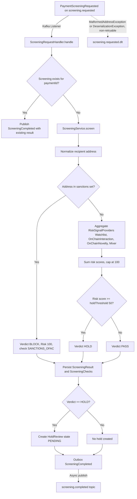
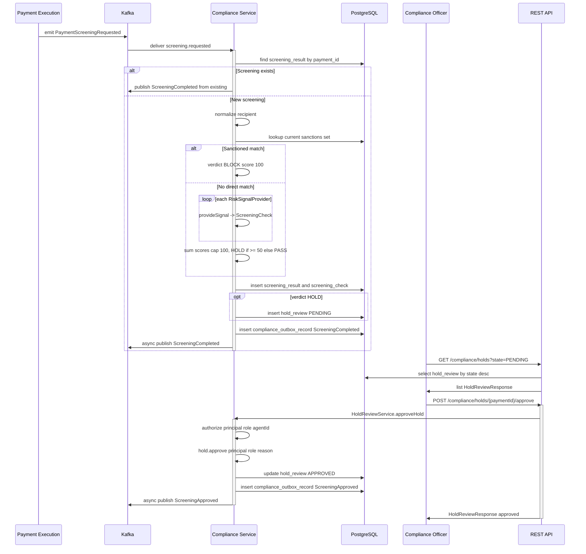
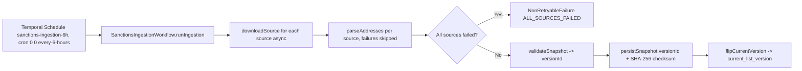
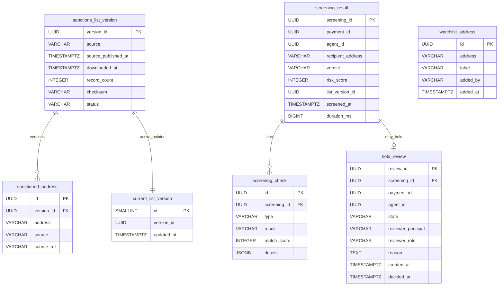

# Compliance Service

The **Compliance Service** (`:8082`) is ArcPay's automated risk-screening gate for outbound USDC payments. It consumes `screening.requested` events emitted during payment execution, runs a multi-signal risk assessment (sanctions match, internal watchlist, on-chain counterparty interaction, on-chain novelty, mixer detection) against a normalized recipient address, and returns a **PASS / HOLD / BLOCK** verdict. Clean payments flow straight through; risky ones are parked as human-reviewable holds; sanctioned ones are blocked outright. The service also owns the regulatory data plane: a Temporal-scheduled workflow ingests OFAC, UN, EU, and UK HMT sanctions lists every six hours and atomically flips the active list version that all screenings read from.

---

## Responsibilities

- **Consume** `screening.requested` (`PaymentScreeningRequested`) Kafka events.
- **Screen** recipient addresses through a unified sanctions lookup plus a chain of risk-signal providers.
- **Decide** a `Verdict` of `PASS`, `HOLD`, or `BLOCK` and compute a capped risk score.
- **Persist** screening results and per-signal checks to PostgreSQL.
- **Hold & review**: open a `PENDING` hold review on `HOLD` verdicts; let officers/owners approve or reject.
- **Emit** `screening.completed`, `screening.approved`, and `screening.rejected` events via the Namastack transactional outbox.
- **Ingest sanctions**: download, parse, validate, persist, and atomically activate sanctions snapshots on a Temporal schedule.
- **Expose** a REST API for watchlist management and hold/screening queries.

Entry point: `ComplianceApplication` — `@SpringBootApplication`, `@EnableFeignClients(basePackages = "com.arcpay.identity.client")`, `@EnableScheduling`, `@EnableCaching`, `@EnableConfigurationProperties(SanctionsIngestionProperties.class)` (`compliance/compliance/src/main/java/com/arcpay/compliance/ComplianceApplication.java:11-16`).

---

## Screening Flow

A payment screening request travels from Kafka through idempotency checks, the screening engine, persistence, and finally outbox-published completion. On malformed or undeserializable input, the message is routed to a dead-letter topic instead of poisoning the consumer.

### 1. Consume

`ScreeningRequestedListener` binds to the topic via `@KafkaListener(topics = PaymentScreeningRequested.TOPIC)` and delegates to `ScreeningRequestHandler.handle(event)` (`application/stream/ScreeningRequestedListener.java:16,19`). The topic string is `screening.requested` (`compliance-api/.../domain/event/PaymentScreeningRequested.java:18`).

The `PaymentScreeningRequested` payload carries `paymentId`, `agentId`, `recipientAddress`, `amount`, `currency`, and `requestedAt` (`compliance-api/.../domain/event/PaymentScreeningRequested.java:10-16`).

### 2. Idempotency & Persist

`ScreeningRequestHandler.handle` is `@Transactional` (`application/stream/ScreeningRequestHandler.java:30`). It first looks up an existing screening by `paymentId`; if one exists it re-publishes `ScreeningCompleted` with the stored result and returns (lines 32-37). Otherwise it runs the engine, persists the result and its checks via `screeningStore.insert(result, result.checks())`, creates a `PENDING` hold review when the verdict is `HOLD`, and publishes `ScreeningCompleted` (lines 39-46).

### 3. Screen & Decide

`ScreeningService` implements the `ScreeningEngine` port (`domain/port/ScreeningEngine.java`). Its `screen(paymentId, agentId, recipientAddress)` method (`domain/service/ScreeningService.java:40-68`):

1. Normalizes the address via `AddressNormalizer.normalize(...)` (line 43); a non-`^0x[0-9a-f]{40}$` value throws `MalformedAddressException` (`domain/service/AddressNormalizer.java:9,18-20`).
2. Loads the current sanctions set from `sanctionsSetProvider.getCurrentSanctionsSet()` (line 44).
3. **Direct sanctions match** -> `BLOCK`, risk score `100`, a single `SANCTIONS_OFAC` check with result `MATCH` (lines 47-58, 93-100).
4. Otherwise iterates every `RiskSignalProvider`, collecting a `ScreeningCheck` from each (lines 60-63).
5. Sums match scores and caps the total at `100` (lines 65, 102-104).
6. `riskScore >= holdThreshold` -> `HOLD`, else `PASS` (line 66).

The hold threshold defaults to `compliance.screening.hold-threshold: 50` (`application.yml:59`), wired into a `ScreeningThreshold` bean (`application/config/ScreeningConfig.java:11-14`).

### Verdict & Check Model

| Model | Values / Fields |
|-------|-----------------|
| `Verdict` | `PASS`, `HOLD`, `BLOCK` (`compliance-api/.../domain/model/Verdict.java:3-7`) |
| `CheckType` | `SANCTIONS_OFAC`, `SANCTIONS_UN`, `SANCTIONS_EU`, `SANCTIONS_UK`, `WATCHLIST`, `ONCHAIN_INTERACTION`, `ONCHAIN_NOVELTY`, `ONCHAIN_MIXER` (`compliance-api/.../domain/model/CheckType.java:3-12`) |
| `CheckResult` | `CLEAR`, `LOW_RISK`, `FLAGGED`, `MATCH` (`compliance-api/.../domain/model/CheckResult.java:3-8`) |
| `ScreeningResult` | `screeningId`, `paymentId`, `agentId`, `recipientAddress`, `verdict`, `riskScore`, `checks`, `listVersionId`, `screenedAt`, `durationMs` (`domain/model/ScreeningResult.java:10-20`) |
| `ScreeningCheck` | `type`, `result`, `matchScore`, `details` (`compliance-api/.../domain/model/ScreeningCheck.java:8`) |

> Note: only the consolidated `SANCTIONS_OFAC` check type is emitted for sanctions matches; `SANCTIONS_UN`, `SANCTIONS_EU`, and `SANCTIONS_UK` are defined in the enum but are not separately generated — all sources merge into one sanctions set persisted under the aggregate source `ALL` (`infrastructure/db/SanctionsSnapshotWriterAdapter.java:24,42`).

---

## Risk Signal Providers

All providers implement `RiskSignalProvider.provideSignal(String recipientAddress) -> ScreeningCheck` (`domain/port/RiskSignalProvider.java:5-7`). Their `matchScore` values are summed (then capped at 100) to produce the final risk score for `HOLD`/`PASS` decisions.

| Provider | Check Type | Score on hit | Logic | Path |
|----------|-----------|--------------|-------|------|
| `WatchlistSignalProvider` | `WATCHLIST` | `100` | `watchlistStore.contains(address)` -> `MATCH` | `infrastructure/watchlist/WatchlistSignalProvider.java:16,22,25-26` |
| `OnChainInteractionSignalProvider` | `ONCHAIN_INTERACTION` | `70` | any on-chain counterparty is in the sanctions set -> `FLAGGED` | `infrastructure/onchain/OnChainInteractionSignalProvider.java:19,25-50` |
| `OnChainNoveltySignalProvider` | `ONCHAIN_NOVELTY` | `10` | no prior USDC counterparties -> `LOW_RISK` | `infrastructure/onchain/OnChainNoveltySignalProvider.java:18,23-31` |
| `MixerSignalProvider` | `ONCHAIN_MIXER` | `mixer-score` (default `50`) | address matches configured mixer set -> `FLAGGED` | `infrastructure/mixer/MixerSignalProvider.java:22-23,33-43` |

Mixer addresses are sourced from `${compliance.onchain.mixer-addresses:}` (empty list by default, `application.yml:78`).

> **Conditional activation:** The two on-chain providers and their scanner are `@ConditionalOnBean(Web3j.class)` (`OnChainInteractionSignalProvider.java:15`, `OnChainNoveltySignalProvider.java:14`, `UsdcTransferLogScanner.java:24`). The `Web3j` bean is created only when `compliance.onchain.rpc-url` is set (`infrastructure/onchain/OnChainConfig.java:14-18`); `rpc-url` defaults to empty (`application.yml:75`). With no RPC configured, only `WatchlistSignalProvider` and `MixerSignalProvider` participate in the signal chain.

---

## On-Chain Screening (web3j `eth_getLogs`)

When enabled, the on-chain providers determine a recipient's counterparties by scanning USDC `Transfer` events over a **bounded block window** via web3j.

`UsdcTransferLogScanner.counterpartiesOf(String recipientAddress)` (`infrastructure/onchain/UsdcTransferLogScanner.java:38-54`):

1. Reads the latest block with `web3j.ethBlockNumber()` (line 40).
2. Computes `fromBlock = latest - scanBlockWindow`, clamped to zero (lines 41-44); window is `compliance.onchain.scan-block-window: 50000` (`application.yml:77`, `infrastructure/onchain/OnChainProperties.java:11`).
3. Builds a left-padded topic from the recipient address (lines 45, 92-95).
4. Issues two `eth_getLogs` queries — recipient as `from`, then recipient as `to` (lines 47-48, 56-90).
5. Decodes the `Transfer(address indexed from, address indexed to, uint256 value)` event, extracting counterparties from `topics[1]` / `topics[2]` (lines 28-33, 78-87).
6. Returns a deduplicated counterparty set; on any exception it logs a warning and returns an empty set (lines 50-53).

The USDC contract address comes from `${ARC_USDC_ADDRESS}` (`application.yml:76`). There are no Solidity contracts in this service — the chain is read-only via RPC.

---

## Dead-Letter Topic (DLT) Error Handling

`ScreeningConsumerErrorConfig` hardens the Kafka consumer so that bad messages do not block the partition (`infrastructure/messaging/ScreeningConsumerErrorConfig.java:23-70`).

- **DLT routing**: failed messages go to `{original-topic}.dlt` (suffix `".dlt"`, line 26) via a `DeadLetterPublishingRecoverer`, with the target partition fixed to `-1` (lines 34-36).
- **Backoff**: exponential — initial `1000ms`, max `5000ms`, multiplier `2.0`, up to `3` attempts (lines 38-42).
- **Non-retryable exceptions**: `MalformedAddressException` and `DeserializationException` skip retries and go straight to the DLT (line 45).
- **Metric**: a `compliance.screening.dlt` counter is incremented on recovery (when a message is sent to the DLT) (lines 30-32, 46-54).
- **DLT templates**: separate serializers per message type — `ByteArraySerializer` for `byte[]` messages, the supplied JSON `KafkaTemplate` for objects (lines 58-69).

The consumer itself uses `ErrorHandlingDeserializer` for both key and value, with trusted package `com.arcpay.compliance.domain.event` (`application.yml:25-30`).

---

## Hold Review (Approve / Reject)

When a screening yields `HOLD`, a `HoldReview` row is created in `PENDING` state. Compliance officers (or the owning party) then resolve it.

**Domain model** — `HoldReview` carries `reviewId`, `screeningId`, `paymentId`, `agentId`, `state`, `reviewerPrincipal`, `reviewerRole`, `reason`, `createdAt`, `decidedAt` (`domain/model/HoldReview.java:11-21`). `ReviewState` is `PENDING`, `APPROVED`, `REJECTED` (`domain/model/ReviewState.java:3-7`).

State transitions are immutable: `approve(...)` / `reject(...)` route through a private `decide(...)` that validates the review is `PENDING`, that principal/role are non-null, and that the stripped reason is at least 10 characters, then returns a new instance with the new state, reviewer info, and `decidedAt` (`domain/model/HoldReview.java:32-56`).

**Service** — `HoldReviewService.approveHold` / `rejectHold` (`domain/service/HoldReviewService.java:26-54`) load the hold by `paymentId`, authorize the reviewer via `reviewAuthorizer.canReview(principal, role, agentId)`, apply the transition, persist the update, and publish the decision event. `DefaultReviewAuthorizer` grants any `COMPLIANCE_OFFICER` unconditionally; otherwise it resolves the agent's owner via `OwnerResolver` and matches the authenticated principal's `ownerId` (`infrastructure/review/DefaultReviewAuthorizer.java:22-35`). Owner resolution is a Feign call to the Identity Service via `IdentityServiceClient.getAgent(agentId).ownerId()` (`infrastructure/client/identity/IdentityServiceAdapter.java:21-30`).

---

## Events

All outbound events are published through the Namastack transactional outbox, keyed by `paymentId`.

| Event | Topic | Key Fields | Path |
|-------|-------|-----------|------|
| `PaymentScreeningRequested` (inbound) | `screening.requested` | `paymentId`, `agentId`, `recipientAddress`, `amount`, `currency`, `requestedAt` | `compliance-api/.../event/PaymentScreeningRequested.java:10-18` |
| `ScreeningCompleted` | `screening.completed` | `paymentId`, `agentId`, `verdict`, `riskScore`, `checks`, `listVersionId`, `screenedAt` | `compliance-api/.../event/ScreeningCompleted.java:12-21` |
| `ScreeningApproved` | `screening.approved` | `paymentId`, `reviewer`, `reason`, `decidedAt` | `compliance-api/.../event/ScreeningApproved.java:9-11` |
| `ScreeningRejected` | `screening.rejected` | `paymentId`, `reviewer`, `reason`, `decidedAt` | `compliance-api/.../event/ScreeningRejected.java:9-11` |

`ComplianceOutboxEventPublisher` extends `AbstractOutboxEventPublisher` with key property list `["paymentId"]` (`infrastructure/messaging/ComplianceOutboxEventPublisher.java:12-14`). The outbox uses table prefix `compliance_`, poll interval `2000ms`, batch size `20`, and exponential retry (max 5, initial 1000ms, max 60000ms, multiplier 2.0) (`application.yml:38-52`).

---

## REST API

Base paths: `/compliance/watchlist`, `/compliance/holds`, `/compliance/screenings`. Authentication is via `ApiKeyAuthFilter` (owner API keys -> `OwnerPrincipal`) and `ServiceAuthFilter` (`X-Service-Auth` service token) (`application/security/SecurityConfig.java:60-61,79-87`).

| Method | Path | Auth | Purpose |
|--------|------|------|---------|
| `POST` | `/compliance/watchlist` | `COMPLIANCE_OFFICER` | Add a watchlist address (validated `^0x[0-9a-fA-F]{40}$` in the controller, optional label) -> `201` |
| `DELETE` | `/compliance/watchlist/{address}` | `COMPLIANCE_OFFICER` | Remove a watchlist address -> `204` |
| `GET` | `/compliance/watchlist` | `COMPLIANCE_OFFICER` | List all watchlist entries, sorted |
| `GET` | `/compliance/screenings/{paymentId}` | `COMPLIANCE_OFFICER` | Fetch a screening result by payment id |
| `GET` | `/compliance/holds` | `COMPLIANCE_OFFICER` | List holds by `state` (default `PENDING`), newest first, capped at 200 |
| `GET` | `/compliance/holds/{paymentId}` | `COMPLIANCE_OFFICER` | Fetch a single hold by payment id |
| `POST` | `/compliance/holds/{paymentId}/approve` | authenticated owner principal | Approve a held payment (body `reason`) |
| `POST` | `/compliance/holds/{paymentId}/reject` | authenticated owner principal | Reject a held payment (body `reason`) |

- **Watchlist** — `WatchlistController` (`application/controller/WatchlistController.java:32-74`): add normalizes/validates the address then calls `watchlistStore.addAddress(normalized, label, principal.email())`; delete normalizes then `removeAddress`; list returns sorted `WatchlistEntryResponse` DTOs. All three routes are gated by `COMPLIANCE_OFFICER` in `SecurityConfig` (`SecurityConfig.java:50-51`).
- **Screening / hold queries** — `ScreeningQueryController` (`application/controller/ScreeningQueryController.java:24-56`): `GET /compliance/screenings/{paymentId}` maps via `screeningQueryMapper.toApi(...)` and throws `ScreeningNotFoundException` if absent; `GET /compliance/holds` calls `findByStateOrderByCreatedAtDesc(state)`; `GET /compliance/holds/{paymentId}` throws `HoldNotFoundException` if absent.
- **Hold decisions** — `HoldReviewController` (`application/controller/HoldReviewController.java:25-54`): resolves the current reviewer (email + authority) from the `OwnerPrincipal` in the security context and delegates to `HoldReviewService.approveHold` / `rejectHold`, returning `HoldReviewResponse`. Authorization (officer-or-owner) is enforced inside `HoldReviewService` rather than by URL role rules.

Role mapping and access rules live in `SecurityConfig` (`application/security/SecurityConfig.java:42-62`); internal `/api/v1/internal/**` endpoints require the `SERVICE` role (lines 48-49).

> The hold queue is capped at 200 rows: `HoldReviewStoreAdapter.findByStateOrderByCreatedAtDesc` requests `PageRequest.of(0, 200, ...)` (`infrastructure/db/HoldReviewStoreAdapter.java:21,52-59`).

---

## Sanctions Ingestion (Temporal Scheduled Workflow)

Sanctions data is refreshed on a Temporal schedule that downloads all sources in parallel, parses and validates them, persists a snapshot, and atomically flips the active version pointer.

- **Workflow** — `SanctionsIngestionWorkflow` defines `WORKFLOW_ID = "SanctionsIngestion"`, `TASK_QUEUE = "ComplianceTaskQueue"`, and `runIngestion(String triggerTimestamp)` (`infrastructure/temporal/SanctionsIngestionWorkflow.java:9-14`). The impl is `@WorkflowImpl(taskQueues = "ComplianceTaskQueue")` (`SanctionsIngestionWorkflowImpl.java:19`).
- **Execution** (`SanctionsIngestionWorkflowImpl.java:44-79`): launches `Async.function(sourceActivities::downloadSource, source)` for each source (lines 48-51), then sequentially calls `parseAddresses(source, rawData)` per download, catching `ActivityFailure` (all retries exhausted) and continuing (lines 53-64). If **every** source fails it throws `ApplicationFailure.newNonRetryableFailure("All sanctions sources failed", "ALL_SOURCES_FAILED")` (lines 66-68). It then calls `validateSnapshot` -> `versionId`, `persistSnapshot`, and `flipCurrentVersion` (lines 70-73). The `sourceActivities` stub uses a 5-minute start-to-close timeout with up to 5 exponential-backoff retries; `flipActivities` uses a 30s timeout and a single attempt (no retry) (lines 24-42).
- **Activities** — `SanctionsIngestionActivitiesImpl` (`infrastructure/temporal/SanctionsIngestionActivitiesImpl.java:27-97`): `downloadSource` delegates to `SanctionsFeedDownloader`; `parseAddresses` UTF-8 decodes and routes through `ParserRegistry.parserFor(source)`; `validateSnapshot` rejects total record counts `< 1` (`EMPTY_SNAPSHOT`) or `> 10_000_000` (`OVERSIZED_SNAPSHOT`) with non-retryable failures and otherwise returns a random `versionId`; `persistSnapshot` computes a SHA-256 checksum over canonically (source- and address-) ordered records, calls `snapshotWriter.persistSnapshot(...)`, and records per-source success in the refresh tracker; `flipCurrentVersion` updates the `current_list_version` pointer.
- **Schedule** — `SanctionsScheduleRegistrar` (`InitializingBean`) registers schedule id `"sanctions-ingestion-6h"` in `afterPropertiesSet`, using the cron from `properties.refreshCron()`, action workflow type `SanctionsIngestionWorkflow` with workflow id `SanctionsIngestionWorkflow.WORKFLOW_ID` on task queue `ComplianceTaskQueue`, overlap policy `SKIP`, and unpaused initial state; an existing-schedule `ScheduleException` is swallowed (`infrastructure/temporal/SanctionsScheduleRegistrar.java:26-61`).
- **Sources** — `SanctionsSource` enum: `OFAC_SDN`, `OFAC_NONSDN`, `UN`, `EU`, `UK_HMT` (`infrastructure/sanctions/SanctionsSource.java:3-9`). Refresh cron is `0 0 */6 * * *` and feed URLs are configured at `application.yml:61,68-73`.

### Active Set Caching

`SanctionsSetCache` is the `@Primary` `SanctionsSetProvider` (`infrastructure/sanctions/SanctionsSetCache.java:16-18`). It holds an `AtomicReference` snapshot, initializes it empty on `@PostConstruct` and then refreshes (lines 27-31), and on a `@Scheduled(fixedDelayString = "${compliance.sanctions.poll-interval-ms}")` poll fetches from the DB adapter and swaps in a new set only when the `versionId` differs, logging the address count; on failure it retains the previous snapshot (lines 42-60). `SanctionsSnapshotAdapter` reads the singleton `current_list_version` row (`CURRENT_POINTER_ID = 1`) for the active `versionId`, then loads all `sanctioned_address` rows for that version into a `SanctionsSet` (`infrastructure/db/SanctionsSnapshotAdapter.java:18,25-46`). `SanctionsSet.contains(normalizedAddress)` backs the direct sanctions check (`domain/model/SanctionsSet.java:17-19`).

---

## Persistence

PostgreSQL is the source of truth. Flyway is enabled (`application.yml:18-19`) with JPA `ddl-auto: validate` (`application.yml:14-16`) — migrations are definitive. Eight migrations live under `compliance/compliance/src/main/resources/db/migration/`.

| # | Migration | Table | Notes |
|---|-----------|-------|-------|
| V1 | `V1__113_create_sanctions_list_version.sql` | `sanctions_list_version` | snapshot metadata; `status` default `ACTIVE` |
| V2 | `V2__113_create_sanctioned_address.sql` | `sanctioned_address` | FK to version; index `idx_sanctioned_address_lookup (version_id, address)` |
| V3 | `V3__113_create_current_list_version.sql` | `current_list_version` | singleton (`id` SMALLINT PK, `CHECK (id = 1)`) pointing at the active version |
| V4 | `V4__113_create_watchlist_address.sql` | `watchlist_address` | `address` unique; `added_by` recorded |
| V5 | `V5__113_create_screening_result.sql` | `screening_result` | `payment_id` unique; index `idx_screening_result_agent (agent_id, screened_at)` |
| V6 | `V6__113_create_screening_check.sql` | `screening_check` | FK to result; `details` JSONB |
| V7 | `V7__113_create_hold_review.sql` | `hold_review` | `payment_id` unique; `state` default `PENDING`; index `idx_hold_review_queue (state, created_at)` |
| V8 | `V8__113_create_outbox_tables.sql` | `compliance_outbox_record`, `compliance_outbox_instance`, `compliance_outbox_partition` | Namastack outbox tables |

---

## Configuration Reference

| Concern | Value | Source |
|---------|-------|--------|
| HTTP port | `8082` (via `SERVER_PORT`) | `docker-compose.yml:145,148,151` |
| Kafka consumer group | `compliance`, `auto-offset-reset: earliest`, `ErrorHandlingDeserializer` | `application.yml:22-30` |
| Trusted event packages | `com.arcpay.compliance.domain.event` | `application.yml:30` |
| Temporal | target `${TEMPORAL_ADDRESS:localhost:7233}`, namespace `arcpay`, auto-discovery `com.arcpay.compliance` | `application.yml:31-36` |
| Temporal task queue | `ComplianceTaskQueue` | `application.yml:54-55`, `SanctionsIngestionWorkflow.java:11` |
| Hold threshold | `50` | `application.yml:59` |
| Scan block window | `50000` | `application.yml:77` |
| USDC contract | `${ARC_USDC_ADDRESS}` | `application.yml:76` |
| On-chain RPC URL | `${ARC_RPC_URL:}` (empty -> Web3j/on-chain providers disabled) | `application.yml:75` |
| Mixer addresses / score | `[]` / `50` | `application.yml:78-79` |
| Sanctions cron | `0 0 */6 * * *`; staleness warn `12h`, critical `24h` (OFAC SDN) | `application.yml:61-65` |
| Identity service | `${IDENTITY_SERVICE_URL:http://localhost:8080}` | `application.yml:98-100` |

---

## Related pages

- [[Payment-Execution-Service]] — emits `screening.requested` and consumes `screening.completed` / `screening.approved` / `screening.rejected`.
- [[Agent-Identity-Service]] — resolves agent owners for hold-review authorization.
- [[Policy-Engine-Service]]
- [[Settlement-Service]]
- [[Architecture-Overview]]
