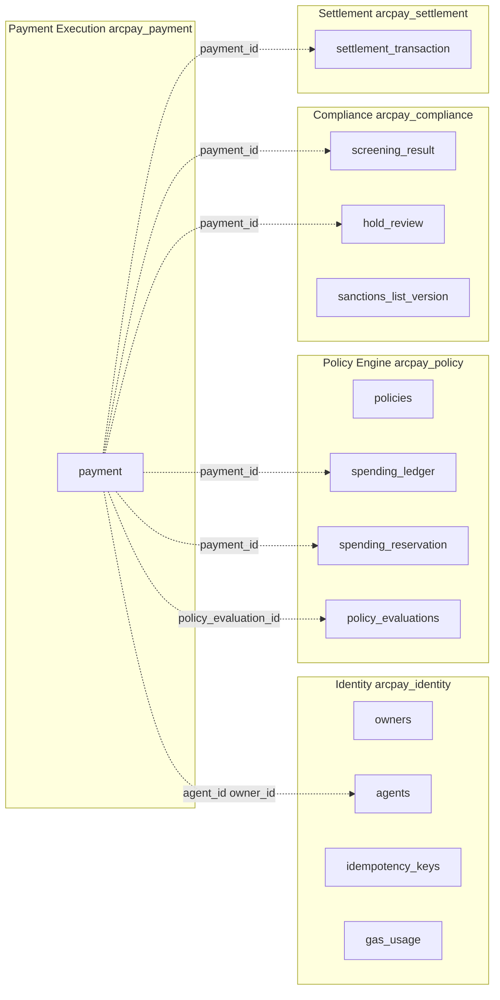
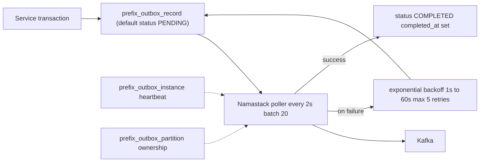

# Data and Persistence

ArcPay runs five microservices, and each one owns its own PostgreSQL database with no shared schemas and no cross-service foreign keys. Every relationship that crosses a service boundary is just an opaque UUID, reconciled through REST calls, Temporal workflows, or asynchronous Kafka events delivered via a namastack transactional outbox. Schema is owned entirely by Flyway (`ddl-auto: validate`), money is stored as fixed-precision `NUMERIC`, enums are persisted as strings, and complex structures land in `JSONB`. This page is the authoritative map of every table, convention, and constraint in the platform.

---

## Database-per-Service Model

Each service connects to a dedicated logical database. Schema creation is forbidden at runtime (`spring.jpa.hibernate.ddl-auto: validate`) so Flyway is the single source of DDL truth.

| Service | Database | Default JDBC URL | Port | Datasource Config |
|---------|----------|------------------|------|-------------------|
| Agent Identity | `arcpay_identity` | `jdbc:postgresql://localhost:5432/arcpay_identity` | 8080 | `identity/identity/src/main/resources/application.yml:5` |
| Policy Engine | `arcpay_policy` | `jdbc:postgresql://localhost:5432/arcpay_policy` | 8081 | `policy-engine/policy-engine/src/main/resources/application.yml:14` |
| Compliance | `arcpay_compliance` | `jdbc:postgresql://localhost:5432/arcpay_compliance` | 8082 | `compliance/compliance/src/main/resources/application.yml:11` |
| Payment Execution | `arcpay_payment` | `jdbc:postgresql://localhost:5432/arcpay_payment` | 8083 | `payment-execution/payment-execution/src/main/resources/application.yml:11` |
| Settlement | `arcpay_settlement` | `jdbc:postgresql://localhost:5432/arcpay_settlement` | 8084 | `settlement/settlement/src/main/resources/application.yml:5` |

> Only Policy Engine pins `server.port: 8081` in `application.yml` (line 2). The other four services receive their port via the `SERVER_PORT` environment variable in `docker-compose.yml` (lines 103/151/174/198 → 8080/8082/8083/8084).

Shared datasource conventions (Identity shown; mirrored across services):

- `SPRING_DATASOURCE_URL` env override — `identity/identity/src/main/resources/application.yml:5`
- `DB_USERNAME` / `DB_PASSWORD` default to `arcpay` / `arcpay` — `application.yml:6-7`
- `spring.jpa.hibernate.ddl-auto: validate` — Flyway owns all DDL — `application.yml:10`
- `spring.flyway.enabled: true` — `application.yml:13`

### Flyway Naming Convention

Migrations follow `V<version>__<ticket>_<description>.sql`. Identity's migrations omit the ticket segment (`V1__create_owners_table.sql`); later services include it (`V1__42_create_policies_table.sql`, `V8__113_create_outbox_tables.sql`). Migration counts per service: Identity 5, Policy Engine 7, Compliance 8, Payment Execution 2, Settlement 2.

---

## Cross-Service Data Topology

No database-level referential integrity crosses a service boundary. Identifiers are passed as opaque UUIDs and consistency is maintained at the application/messaging layer.



| Relationship | From | To | Storage | Enforcement |
|--------------|------|----|---------|-------------|
| Payment to Owner | `payment.owner_id` | `owners.owner_id` | UUID reference | Application layer |
| Payment to Agent | `payment.agent_id` | `agents.agent_id` | UUID reference | Application layer |
| Payment to Policy Evaluation | `payment.policy_evaluation_id` | `policy_evaluations.evaluation_id` | UUID reference | Temporal/workflow engine |
| Screening to Payment | `screening_result.payment_id` | `payment.payment_id` | Unique 1:1 | Compliance to Payment messaging |
| Settlement to Payment | `settlement_transaction.payment_id` | `payment.payment_id` | PK 1:1 | Settlement from Payment events |
| Spending Ledger to Payment | `spending_ledger.payment_id` | `payment.payment_id` | Unique 1:1 | Policy from Payment events |
| Reservation to Payment | `spending_reservation.payment_id` | `payment.payment_id` | PK 1:1 | Policy from Payment events |

---

## Identity Service (`arcpay_identity`)

Five migrations under `identity/identity/src/main/resources/db/migration/`: `V1__create_owners_table.sql`, `V2__create_agents_table.sql`, `V3__create_idempotency_keys_table.sql`, `V4__create_outbox_tables.sql`, `V5__create_gas_usage_table.sql`.

### `owners`
Owner account registration and authentication — `V1__create_owners_table.sql:1-14`.

- `owner_id` (UUID) PK
- `email` (VARCHAR 255) — case-insensitive unique via `idx_owners_email` on `LOWER(email)`
- `wallet_address` (VARCHAR 42) — case-insensitive unique via `idx_owners_wallet` on `LOWER(...)`
- `api_key_hash` (VARCHAR 64) — SHA256 of API key, indexed
- `status` (VARCHAR 20, default `ACTIVE`) — `OwnerStatus`: `ACTIVE, SUSPENDED` (`OwnerStatus.java:3-6`)
- `created_at`, `updated_at` (TIMESTAMPTZ)

Entity: `OwnerEntity` — `infrastructure/db/owner/OwnerEntity.java:22`, status via `@Enumerated(EnumType.STRING)` at line 45.

### `agents`
Agent provisioning and lifecycle tracking — `V2__create_agents_table.sql:1-21`.

- `agent_id` (UUID) PK
- `owner_id` (UUID) FK to `owners` — `V2:16`
- `name` (VARCHAR 64) — unique per owner via `idx_agents_owner_name` on `(owner_id, LOWER(name))`
- `purpose` (VARCHAR 256)
- `status` (VARCHAR 20, default `PROVISIONING`) — `AgentStatus`: `PROVISIONING, WALLET_READY, ACTIVE, SUSPENDED, FAILED` (`AgentStatus.java:3-9`)
- `wallet_id` (VARCHAR 255), `wallet_address` (VARCHAR 42)
- `on_chain_tx_hash` (VARCHAR 66), `policy_hash` (VARCHAR 66), `metadata_hash` (VARCHAR 66, `NOT NULL`)
- `failure_reason` (TEXT)
- `created_at`, `updated_at` (TIMESTAMPTZ)

Entity: `AgentEntity` — `infrastructure/db/agent/AgentEntity.java:20`, status via `@Enumerated(EnumType.STRING)` at line 44.

### `idempotency_keys`
Duplicate request detection with 24-hour TTL — `V3__create_idempotency_keys_table.sql:1-13`.

- `idempotency_key` (UUID) + `owner_id` (UUID) — composite PK
- `endpoint` (VARCHAR 255), `response_status` (INTEGER), `response_body` (TEXT)
- `created_at` (TIMESTAMPTZ), `expires_at` (TIMESTAMPTZ, `now() + INTERVAL '24 hours'`) — `V3:8`

Entity: `IdempotencyKeyEntity` — `infrastructure/db/idempotency/IdempotencyKeyEntity.java:18`, composite key via `@IdClass(IdempotencyKeyId.class)` at line 19.

### `gas_usage`
On-chain transaction gas costs per owner/agent — `V5__create_gas_usage_table.sql:1-14`.

- `id` (UUID) PK
- `owner_id` (UUID) FK to `owners`, `agent_id` (UUID, nullable — no FK)
- `operation` (VARCHAR 50), `tx_hash` (VARCHAR 66)
- `gas_used` (BIGINT), `gas_cost_usdc` (NUMERIC 18,8)
- `created_at` (TIMESTAMPTZ)

Entity: `GasUsageEntity` — `infrastructure/db/gasusage/GasUsageEntity.java:18`, `gasCostUsdc` as `BigDecimal(precision 18, scale 8)` at line 47.

Outbox tables: `agentidentity_outbox_record`, `agentidentity_outbox_instance`, `agentidentity_outbox_partition` (see [Transactional Outbox](#transactional-outbox-namastack)).

---

## Policy Engine (`arcpay_policy`)

Seven migrations under `policy-engine/policy-engine/src/main/resources/db/migration/`: `V1__42_create_policies_table.sql`, `V2__42_create_spending_ledger_table.sql`, `V3__42_create_spending_locks_table.sql`, `V4__42_create_policy_evaluations_table.sql`, `V5__42_create_outbox_tables.sql`, `V6__55_create_shedlock_table.sql`, `V7__139_create_spending_reservation.sql`.

### `policies`
Versioned policy definitions per agent — `V1__42_create_policies_table.sql:1-15`.

- `policy_id` (UUID) PK
- `agent_id` (UUID), `owner_id` (UUID)
- `version` (INT) — unique per agent via `policies_agent_version_uq` on `(agent_id, version)`
- `rules` (JSONB) — `V1:6`
- `policy_hash` (VARCHAR 66)
- `status` (VARCHAR 20, default `ACTIVE`) — `PolicyStatus`: `ACTIVE, SUPERSEDED` (`PolicyStatus.java:3-6`)
- `created_at`, `updated_at` (TIMESTAMPTZ)

Entity: `PolicyEntity` — `infrastructure/db/policy/PolicyEntity.java:22`, `rules` via `@JdbcTypeCode(SqlTypes.JSON)` at lines 45-47.

### `spending_ledger`
Immutable record of each executed payment — `V2__42_create_spending_ledger_table.sql:1-13`.

- `entry_id` (UUID) PK
- `agent_id` (UUID), `payment_id` (UUID) — unique via `spending_ledger_payment_uq`
- `amount` (NUMERIC 18,6), `recipient` (VARCHAR 42)
- `executed_at`, `created_at` (TIMESTAMPTZ)

Entity: `SpendingLedgerEntity` — `infrastructure/db/spending/SpendingLedgerEntity.java:18`, `amount` mapped `precision 18, scale 6` at lines 38-39.

### `spending_locks`
Distributed mutex preventing concurrent spend evaluation races — `V3__42_create_spending_locks_table.sql:1-5`.

- `agent_id` (UUID) PK, `created_at` (TIMESTAMPTZ)

Entity: `SpendingLockEntity` — `infrastructure/db/spending/SpendingLockEntity.java:17`.

### `policy_evaluations`
Audit trail of evaluation decisions with retention window — `V4__42_create_policy_evaluations_table.sql:1-15`.

- `evaluation_id` (UUID) PK
- `agent_id` (UUID), `policy_id` (UUID)
- `verdict` (VARCHAR 20) — `PolicyVerdict`: `APPROVED, REJECTED, REQUIRES_APPROVAL` (`PolicyVerdict.java:3-7`)
- `rule_results` (JSONB) — `V4:6`
- `requested_amount` (NUMERIC 18,6), `recipient_address` (VARCHAR 42)
- `duration_ms` (INT), `dry_run` (BOOLEAN, default `false`), `evaluated_at` (TIMESTAMPTZ)

Entity: `PolicyEvaluationEntity` — `infrastructure/db/evaluation/PolicyEvaluationEntity.java:23`. Retention is configurable: `arcpay.policy.evaluation.retention-days` (default 90; `application.yml:57`), cleanup via `arcpay.policy.evaluation.cleanup-cron` (default `0 0 2 * * *`; `application.yml:58`).

### `spending_reservation`
Pre-authorization holds before evaluation completes — `V7__139_create_spending_reservation.sql:1-11`.

- `payment_id` (UUID) PK
- `agent_id` (UUID), `amount` (NUMERIC 18,6), `recipient` (VARCHAR 42)
- `status` (VARCHAR 16) — `ReservationStatus`: `HELD, COMMITTED, RELEASED` (`ReservationStatus.java:3-7`)
- `created_at` (TIMESTAMPTZ)

Entity: `ReservationEntity` — `infrastructure/db/spending/ReservationEntity.java:21`.

### `shedlock`
Standard ShedLock table coordinating scheduled tasks across instances — `V6__55_create_shedlock_table.sql:1-7`.

- `name` (VARCHAR 64) PK, `lock_until` (TIMESTAMPTZ), `locked_at` (TIMESTAMPTZ), `locked_by` (VARCHAR 255)

Outbox tables: `policyengine_outbox_record`, `policyengine_outbox_instance`, `policyengine_outbox_partition`.

---

## Compliance Service (`arcpay_compliance`)

Eight migrations under `compliance/compliance/src/main/resources/db/migration/`, all ticket 113: `V1__113_create_sanctions_list_version.sql` through `V8__113_create_outbox_tables.sql`.

### `sanctions_list_version`
Metadata for each sanctions list snapshot — `V1__113_create_sanctions_list_version.sql:1-9`.

- `version_id` (UUID) PK
- `source` (VARCHAR 32) — configured sources `OFAC_SDN, OFAC_NONSDN, UN, EU, UK_HMT` (`application.yml:67`)
- `source_published_at` (TIMESTAMPTZ, nullable), `downloaded_at` (TIMESTAMPTZ)
- `record_count` (INTEGER), `checksum` (VARCHAR 128)
- `status` (VARCHAR 16, default `ACTIVE`)

Entity: `SanctionsListVersionEntity` — `infrastructure/db/SanctionsListVersionEntity.java:17`.

### `sanctioned_address`
Denormalized addresses, one row per address per version — `V2__113_create_sanctioned_address.sql:1-9`.

- `id` (UUID) PK, `version_id` (UUID) FK to `sanctions_list_version`
- `address` (VARCHAR 64), `source` (VARCHAR 32), `source_ref` (VARCHAR 128, nullable)
- Index `idx_sanctioned_address_lookup` on `(version_id, address)`

Entity: `SanctionedAddressEntity` — `infrastructure/db/SanctionedAddressEntity.java:16`.

### `current_list_version`
Singleton pointer to the active sanctions list, enabling atomic swaps during refresh — `V3__113_create_current_list_version.sql:1-5`.

- `id` (SMALLINT) PK, default `1`, constrained `CHECK (id = 1)`
- `version_id` (UUID, `NOT NULL` — no FK), `updated_at` (TIMESTAMPTZ)

### `watchlist_address`
Manually curated suspect addresses for enhanced monitoring — `V4__113_create_watchlist_address.sql:1-7`.

- `id` (UUID) PK, `address` (VARCHAR 64, unique)
- `label` (VARCHAR 255, nullable), `added_by` (VARCHAR 255), `added_at` (TIMESTAMPTZ)

### `screening_result`
Outcome of compliance screening per payment — `V5__113_create_screening_result.sql:1-13`.

- `screening_id` (UUID) PK
- `payment_id` (UUID, unique), `agent_id` (UUID), `recipient_address` (VARCHAR 64)
- `verdict` (VARCHAR 8) — `Verdict`: `PASS, HOLD, BLOCK` (`compliance-api/.../domain/model/Verdict.java:3-7`)
- `risk_score` (INTEGER), `list_version_id` (UUID, nullable — no FK)
- `screened_at` (TIMESTAMPTZ), `duration_ms` (BIGINT)
- Index `idx_screening_result_agent` on `(agent_id, screened_at)`

Entity: `ScreeningResultEntity` — `infrastructure/db/ScreeningResultEntity.java:20`. Hold threshold via `compliance.screening.hold-threshold` (default 50; `application.yml:59`).

### `screening_check`
Granular per-check detail under a screening — `V6__113_create_screening_check.sql:1-8`.

- `id` (UUID) PK, `screening_id` (UUID) FK to `screening_result`
- `type` (VARCHAR 32), `result` (VARCHAR 16), `match_score` (INTEGER)
- `details` (JSONB, nullable) — `V6:7`

### `hold_review`
Manual review queue for held payments — `V7__113_create_hold_review.sql:1-14`.

- `review_id` (UUID) PK
- `screening_id` (UUID) FK to `screening_result`, `payment_id` (UUID, unique), `agent_id` (UUID)
- `state` (VARCHAR 16, default `PENDING`) — `ReviewState`: `PENDING, APPROVED, REJECTED` (`ReviewState.java:3-7`)
- `reviewer_principal` (VARCHAR 255, nullable), `reviewer_role` (VARCHAR 32, nullable), `reason` (TEXT, nullable)
- `created_at` (TIMESTAMPTZ), `decided_at` (TIMESTAMPTZ, nullable)
- Index `idx_hold_review_queue` on `(state, created_at)`

Entity: `HoldReviewEntity` — `infrastructure/db/HoldReviewEntity.java:20`.

Outbox tables: `compliance_outbox_record`, `compliance_outbox_instance`, `compliance_outbox_partition` (`V8__113_create_outbox_tables.sql:1-45`).

---

## Payment Execution Service (`arcpay_payment`)

Two migrations under `payment-execution/payment-execution/src/main/resources/db/migration/`: `V1__142_create_payment.sql`, `V2__142_create_outbox_tables.sql`.

### `payment`
Central ledger of all payment requests and their lifecycle — `V1__142_create_payment.sql:1-25`.

- `payment_id` (VARCHAR 36, holds a UUID) PK — `V1:2`
- `agent_id`, `owner_id` (VARCHAR 36, hold UUIDs)
- `idempotency_key` (VARCHAR 255) — unique via `uq_payment_idem` on `(agent_id, idempotency_key)`
- `request_fingerprint` (VARCHAR 66) — web3j `Hash.sha3String` (Keccak-256) of the normalized request (`PaymentOrchestrationService.java:52-61`)
- `recipient_address` (VARCHAR 42), `amount` (NUMERIC 18,6), `currency` (VARCHAR 10), `memo` (VARCHAR 256, nullable)
- `status` (VARCHAR 20) — `PaymentStatus`: `PENDING, POLICY_CHECK, SCREENING, HELD, EXECUTING, COMPLETED, FAILED, REJECTED` (`PaymentStatus.java:3-12`)
- `rejection_reason` (VARCHAR 30, nullable) — `RejectionReason`
- `failure_reason` (VARCHAR 30, nullable) — `FailureReason`
- `tx_hash` (VARCHAR 66, nullable), `on_chain_ref` (VARCHAR 66, nullable)
- `policy_evaluation_id` (VARCHAR 36, nullable, holds a UUID), `compliance_risk_score` (INT, nullable)
- `metadata` (JSONB, nullable) — `V1:18`
- `created_at`, `updated_at` (TIMESTAMPTZ), `completed_at` (TIMESTAMPTZ, nullable)
- Index `idx_payment_agent_status` on `(agent_id, status)`

Entity: `PaymentEntity` — `infrastructure/db/PaymentEntity.java:33`. UUIDs mapped `@JdbcTypeCode(SqlTypes.VARCHAR)` (lines 36, 41, 45, 85); enums via `@Enumerated(EnumType.STRING)` (lines 67, 71, 75); `metadata` via `@JdbcTypeCode(SqlTypes.JSON)` (line 92).

Outbox tables: `paymentexecution_outbox_record`, `paymentexecution_outbox_instance`, `paymentexecution_outbox_partition`.

---

## Settlement Service (`arcpay_settlement`)

Two migrations under `settlement/settlement/src/main/resources/db/migration/`: `V1__151_create_settlement_transaction.sql`, `V2__151_create_outbox_tables.sql`.

### `settlement_transaction`
Record of blockchain transaction submission per payment — `V1__151_create_settlement_transaction.sql:1-13`.

- `payment_id` (VARCHAR 36, holds a UUID) PK — `V1:2`
- `circle_tx_id` (VARCHAR 64, nullable), `tx_hash` (VARCHAR 66, nullable)
- `state` (VARCHAR 20) — `TransferState`: `INITIATED, QUEUED, SENT, CONFIRMED, COMPLETED, FAILED, DENIED, CANCELLED, STUCK` (`TransferState.java:3-13`)
- `network_fee` (NUMERIC 18,6, nullable), `error_reason` (VARCHAR 255, nullable)
- `created_at`, `updated_at` (TIMESTAMPTZ)
- Index `idx_settlement_transaction_circle_tx_id` on `(circle_tx_id)` for Circle webhook correlation

Entity: `SettlementTransactionEntity` — `infrastructure/db/SettlementTransactionEntity.java:23`, `payment_id` via `@JdbcTypeCode(SqlTypes.VARCHAR)` at line 33.

Outbox tables: `settlement_outbox_record`, `settlement_outbox_instance`, `settlement_outbox_partition`.

---

## Transactional Outbox (Namastack)

All five services persist outbound events in their own database inside the same transaction as the state change, then a poller publishes them to Kafka — guaranteeing the event survives even if Kafka is momentarily unavailable.



### Configuration

```yaml
namastack:
  outbox:
    poll-interval: 2000
    batch-size: 20
    jdbc:
      table-prefix: "<service>_"
      schema-initialization:
        enabled: false
    retry:
      policy: exponential
      max-retries: 5
      exponential:
        initial-delay: 1000
        max-delay: 60000
        multiplier: 2.0
```

Schema initialization is disabled because Flyway owns the tables.

### Table Prefix per Service

| Service | Prefix | Config |
|---------|--------|--------|
| Identity | `agentidentity_` | `identity/.../application.yml:35` |
| Policy Engine | `policyengine_` | `policy-engine/.../application.yml:65` |
| Compliance | `compliance_` | `compliance/.../application.yml:43` |
| Payment Execution | `paymentexecution_` | `payment-execution/.../application.yml:41` |
| Settlement | `settlement_` | `settlement/.../application.yml:29` |

### Outbox Table Schema (uniform across services)

**`{prefix}outbox_record`** — the event queue:
- `id` (VARCHAR 255) PK
- `status` (VARCHAR 20, migration default `PENDING`) — the namastack `OutboxRecordStatus` enum is `NEW, COMPLETED, FAILED` (`io.namastack.outbox.OutboxRecordStatus`)
- `record_key` (VARCHAR 255), `record_type` (VARCHAR 255)
- `payload` (TEXT), `context` (TEXT, nullable)
- `created_at` (TIMESTAMPTZ), `completed_at` (TIMESTAMPTZ, nullable), `next_retry_at` (TIMESTAMPTZ, nullable)
- `failure_count` (INTEGER, default 0), `failure_reason` (TEXT, nullable)
- `partition_no` (INTEGER), `handler_id` (VARCHAR 255, nullable)
- Indexes: `(status, next_retry_at)` dequeue; `(record_key, created_at)` dedup; `(status, partition_no, next_retry_at)` partitioned consumers — e.g. `compliance/.../V8__113_create_outbox_tables.sql:1-25`

**`{prefix}outbox_instance`** — processor heartbeat tracking:
- `instance_id` (VARCHAR 255) PK, `hostname` (VARCHAR 255, nullable), `port` (INTEGER, nullable)
- `status` (VARCHAR 20, default `ACTIVE`), `started_at` (TIMESTAMPTZ), `last_heartbeat` (TIMESTAMPTZ, nullable)
- `created_at`, `updated_at` (TIMESTAMPTZ)

**`{prefix}outbox_partition`** — partition ownership and optimistic versioning:
- `partition_number` (INTEGER) PK, `instance_id` (VARCHAR 255, nullable)
- `version` (BIGINT, default 0), `updated_at` (TIMESTAMPTZ)
- e.g. `policy-engine/.../V5__42_create_outbox_tables.sql:39-45`

---

## Column and Type Conventions

These conventions are uniform across services and enforced both in migrations and JPA mappings.

| Concern | Convention | Example |
|---------|-----------|---------|
| UUID | `UUID` natively in Identity/Policy/Compliance; `VARCHAR(36)` mapped to `java.util.UUID` in Payment/Settlement | `payment.payment_id VARCHAR(36)` (`V1__142_create_payment.sql:2`); `PaymentEntity.java:36` `@JdbcTypeCode(SqlTypes.VARCHAR)` |
| Enums | `VARCHAR` string, never ordinal | `PaymentEntity.java:67-68` `@Enumerated(EnumType.STRING)` |
| Complex types | `JSONB` | `policies.rules` (`V1__42_create_policies_table.sql:6`); `PolicyEntity.java:45-47` `@JdbcTypeCode(SqlTypes.JSON)` |
| USDC amounts | `NUMERIC(18,6)` | `payment.amount`, `spending_ledger.amount`; `SpendingLedgerEntity.java:38-39` |
| Gas cost | `NUMERIC(18,8)` | `gas_usage.gas_cost_usdc` (`V5__create_gas_usage_table.sql:8`) |
| Keccak256 hashes | `VARCHAR(66)` (`0x` + 64 hex) | `agents.on_chain_tx_hash`, `policies.policy_hash`, `payment.tx_hash` |
| EVM addresses | `VARCHAR(42)` (`0x` + 40 hex) | `owners.wallet_address`, `payment.recipient_address`, `spending_ledger.recipient` |
| Timestamps | `TIMESTAMPTZ NOT NULL` (Identity/Policy/Compliance default `now()`) | `owners.created_at/updated_at` (`V1__create_owners_table.sql:7-8`); `OwnerEntity.java:49-55` `@CreationTimestamp`/`@UpdateTimestamp` |

---

## Constraints and Indexes

### Unique Constraints

| Table | Constraint | Columns | Purpose |
|-------|-----------|---------|---------|
| owners | `idx_owners_email` | `LOWER(email)` | Case-insensitive email uniqueness |
| owners | `idx_owners_wallet` | `LOWER(wallet_address)` | Case-insensitive wallet uniqueness |
| agents | `idx_agents_owner_name` | `(owner_id, LOWER(name))` | Agent name unique per owner |
| idempotency_keys | composite PK | `(idempotency_key, owner_id)` | 24-hour request dedup |
| policies | `policies_agent_version_uq` | `(agent_id, version)` | One policy per version per agent |
| spending_ledger | `spending_ledger_payment_uq` | `(payment_id)` | One ledger entry per payment |
| payment | `uq_payment_idem` | `(agent_id, idempotency_key)` | Idempotency key unique per agent |
| screening_result | via `payment_id` | `(payment_id)` | One screening per payment |
| hold_review | via `payment_id` | `(payment_id)` | One review per payment |
| watchlist_address | implicit | `(address)` | Unique watchlist addresses |
| current_list_version | `CHECK (id = 1)` | `(id)` | Single active-list pointer row |

### Within-Service Foreign Keys

| From | To |
|------|----|
| `agents.owner_id` | `owners.owner_id` |
| `idempotency_keys.owner_id` | `owners.owner_id` |
| `gas_usage.owner_id` | `owners.owner_id` |
| `sanctioned_address.version_id` | `sanctions_list_version.version_id` |
| `screening_check.screening_id` | `screening_result.screening_id` |
| `hold_review.screening_id` | `screening_result.screening_id` |

> `screening_result.list_version_id` and `current_list_version.version_id` are plain `UUID` columns with no declared foreign key.

### Query / Audit Indexes

| Index | Table | Columns |
|-------|-------|---------|
| `idx_agents_status` | agents | `(status)` |
| `idx_agents_owner_id` | agents | `(owner_id)` |
| `idx_owners_api_key_hash` | owners | `(api_key_hash)` |
| `idx_idempotency_expires` | idempotency_keys | `(expires_at)` |
| `idx_gas_usage_owner` | gas_usage | `(owner_id, created_at)` |
| `idx_policies_agent_status` | policies | `(agent_id, status)` |
| `idx_spending_agent_time` | spending_ledger | `(agent_id, executed_at)` |
| `idx_reservation_agent_status` | spending_reservation | `(agent_id, status)` |
| `idx_evaluations_agent` | policy_evaluations | `(agent_id, evaluated_at)` |
| `idx_payment_agent_status` | payment | `(agent_id, status)` |
| `idx_sanctioned_address_lookup` | sanctioned_address | `(version_id, address)` |
| `idx_screening_result_agent` | screening_result | `(agent_id, screened_at)` |
| `idx_hold_review_queue` | hold_review | `(state, created_at)` |
| `idx_settlement_transaction_circle_tx_id` | settlement_transaction | `(circle_tx_id)` |

---

## Retention and Data Lifecycle

- **`idempotency_keys`** — 24-hour TTL via `expires_at` (`V3__create_idempotency_keys_table.sql:8`).
- **`policy_evaluations`** — configurable retention (`arcpay.policy.evaluation.retention-days`, default 90) with a scheduled cleanup cron (`arcpay.policy.evaluation.cleanup-cron`, default `0 0 2 * * *`); cross-instance coordination uses the `shedlock` table.
- **Outbox records** — retained until `status = COMPLETED` (`completed_at` set).
- **All other domain tables** retain data indefinitely; there are no soft-delete columns.

---

## What Is Deliberately Absent

To prevent assumptions, the following persistence patterns are **not** present in the codebase:

- **No cross-service foreign keys** — all inter-service links are opaque UUIDs reconciled by REST, Temporal, or outbox-delivered Kafka events.
- **No event-sourcing store** — services persist current state only; events are derived from state changes and published via the outbox.
- **No audit/history shadow tables** — `created_at`/`updated_at` are the only temporal tracking.
- **No encryption-at-rest columns or PostgreSQL row-level security** in migrations; secrets such as Circle API keys live in environment variables, and API keys are stored hashed (`api_key_hash`).
- **No soft-delete** (`deleted_at`) columns and **no CDC** (e.g. Debezium); event publication is synchronous outbox polling, not transaction-log streaming.

---

## Related pages

- [[Architecture-Overview]]
- [[Event-Driven-Messaging]]
- [[Agent-Identity-Service]]
- [[Policy-Engine-Service]]
- [[Compliance-Service]]
- [[Payment-Execution-Service]]
- [[Settlement-Service]]
