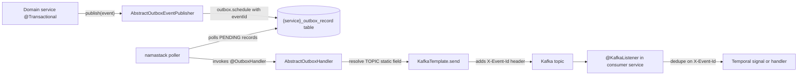
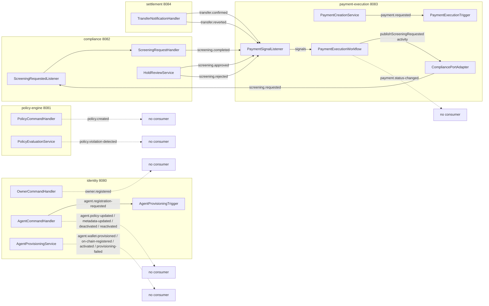
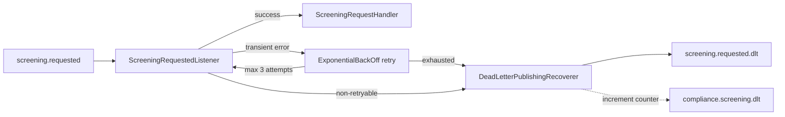

# Event Catalog

ArcPay's five services never call each other synchronously to advance a workflow. Instead, every meaningful state change is captured as a domain event, persisted in the same database transaction that mutated the state, and asynchronously relayed to Kafka by a background outbox handler. Downstream services subscribe to the topics they care about — most often to drive a Temporal workflow forward via signals. This page is the authoritative catalog of every Kafka topic in the system: who produces it, who consumes it, what's in the payload, and how exactly-once-ish delivery is achieved through the transactional outbox.

---

## The Transactional Outbox Pattern

ArcPay uses the [namastack outbox](https://github.com/namastack) library to guarantee that an event is published **if and only if** the business transaction that produced it commits. Domain services do not call `kafkaTemplate.send()` directly; events are *scheduled* into an outbox table inside the caller's transaction, then a separate handler relays them to Kafka.

### How it works end to end

**Producer side — `AbstractOutboxEventPublisher`** (`platform-infra/src/main/java/com/arcpay/platform/infrastructure/messaging/AbstractOutboxEventPublisher.java`):

- `publish(event)` is annotated `@Transactional(propagation = Propagation.MANDATORY)` (line 20) — it **must** run inside an existing transaction, so the event can only be scheduled when the caller already holds one. This is what binds the event to the state change.
- A fresh UUID `eventId` is minted per event (line 24) and stored in the outbox context map under the key `eventId` (line 25).
- The Kafka message **key** is resolved by reflection: each service supplies an ordered `keyFieldNames` list, and the publisher invokes the first matching accessor that returns a non-null value (lines 33–51). If no field yields a value, it throws.

**Relay side — `AbstractOutboxHandler`** (`platform-infra/src/main/java/com/arcpay/platform/infrastructure/messaging/AbstractOutboxHandler.java`):

- Annotated `@io.namastack.outbox.annotation.OutboxHandler` (line 18); namastack polls the outbox table and invokes `handle(event, metadata)`.
- The destination topic is read reflectively from the event class's `public static final String TOPIC` field (line 20, `resolveStaticField`). Every event record therefore owns its topic name.
- The stored `eventId` is pulled from `metadata.getContext()` (line 22) and attached to the outgoing `ProducerRecord` as the **`X-Event-Id`** header (lines 48–50).
- The send is bounded by a **10-second** timeout (line 24, `.get(10, TimeUnit.SECONDS)`); failures throw and leave the record for namastack to retry.

**Header contract — `OutboxHeaders`** (`platform-infra/src/main/java/com/arcpay/platform/infrastructure/messaging/OutboxHeaders.java`):

| Constant | Value | Role |
|---|---|---|
| `EVENT_ID_HEADER` | `X-Event-Id` | Kafka record header (line 5) — consumer idempotency key |
| `EVENT_ID_CONTEXT_KEY` | `eventId` | Outbox context-map key carrying the id from publish to relay (line 7) |

> **Idempotency note:** The framework *propagates* a unique `X-Event-Id` per event so consumers can deduplicate, but it does not enforce dedupe at the framework level — that responsibility lives in each consumer.

### The outbox table

Every service owns an `{service}_outbox_record` table with the same shape (example schema from `settlement/settlement/src/main/resources/db/migration/V2__151_create_outbox_tables.sql`):

| Column | Type | Purpose |
|---|---|---|
| `id` | VARCHAR(255) PK | record id |
| `status` | VARCHAR(20) default `PENDING` | polling state |
| `record_key` | VARCHAR(255) | resolved Kafka message key |
| `record_type` | VARCHAR(255) | FQCN of the event class |
| `payload` | TEXT | JSON-serialized event |
| `context` | TEXT | JSON context including `eventId` |
| `created_at` / `completed_at` / `next_retry_at` | TIMESTAMPTZ | lifecycle timestamps |
| `failure_count` / `failure_reason` / `partition_no` / `handler_id` | INTEGER / TEXT / INTEGER / VARCHAR(255) | retry & partitioning metadata |

Indexed on `(status, next_retry_at)`, `(record_key, created_at)`, and `(status, partition_no, next_retry_at)`. The same migration also creates `{service}_outbox_instance` and `{service}_outbox_partition` tables for namastack's partitioned polling.

### Per-service outbox wiring

| Service | Port | Outbox table | Publisher class (key fields) | Handler class |
|---|---|---|---|---|
| identity | 8080 | `agentidentity_outbox_record` | `OutboxEventPublisher` — `["agentId","ownerId"]` | `AgentIdentityOutboxHandler` |
| policy-engine | 8081 | `policyengine_outbox_record` | `OutboxEventPublisher` — `["agentId"]` | `PolicyEngineOutboxHandler` |
| compliance | 8082 | `compliance_outbox_record` | `ComplianceOutboxEventPublisher` — `["paymentId"]` | `ComplianceOutboxHandler` |
| payment-execution | 8083 | `paymentexecution_outbox_record` | `PaymentOutboxEventPublisher` — `["paymentId"]` | `PaymentOutboxHandler` |
| settlement | 8084 | `settlement_outbox_record` | `SettlementOutboxEventPublisher` — `["paymentId"]` | `SettlementOutboxHandler` |

The identity publisher's key fields `["agentId","ownerId"]` (`identity/identity/src/main/java/com/arcpay/identity/agentidentity/infrastructure/messaging/OutboxEventPublisher.java:13`) mean agent events key on `agentId` while `owner.registered` (which has no `agentId`) falls through to `ownerId`. Ports are bound in `docker-compose.yml` (`SERVER_PORT` per service).

---

## Event Flow Across Services

The live cross-service spine is the **payment lifecycle**: `payment-execution` requests screening, `compliance` answers, manual reviewers approve/reject holds, and `settlement` reports the on-chain outcome — every hop landing as a signal into the `PaymentExecutionWorkflow`. The identity, owner, and policy events are published faithfully but currently have no in-repo consumers (audit/projection sinks are not yet wired).

---

## Producer / Consumer Matrix

All events travel **Outbox → Kafka** and carry an `X-Event-Id` header for consumer-side idempotency.

| Topic | Produced by | Consumed by | Payload key field |
|---|---|---|---|
| `agent.registration-requested` | identity / `AgentCommandHandler.registerAgent()` | identity / `AgentProvisioningTrigger` | `agentId` |
| `agent.wallet-provisioned` | identity / `AgentProvisioningService.completeWalletCreation()` | _(no consumer)_ | `agentId` |
| `agent.on-chain-registered` | identity / `AgentProvisioningService.completeOnChainRegistration()` | _(no consumer)_ | `agentId` |
| `agent.activated` | identity / `AgentProvisioningService.completeOnChainRegistration()` | _(no consumer)_ | `agentId` |
| `agent.provisioning-failed` | identity / `AgentProvisioningService.failProvisioning()` | _(no consumer)_ | `agentId` |
| `agent.deactivated` | identity / `AgentCommandHandler.deactivate()` | _(no consumer)_ | `agentId` |
| `agent.reactivated` | identity / `AgentCommandHandler.reactivate()` | _(no consumer)_ | `agentId` |
| `agent.policy-updated` | identity / `AgentCommandHandler.updatePolicy()` | _(no consumer)_ | `agentId` |
| `agent.metadata-updated` | identity / `AgentCommandHandler.updateMetadata()` | _(no consumer)_ | `agentId` |
| `owner.registered` | identity / `OwnerCommandHandler.registerOwner()` | _(no consumer)_ | `ownerId` |
| `policy.created` | policy-engine / `PolicyCommandHandler.createOrUpdatePolicy()` | _(no consumer)_ | `agentId` |
| `policy.violation-detected` | policy-engine / `PolicyEvaluationService` | _(no consumer)_ | `agentId` |
| `screening.requested` | payment-execution / `CompliancePortAdapter.publishScreeningRequest()` (via Temporal activity) | compliance / `ScreeningRequestedListener` | `paymentId` |
| `screening.completed` | compliance / `ScreeningRequestHandler.handle()` | payment-execution / `PaymentSignalListener` | `paymentId` |
| `screening.approved` | compliance / `HoldReviewService.approveHold()` | payment-execution / `PaymentSignalListener` | `paymentId` |
| `screening.rejected` | compliance / `HoldReviewService.rejectHold()` | payment-execution / `PaymentSignalListener` | `paymentId` |
| `payment.requested` | payment-execution / `PaymentCreationService.create()` | payment-execution / `PaymentExecutionTrigger` | `paymentId` |
| `payment.status-changed` | payment-execution / `PaymentStatusService` (event built by `PaymentStateMachine`) | _(no consumer)_ | `paymentId` |
| `transfer.confirmed` | settlement / `TransferNotificationHandler.handle()` (via `SettlementEventFactory`) | payment-execution / `PaymentSignalListener` | `paymentId` |
| `transfer.reverted` | settlement / `TransferNotificationHandler.handle()` (via `SettlementEventFactory`) | payment-execution / `PaymentSignalListener` | `paymentId` |

---

## Event Groups by Domain

### `agent.*` — Agent Identity lifecycle

Emitted by the **identity** service. `agent.registration-requested` is the workflow trigger, published by `AgentCommandHandler.registerAgent()`. The provisioning-outcome events (`wallet-provisioned`, `on-chain-registered`, `activated`, `provisioning-failed`) are published by `AgentProvisioningService`, which is invoked from the Temporal activities of `AgentProvisioningWorkflowImpl`. The remaining events reflect explicit admin/management actions on an existing agent via `AgentCommandHandler`.

| Event class | Topic | Trigger | Payload |
|---|---|---|---|
| `AgentRegistrationRequested` | `agent.registration-requested` | `POST /api/v1/agents` → `AgentCommandHandler.registerAgent()` | `agentId, ownerId, name, purpose, metadataHash, requestedAt` |
| `AgentWalletProvisioned` | `agent.wallet-provisioned` | `AgentProvisioningService.completeWalletCreation()` | `agentId, walletId, walletAddress, provisionedAt` |
| `AgentOnChainRegistered` | `agent.on-chain-registered` | `AgentProvisioningService.completeOnChainRegistration()` | `agentId, txHash, blockNumber, registeredAt` |
| `AgentActivated` | `agent.activated` | `AgentProvisioningService.completeOnChainRegistration()` (emitted alongside on-chain registration) | `agentId, activatedAt` |
| `AgentProvisioningFailed` | `agent.provisioning-failed` | `AgentProvisioningService.failProvisioning()` | `agentId, failedStep, reason, failedAt` |
| `AgentDeactivated` | `agent.deactivated` | `POST /api/v1/agents/{agentId}/deactivate` → `AgentCommandHandler.deactivate()` | `agentId, deactivatedAt` |
| `AgentReactivated` | `agent.reactivated` | `POST /api/v1/agents/{agentId}/reactivate` → `AgentCommandHandler.reactivate()` | `agentId, reactivatedAt` |
| `AgentPolicyUpdated` | `agent.policy-updated` | `PUT /api/v1/internal/agents/{agentId}/policy` → `AgentCommandHandler.updatePolicy()` | `agentId, policyHash, updatedAt` |
| `AgentMetadataUpdated` | `agent.metadata-updated` | `PUT /api/v1/agents/{agentId}` → `AgentCommandHandler.updateMetadata()` | `agentId, name, purpose, metadataHash, updatedAt` |

Records: `identity/identity/src/main/java/com/arcpay/identity/agentidentity/domain/event/` (topic constants verified, e.g. `AgentRegistrationRequested.java:10`, `AgentWalletProvisioned.java:9`, `AgentActivated.java:9`). The `AgentActivated` publish is at `AgentProvisioningService.java:47`.

### `owner.*` — Account registration

| Event class | Topic | Trigger | Payload |
|---|---|---|---|
| `OwnerRegistered` | `owner.registered` | `POST /api/v1/owners/register` → `OwnerCommandHandler.registerOwner()` | `ownerId, email, walletAddress, registeredAt` |

Record: `.../domain/event/OwnerRegistered.java:9`. Keys on `ownerId` (the second key field in the identity publisher).

### `policy.*` — Policy Engine

| Event class | Topic | Trigger | Payload |
|---|---|---|---|
| `PolicyCreated` | `policy.created` | `POST /api/v1/agents/{agentId}/policies` → `PolicyCommandHandler.createOrUpdatePolicy()` | `policyId, agentId, ownerId, version, policyHash, createdAt` |
| `PolicyViolationDetected` | `policy.violation-detected` | `PolicyEvaluationService` on rule violation | `evaluationId, agentId, policyId, violatedRuleType, message, requestedAmount, detectedAt` |

Records: `policy-engine/policy-engine/src/main/java/com/arcpay/policy/policyengine/domain/event/PolicyCreated.java:9`, `PolicyViolationDetected.java:16`.

### `screening.*` — Compliance Shield

The compliance event contract lives in the **`compliance-api`** module so producers and consumers share it. `screening.requested` is the only event compliance *consumes*; the other three it *produces* back to payment-execution.

| Event class | Topic | Trigger | Payload |
|---|---|---|---|
| `PaymentScreeningRequested` | `screening.requested` | payment enters `SCREENING` in workflow → `CompliancePortAdapter.publishScreeningRequest()` | `paymentId, agentId, recipientAddress, amount, currency, requestedAt` |
| `ScreeningCompleted` | `screening.completed` | screening engine finishes (verdict `PASS` / `HOLD` / `BLOCK`) | `paymentId, agentId, verdict, riskScore, checks[], listVersionId, screenedAt` |
| `ScreeningApproved` | `screening.approved` | reviewer approves a HOLD | `paymentId, reviewer, reason, decidedAt` |
| `ScreeningRejected` | `screening.rejected` | reviewer rejects a HOLD | `paymentId, reviewer, reason, decidedAt` |

`verdict` is the `Verdict` enum: `PASS, HOLD, BLOCK` (`compliance/compliance-api/src/main/java/com/arcpay/compliance/domain/model/Verdict.java`). Records: `compliance/compliance-api/src/main/java/com/arcpay/compliance/domain/event/` (`PaymentScreeningRequested.java:18`, `ScreeningCompleted.java:21`, `ScreeningApproved.java:11`, `ScreeningRejected.java:11`).

### `payment.*` — Payment Execution

| Event class | Topic | Trigger | Payload |
|---|---|---|---|
| `PaymentRequested` | `payment.requested` | `POST /api/v1/payments` → `PaymentCreationService.create()` | `paymentId, agentId, ownerId, walletId, idempotencyKey, recipientAddress, amount, currency, memo, metadata, requestedAt` |
| `PaymentStatusChanged` | `payment.status-changed` | any `PaymentStateMachine` transition, published by `PaymentStatusService` | `paymentId, agentId, status, previousStatus, transactionHash, changedAt` |

`status` is carried as a `String` on the event; the `PaymentStatus` enum is `PENDING, POLICY_CHECK, SCREENING, HELD, EXECUTING, COMPLETED, FAILED, REJECTED`. Records: `payment-execution/payment-execution-api/src/main/java/com/arcpay/payment/paymentexecution/domain/event/PaymentRequested.java:24`, `PaymentStatusChanged.java:12`.

### `transfer.*` — Settlement

`TransferNotificationHandler.handle()` translates a terminal settlement state into one of two events via `SettlementEventFactory.eventFor()`, then publishes through the outbox.

| Event class | Topic | Trigger | Payload |
|---|---|---|---|
| `TransferConfirmed` | `transfer.confirmed` | settlement reaches `COMPLETED` | `paymentId, txHash, networkFee, confirmedAt` |
| `TransferReverted` | `transfer.reverted` | settlement reaches `FAILED` / `DENIED` / `CANCELLED` | `paymentId, reason, revertedAt` |

Both events implement the `SettlementEvent` interface. Records: `settlement/settlement-api/src/main/java/com/arcpay/settlement/domain/event/TransferConfirmed.java:13`, `TransferReverted.java:11`. Mapping logic: `settlement/settlement/src/main/java/com/arcpay/settlement/domain/SettlementEventFactory.java:24-30`.

---

## Consumers and Workflow Signals

Four `@KafkaListener` components exist in production code; the busiest, `PaymentSignalListener`, fans five topics into the same Temporal workflow.

| Topic | Listener | Action |
|---|---|---|
| `agent.registration-requested` | `AgentProvisioningTrigger` (identity, line 23) | starts `AgentProvisioningWorkflow.provision()` |
| `payment.requested` | `PaymentExecutionTrigger` (payment-execution, line 25) | starts `PaymentExecutionWorkflow.execute()` |
| `screening.requested` | `ScreeningRequestedListener` (compliance, line 16) | calls `ScreeningRequestHandler.handle()` |
| `screening.completed` | `PaymentSignalListener.onScreeningCompleted` (line 30) | signals `onScreeningResult(...)` |
| `screening.approved` | `PaymentSignalListener.onScreeningApproved` (line 36) | signals `onReviewDecision(true)` |
| `screening.rejected` | `PaymentSignalListener.onScreeningRejected` (line 42) | signals `onReviewDecision(false)` |
| `transfer.confirmed` | `PaymentSignalListener.onTransferConfirmed` (line 48) | signals `onChainResult(confirmed=true)` |
| `transfer.reverted` | `PaymentSignalListener.onTransferReverted` (line 54) | signals `onChainResult(confirmed=false)` |

**Consumer group IDs.** The payment-execution listeners pin explicit groups of the form `${spring.kafka.consumer.group-id}-{purpose}` — `-payment-trigger`, `-screening-result`, `-review-approved`, `-review-rejected`, `-transfer-confirmed`, `-transfer-reverted` — so each subscription scales and tracks offsets independently. The identity (`AgentProvisioningTrigger`) and compliance (`ScreeningRequestedListener`) listeners declare no `groupId` and use the service default group.

---

## Dead-Letter Topic (compliance only)

The screening consumer is the single point in the system that processes external Kafka traffic which can be malformed or undeserializable, so it is the only one hardened with a dead-letter topic. DLT handling is **not** configured for identity, policy-engine, payment-execution, or settlement.

**Config:** `compliance/compliance/src/main/java/com/arcpay/compliance/infrastructure/messaging/ScreeningConsumerErrorConfig.java`

- **Topic naming:** `{original-topic}.dlt` → `screening.requested.dlt`, via the `DLT_SUFFIX = ".dlt"` constant (line 26) applied in the recoverer's topic resolver (line 36).
- **Error handler:** `DefaultErrorHandler` (line 44) backed by a `DeadLetterPublishingRecoverer` (line 34).
- **Retry:** `ExponentialBackOff` — **3** max attempts, initial **1s**, multiplier **2.0**, max **5s** (lines 38–42).
- **Non-retryable (straight to DLT, no retry):** `MalformedAddressException`, `DeserializationException` (line 45).
- **Observability:** the `compliance.screening.dlt` counter is incremented on each recovery (line 52).
- **DLT producer templates:** a byte-array template (for `byte[]` payloads of deserialization failures) and the JSON template are registered so any payload class can be forwarded (lines 58–69).
- The behavior is covered by `compliance/compliance/src/integration-test/java/com/arcpay/compliance/application/stream/ScreeningRequestedListenerDltIntegrationTest.java`.

---

## Related pages

- [[Transactional-Outbox]]
- [[Compliance-Shield]]
- [[Payment-Execution]]
- [[Agent-Identity-Service]]
- [[Policy-Engine]]
- [[Settlement-Service]]
- [[Temporal-Workflows]]
