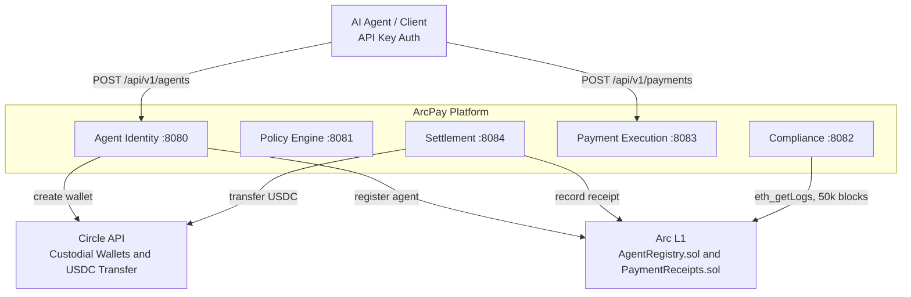

# ArcPay

> Policy-controlled USDC payments for autonomous AI agents, on Circle's Arc L1.

ArcPay lets autonomous AI agents move USDC **autonomously but under control**. Each agent is provisioned with a verifiable identity and a Circle custodial wallet, bound to a human **Owner** who sets its spending **policy**. Every payment an agent initiates is checked against that policy (reserve → commit/release accounting), screened for compliance (watchlists + on-chain history), settled through Circle's API, and recorded as a tamper-evident on-chain receipt. The platform is five independently-deployable Spring Boot 4 services that coordinate over Kafka (transactional outbox) and Temporal sagas, each owning its own PostgreSQL database.

---

## System Context

---

## The Five Services

| Service | Port | Database | Responsibility | Key Tech |
|---------|------|----------|----------------|----------|
| **Agent Identity** (`identity`) | 8080 | `arcpay_identity` | Provisions agents with verifiable identity + Circle custodial USDC wallet; registers them on-chain; manages lifecycle (deactivate / reactivate / update); registers owners | Temporal `AgentProvisioning` + `AgentOnChainSync`; Circle Wallet API; web3j `FunctionEncoder`; Flyway V1–V5 |
| **Policy Engine** (`policy-engine`) | 8081 | `arcpay_policy` | Enforces owner spending limits via atomic **reserve → commit/release** so two concurrent payments cannot both slip under the limit | Reservation model `HELD/COMMITTED/RELEASED`; Policy `ACTIVE/SUPERSEDED`; 90-day evaluation retention (cleanup cron); Resilience4j; ShedLock; Flyway V1–V7 |
| **Compliance** (`compliance`) | 8082 | `arcpay_compliance` | Screens recipients against sanctions watchlists (OFAC/UN/EU/UK-HMT) and on-chain interaction history; holds suspicious payments for human review | Temporal `SanctionsIngestion` (6h refresh); `ScreeningResult` with `Verdict PASS/HOLD/BLOCK`; `HoldReview`; Kafka dead-letter topic; Flyway V1–V8 |
| **Payment Execution** (`payment-execution`) | 8083 | `arcpay_payment` | Orchestrates payments end-to-end as an idempotent Temporal saga: precondition → reserve → screen → settle → commit, compensating by releasing the reservation on failure | Temporal `PaymentExecution` with signals; `PaymentStatus POLICY_CHECK→SCREENING→…→COMPLETED`; Flyway V1–V2 |
| **Settlement** (`settlement`) | 8084 | `arcpay_settlement` | Executes the USDC transfer via Circle, reconciles from Circle's signature-verified webhook, and writes a tamper-evident on-chain receipt | Circle transfer API; web3j `PaymentReceipts.sol`; gas buffer 0.50 USDC; `TransferConfirmed/TransferReverted` events; Flyway V1–V2 |

_Source: `settings.gradle.kts:1-36`, `docker-compose.yml:91-212`, per-service `application.yml`._

---

## Platform Tenets

These five principles are visible in the code itself, not just documented.

### 1. Hexagonal layering (ports & adapters)

Every service splits into `application` (controllers, Kafka listeners, security filters), `domain` (business logic, models, ports — zero infra dependencies), and `infrastructure` (JPA entities, repository adapters, external clients). The boundaries are **enforced by ArchUnit**: domain may not access any other layer, JPA `@Entity` types live only in `infrastructure.db`, `@RestController` types only in `application.controller`, `@KafkaListener` methods only in `application.stream`, and `@Autowired` is banned in production code.

_Source: `identity/identity/src/test/java/com/arcpay/identity/agentidentity/architecture/ArchitectureTest.java:15-139`; parallel `HexagonalArchitectureTest` in each other service._

### 2. Database per service

Each service owns an isolated PostgreSQL 16 database — `arcpay_identity`, `arcpay_policy`, `arcpay_compliance`, `arcpay_payment`, `arcpay_settlement` — with its own Flyway migration history. No service reads another's tables; they communicate only via REST and Kafka.

_Source: `docker-compose.yml:104,130,152,175,199`, `*/*/src/main/resources/db/migration/V*.sql`._

### 3. Transactional outbox → Kafka

Domain writes and event journaling happen in one transaction via the **namastack** outbox (poll interval 2000ms, batch size 20, exponential retry 1s→60s ×2.0, max 5 retries), then a poller batch-publishes to Kafka. Each service uses its own table prefix (`agentidentity_`, `policyengine_`, `compliance_`, `paymentexecution_`, `settlement_`). Every published event carries an `X-Event-Id` header.

_Source: `identity/identity/src/main/resources/application.yml:30-44` (and the equivalent block in every service); `platform-infra/.../OutboxHeaders.java:5`; `OutboxEventPublisher.java`._

### 4. Temporal sagas

Long-running, cross-service flows run as Temporal workflows with per-service task queues (`AgentIdentityTaskQueue`, `ComplianceTaskQueue`, `PaymentExecutionTaskQueue`).

| Workflow | Service | ID convention | Highlights |
|----------|---------|---------------|------------|
| `AgentProvisioning` | identity | `AgentProvisioning_<agentId>` | create Circle wallet → register on-chain; 300s execution timeout; failure marks provisioning failed and publishes `agent.provisioning-failed` |
| `AgentOnChainSync` | identity | `AgentOnChainSync_<agentId>_<operation>` | keeps the on-chain registry in step with PostgreSQL during lifecycle changes |
| `PaymentExecution` | payment-execution | `PaymentExecution_<paymentId>` | precondition → reserve → screen → settle → commit; signals `onScreeningResult` / `onReviewDecision` / `onChainResult`; screening & review waits 72h, chain confirm 5m; compensates by releasing the reservation |
| `SanctionsIngestion` | compliance | — | watchlist refresh cron `0 0 */6 * * *`; staleness warn 12h / critical 24h; sources OFAC_SDN, OFAC_NONSDN, UN, EU, UK_HMT |

_Source: `AgentProvisioningWorkflow.java:8-17`, `AgentProvisioningTrigger.java:34-47`, `AgentOnChainSyncWorkflow.java:15-17`, `PaymentExecutionWorkflow.java:12-32`, `SanctionsIngestionWorkflowImpl.java`; `compliance/.../application.yml`._

### 5. On-chain projection

PostgreSQL is the source of truth; the chain is an **independently verifiable projection** written by ArcPay's platform gas wallet (the **registrar**). ArcPay never holds agent custody keys — those live with Circle.

- **`AgentRegistry.sol`** — registrar-gated agent registry on Arc testnet at `0x8A3A6E9825A2b7A6fAe65ebcC8cD95C33327f3Ba`. Functions: `registerAgent` (idempotent), `deactivateAgent`, `reactivateAgent`, `updateMetadata`, `updatePolicy`, `getAgent`, `isAgentActive`, `getAgentByWallet`, `isWalletActive`, `getAgentsByOwner`, plus a two-step registrar transfer (`transferRegistrar` / `acceptRegistrar`). Events include `AgentRegistered`, `AgentDeactivated`, `AgentReactivated`, `MetadataUpdated`, `PolicyUpdated`, `RegistrarTransferStarted`, `RegistrarTransferred`.
- **`PaymentReceipts.sol`** — `recordReceipt(bytes32 paymentId, address payer, address payee, uint256 amount, bytes32 memoHash, uint64 timestamp)` emitting `ReceiptRecorded`; a `recorded[paymentId]` boolean prevents double-recording.

Both contracts are driven by hand-coded web3j `FunctionEncoder` calls (no generated ABI wrappers).

_Source: `identity/identity/contracts/AgentRegistry.sol:1-195`, `settlement/settlement/contracts/PaymentReceipts.sol:1-28`; `BlockchainAdapter.java`, `Web3jReceiptWriter.java`._

---

## REST APIs

### Agent Identity — `:8080`

| Method | Path | Auth | Purpose |
|--------|------|------|---------|
| POST | `/api/v1/agents` | Owner | Register a new agent (requires `Idempotency-Key` header) |
| GET | `/api/v1/agents` | Owner | List agents for owner (pageable, optional status filter) |
| GET | `/api/v1/agents/{agentId}` | Owner | Get agent details |
| PUT | `/api/v1/agents/{agentId}` | Owner | Update metadata (name, purpose) |
| POST | `/api/v1/agents/{agentId}/deactivate` | Owner | Deactivate agent |
| POST | `/api/v1/agents/{agentId}/reactivate` | Owner | Reactivate agent |
| GET | `/api/v1/agents/{agentId}/status` | Owner | Get provisioning status |

Owner self-registration is served by a separate `OwnerController`.

_Source: `AgentController.java:35-108`, `OwnerController.java`._

### Policy Engine — `:8081`

| Method | Path | Auth | Purpose |
|--------|------|------|---------|
| POST | `/api/v1/agents/{agentId}/policies` | Owner | Create or update policy (new version supersedes prior; returns 201) |
| GET | `/api/v1/agents/{agentId}/policies/active` | Owner | Get active policy |
| GET | `/api/v1/agents/{agentId}/policies/{policyId}` | Owner | Get a specific policy version |
| GET | `/api/v1/agents/{agentId}/policies` | Owner | List policy history (pageable) |

Internal endpoints (`InternalReservationController`, `InternalSpendingLedgerController`, `InternalPolicyEvaluationController`) back the reserve/commit/release accounting consumed by the payment saga.

_Source: `PolicyController.java:29-72`._

### Payment Execution — `:8083`

| Method | Path | Auth | Purpose |
|--------|------|------|---------|
| POST | `/api/v1/payments` | Owner | Create payment (202 if new, 200 on idempotent resubmission) |
| GET | `/api/v1/payments/{paymentId}` | Owner | Get payment details |
| GET | `/api/v1/payments` | Owner | List payments (pageable, optional agentId/status filters) |

_Source: `PaymentController.java:31-64`._

### Compliance — `:8082`

Read/review surface via `ScreeningQueryController`, `HoldReviewController`, and `WatchlistController` (screening lookups, hold approve/reject, watchlist queries).

### Settlement — `:8084`

Internal read surface: `GET /api/v1/internal/wallets/{agentId}/balance` and `GET /api/v1/internal/transfers/{paymentId}`. Circle reconciliation arrives at `CircleWebhookController`.

_Source: `InternalReadController.java:20-35`, `CircleWebhookController.java`._

### All services

| Method | Path | Auth | Purpose |
|--------|------|------|---------|
| GET | `/actuator/health` | None | Liveness/readiness |
| GET | `/actuator/{info,metrics,prometheus}` | None | Service info and metrics (Prometheus export) |

_Source: `management.endpoints.web.exposure.include: health, info, metrics, prometheus` in each `application.yml`._

---

## Kafka Event Topics

| Service | Topic | Event |
|---------|-------|-------|
| Identity | `agent.registration-requested` | AgentRegistrationRequested |
| Identity | `agent.wallet-provisioned` | AgentWalletProvisioned |
| Identity | `agent.on-chain-registered` | AgentOnChainRegistered |
| Identity | `agent.activated` | AgentActivated |
| Identity | `agent.deactivated` | AgentDeactivated |
| Identity | `agent.reactivated` | AgentReactivated |
| Identity | `agent.policy-updated` | AgentPolicyUpdated |
| Identity | `agent.metadata-updated` | AgentMetadataUpdated |
| Identity | `agent.provisioning-failed` | AgentProvisioningFailed |
| Identity | `owner.registered` | OwnerRegistered |
| Policy Engine | `policy.created` | PolicyCreated |
| Policy Engine | `policy.violation-detected` | PolicyViolationDetected |
| Compliance | `screening.requested` | PaymentScreeningRequested |
| Compliance | `screening.completed` | ScreeningCompleted |
| Compliance | `screening.approved` | ScreeningApproved |
| Compliance | `screening.rejected` | ScreeningRejected |
| Payment Execution | `payment.requested` | PaymentRequested |
| Payment Execution | `payment.status-changed` | PaymentStatusChanged |
| Settlement | `transfer.confirmed` | TransferConfirmed |
| Settlement | `transfer.reverted` | TransferReverted |

_Source: `TOPIC` constants on each event record under `domain/event/*.java`. Full schemas in [[Event-Catalog]]._

---

## Tech Stack

- **Language / framework:** Java 25, Spring Boot 4.0.6, Spring Cloud 2025.1.1
- **Build:** Gradle (Kotlin DSL); Spotless 7.0.4 (palantir-java-format 2.91.0)
- **Database:** PostgreSQL 16, Flyway 11.x migrations
- **Messaging:** Apache Kafka 3.8.1 (KRaft); namastack 1.6.0 transactional outbox
- **Orchestration:** Temporal Java SDK 1.35.0 (workflows, activities, signals); Temporal server `auto-setup:1.25.2` in local compose
- **Resilience:** Resilience4j circuit breaker (50% threshold, sliding window 10, 30s open); ShedLock (policy-engine cleanup)
- **Blockchain:** web3j 4.14.0 on Arc L1 via `ARC_TESTNET_RPC_URL`; hand-coded `FunctionEncoder` (no generated ABIs)
- **Custody:** Circle Developer-Controlled Wallets; RSA-OAEP entity-secret ciphertext
- **Mapping / testing:** MapStruct; JUnit 5, AssertJ, BDD Mockito, ArchUnit, Testcontainers
- **Observability:** Spring Boot Actuator → Prometheus

_Source: `gradle/libs.versions.toml`, `gradle.properties:15-30`, `build.gradle.kts:4,32`, `docker-compose.yml:28-69`._

---

## Glossary

- **Agent** — an autonomous AI entity provisioned with a Circle custodial USDC wallet on Arc L1, bound to an Owner, with a spending policy and on-chain identity.
- **Owner** — the human/entity that controls one or more agents and sets their spending policies.
- **Reservation** — a hold on spending room (`HELD`) for a pending payment, moving to `COMMITTED` (spend final) or `RELEASED` (freed) based on outcome.
- **Screening verdict** — the compliance decision on a recipient: `PASS` (allowed), `HOLD` (pending human review), or `BLOCK` (rejected).
- **Saga** — a Temporal workflow orchestrating a multi-step, long-running process with compensation (rollback) on failure.
- **Outbox** — events journaled in a DB table atomically with domain writes (via namastack), then batch-published to Kafka, each stamped with an `X-Event-Id` header.
- **Registrar** — the on-chain address (ArcPay's platform gas wallet) authorized via the `onlyRegistrar` modifier to write agent state to `AgentRegistry.sol`.

---

## Related pages

[[Platform-Architecture]] · [[Agent-Identity-Service]] · [[Policy-Engine-Service]] · [[Compliance-Service]] · [[Payment-Execution-Service]] · [[Settlement-Service]] · [[Event-Catalog]] · [[On-Chain-Integration]] · [[Data-and-Persistence]] · [[Security]] · [[Local-Development]] · [[Testing-and-Quality]]
