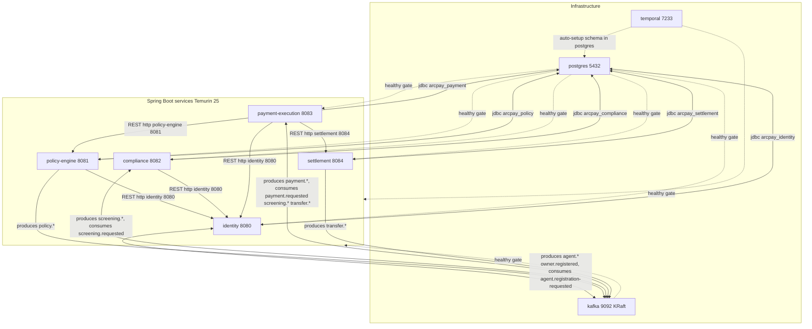

# Local Development

ArcPay's entire backend — five Spring Boot services plus their data and orchestration backbone — runs on your laptop with a single command. `docker compose up --build` builds each service from a multi-stage Temurin 25 image and brings up PostgreSQL (one database per service plus Temporal's two), Kafka in KRaft mode, and a Temporal cluster, then waits for every dependency to report healthy before the services start. This page is the source-of-truth runbook for that stack: what you need, what comes up, how it's wired, and the Gradle commands you run against it.

## Prerequisites

- **Docker** + **Docker Compose v2** (the stack is defined entirely in `docker-compose.yml:1-215`).
- That is the only hard requirement to boot the stack — the multi-stage `Dockerfile` builds each service inside a Temurin 25 container, so no local JDK is needed just to run.
- For running services or tests **outside** Docker you need the Gradle toolchain (Java 25); the wrapper at `/gradlew` provisions the rest.

## Booting the Stack

```bash
docker compose up --build
```

The first run builds all five service images via the multi-stage `Dockerfile` (Temurin 25 JDK to JRE); subsequent runs reuse the layer cache (`docker-compose.yml:2`, `README.md:231-235`).

Useful follow-ups:

```bash
docker compose ps          # container + health status
docker compose logs -f identity
docker compose down -v     # stop and drop the pgdata volume
```

## Service & Port Map

| Service | Port | Database | Health endpoint |
|---------|------|----------|-----------------|
| `postgres` | 5432 | — | `pg_isready -U arcpay -d arcpay` |
| `kafka` | 9092 | — | `kafka-topics.sh --list` |
| `temporal` | 7233 | `temporal`, `temporal_visibility` | `tctl cluster health` |
| `identity` | 8080 | `arcpay_identity` | http://localhost:8080/actuator/health |
| `policy-engine` | 8081 | `arcpay_policy` | http://localhost:8081/actuator/health |
| `compliance` | 8082 | `arcpay_compliance` | http://localhost:8082/actuator/health |
| `payment-execution` | 8083 | `arcpay_payment` | http://localhost:8083/actuator/health |
| `settlement` | 8084 | `arcpay_settlement` | http://localhost:8084/actuator/health |

All service definitions live in `docker-compose.yml:26-212`; the health endpoint table is mirrored in `README.md:240-244`.

### Health checks & startup ordering

The infrastructure containers gate everything else. Each service declares `depends_on` against the shared `x-service-deps` anchor, which requires `postgres`, `kafka`, and `temporal` to all be **healthy** before the service container starts (`docker-compose.yml:18-24`, used at `docker-compose.yml:98, 124, 146, 169, 193`).

| Container | Health check | Cadence |
|-----------|--------------|---------|
| `postgres` | `pg_isready -U arcpay -d arcpay` | 5s / 5s timeout / 10 retries (`docker-compose.yml:38-42`) |
| `kafka` | `/opt/kafka/bin/kafka-topics.sh --bootstrap-server localhost:9092 --list` | 10s / 10s timeout / 12 retries (`docker-compose.yml:62-66`) |
| `temporal` | `tctl --address $(hostname -i):7233 cluster health` (grep `SERVING`) | 10s / 10s timeout / 18 retries / 30s start (`docker-compose.yml:84-89`) |
| services (x5) | `curl -fsS http://localhost:{port}/actuator/health` | 15s / 10s timeout / 12 retries / 90s start (`docker-compose.yml:110-115, 132-137, 155-160, 179-184, 207-212`) |

## Local Topology



## Infrastructure Containers

### PostgreSQL — one database per service

`deploy/local/postgres-init.sql:1-12` runs once on first boot (mounted at `/docker-entrypoint-initdb.d/10-init.sql`, `docker-compose.yml:34`) and creates seven databases:

- `arcpay_identity`, `arcpay_policy`, `arcpay_compliance`, `arcpay_payment`, `arcpay_settlement` — one per service
- `temporal`, `temporal_visibility` — Temporal's stores

The Postgres container itself runs as image `postgres:16-alpine` (`docker-compose.yml:28`). Credentials are `arcpay` / `arcpay` (`docker-compose.yml:30-31`), and data persists in the `pgdata:/var/lib/postgresql/data` volume (`docker-compose.yml:35`). Each service runs **Flyway** migrations against its own database with Hibernate `ddl-auto: validate` — Flyway owns the schema, Hibernate only validates it (e.g. `identity/identity/src/main/resources/application.yml:10-13`, `settlement/settlement/src/main/resources/application.yml:9-13`).

Migration naming differs by service:

- **identity** — `V1__create_owners_table.sql` through `V5__create_gas_usage_table.sql` (owners, agents, idempotency keys, outbox, gas usage)
- **policy-engine** — `V1__42_create_policies_table.sql` through `V7__139_create_spending_reservation.sql` (policies, spending ledger, spending locks, evaluations, outbox, ShedLock, reservations)
- **compliance** — `V1__113_create_sanctions_list_version.sql` through `V8__113_create_outbox_tables.sql` (sanctions list version, sanctioned address, current list version, watchlist address, screening result, screening check, hold review, outbox)
- **payment-execution** — `V1__142_create_payment.sql`, `V2__142_create_outbox_tables.sql`
- **settlement** — `V1__151_create_settlement_transaction.sql`, `V2__151_create_outbox_tables.sql`

### Kafka — KRaft single node

Image `apache/kafka:3.8.1` (`docker-compose.yml:45`), running as a single combined broker + controller node (`KAFKA_PROCESS_ROLES: broker,controller`, `KAFKA_NODE_ID: 1`, `KAFKA_CONTROLLER_QUORUM_VOTERS: 1@kafka:9093`, `docker-compose.yml:49-61`). Replication factors are pinned to `1` (dev defaults), and the cluster id is fixed (`5L6g3nShT-eMCtK--X86sw`, `docker-compose.yml:61`). Inside the compose network services reach it at `kafka:9092` (`docker-compose.yml:14`).

Each service consumes with `auto-offset-reset: earliest` under its own consumer group:

| Service | Consumer group | Config |
|---------|----------------|--------|
| identity | `agent-identity-service` | `identity/identity/src/main/resources/application.yml:17` |
| policy-engine | `policy-engine` | `policy-engine/policy-engine/src/main/resources/application.yml:26` |
| compliance | `compliance` | `compliance/compliance/src/main/resources/application.yml:23` |
| payment-execution | `payment-execution` | `payment-execution/payment-execution/src/main/resources/application.yml:23` |
| settlement | `settlement` | `settlement/settlement/src/main/resources/application.yml:17` |

Compliance uses an `ErrorHandlingDeserializer` for both key and value, each with a delegate (`StringDeserializer` for the key, `JsonDeserializer` for the value) for robustness (`compliance/compliance/src/main/resources/application.yml:25-29`). Topic names are string literals declared on the domain event records:

| Service | Topics (string literals) |
|---------|--------------------------|
| identity | `agent.registration-requested`, `agent.wallet-provisioned`, `agent.on-chain-registered`, `agent.provisioning-failed`, `agent.activated`, `agent.deactivated`, `agent.reactivated`, `agent.metadata-updated`, `agent.policy-updated`, `owner.registered` |
| policy-engine | `policy.created`, `policy.violation-detected` |
| compliance | `screening.requested`, `screening.completed`, `screening.approved`, `screening.rejected` (declared in module `compliance-api`) |
| payment-execution | `payment.requested`, `payment.status-changed` (declared in module `payment-execution-api`) |
| settlement | `transfer.confirmed`, `transfer.reverted` (declared in module `settlement-api`) |

Only a subset of these are actually consumed in-process. The Kafka listeners are:

- **identity** consumes `agent.registration-requested` to trigger provisioning (`identity/identity/src/main/java/com/arcpay/identity/agentidentity/application/stream/AgentProvisioningTrigger.java:23`).
- **compliance** consumes `screening.requested` (`compliance/compliance/src/main/java/com/arcpay/compliance/application/stream/ScreeningRequestedListener.java:16`).
- **payment-execution** consumes `payment.requested`, `screening.completed`, `screening.approved`, `screening.rejected`, `transfer.confirmed`, and `transfer.reverted` (`payment-execution/payment-execution/src/main/java/com/arcpay/payment/paymentexecution/application/stream/PaymentExecutionTrigger.java:25`, `.../PaymentSignalListener.java:30-54`).
- **policy-engine** and **settlement** declare no `@KafkaListener` — they only produce events.

### Temporal — workflow orchestration

Image `temporalio/auto-setup:1.25.2` (`docker-compose.yml:69`). It depends on `postgres` being healthy and points at the already-created databases with `SKIP_DB_CREATE: "true"` (`DB: postgres12`, `POSTGRES_SEEDS: postgres`, `DBNAME: temporal`, `VISIBILITY_DBNAME: temporal_visibility`, `docker-compose.yml:74-81`). Services connect at `temporal:7233` (`docker-compose.yml:15`). In the compose stack the Temporal namespace is set to `default` via `SPRING_TEMPORAL_NAMESPACE` on the shared `x-common-env` anchor (`docker-compose.yml:16`), overriding the per-service application.yml default of `arcpay` (e.g. `identity/identity/src/main/resources/application.yml:26`).

| Service | Task queue | Workflows |
|---------|-----------|-----------|
| identity | `AgentIdentityTaskQueue` | `AgentProvisioning`, `AgentOnChainSync` |
| payment-execution | `PaymentExecutionTaskQueue` | `PaymentExecution` |
| compliance | `ComplianceTaskQueue` | `SanctionsIngestion` |

(`policy-engine` and `settlement` declare no Temporal workflows.)

## The Multi-Stage Dockerfile

`Dockerfile:1-27` builds every service from one parameterized definition:

- **Build stage** — `eclipse-temurin:25-jdk` (`Dockerfile:7`). Build arg `SERVICE` (e.g. `identity/identity`) selects the module; the build runs `./gradlew --no-daemon ":$(echo "$SERVICE" | tr '/' ':'):bootJar"` with a Gradle cache mount and copies the resulting (non-`plain`) jar to `app.jar` (`Dockerfile:10-13`).
- **Runtime stage** — `eclipse-temurin:25-jre` (`Dockerfile:15`). Installs `curl` for health checks (`Dockerfile:16-17`), runs as non-root `appuser` (UID 1001, `Dockerfile:19, 25`), copies `app.jar` into `/app`, sets `SERVER_PORT` from the `PORT` arg (default `8080`), exposes `${PORT}`, and starts with `java -jar /app/app.jar` (`Dockerfile:20-27`). A comment notes Java 25 is container-aware and can be tuned via `JDK_JAVA_OPTIONS` (`Dockerfile:26`).

Build a single image directly:

```bash
docker build --build-arg SERVICE=identity/identity --build-arg PORT=8080 -t arcpay/identity:local .
```

## Configuration via `.env`

Compose auto-loads a gitignored `.env` at the repo root and interpolates it into the service definitions using `${VAR:-default}` syntax, so the stack boots with safe dev defaults and you only set `.env` to override. Shared values come from the `x-common-env` anchor (`docker-compose.yml:11-16`): `DB_USERNAME=arcpay`, `DB_PASSWORD=arcpay`, `KAFKA_BOOTSTRAP_SERVERS=kafka:9092`, `TEMPORAL_ADDRESS=temporal:7233`, `SPRING_TEMPORAL_NAMESPACE=default`. Per-service `SPRING_DATASOURCE_URL` and `SERVER_PORT` are set explicitly per container.

### Variables in `.env.example`

The committed template `.env.example:1-25` is scoped to the identity service plus shared infra; it contains the following keys (all blank/placeholder, to be filled locally):

| Variable | `.env.example` value | Notes |
|----------|----------------------|-------|
| `AGENT_REGISTRY_ADDRESS` | _(blank)_ | on-chain AgentRegistry address |
| `ARC_TESTNET_RPC_URL` | `https://rpc.testnet.arc.network` | Arc RPC endpoint |
| `PLATFORM_WALLET_PRIVATE_KEY` | _(blank)_ | registrar key — never commit |
| `CIRCLE_API_KEY` | _(blank)_ | Circle credential — never commit |
| `CIRCLE_WALLET_SET_ID` | _(blank)_ | Circle credential — never commit |
| `CIRCLE_ENTITY_SECRET` | _(blank)_ | Circle credential — never commit |
| `SERVICE_AUTH_TOKEN` | _(blank)_ | inter-service bearer token — never commit |
| `DB_USERNAME` / `DB_PASSWORD` | `arcpay` / `arcpay` | Postgres credentials |
| `KAFKA_BOOTSTRAP_SERVERS` | `localhost:9092` | host default (compose uses `kafka:9092`) |
| `TEMPORAL_ADDRESS` | `localhost:7233` | host default (compose uses `temporal:7233`) |

### Additional env vars referenced by compose / application.yml

These are **not** in `.env.example` but are read by the stack (with the listed compose defaults where applicable):

| Variable | Default (compose) | Used by | Notes |
|----------|-------------------|---------|-------|
| `AGENT_REGISTRY_ADDRESS` | `0x8A3A6E9825A2b7A6fAe65ebcC8cD95C33327f3Ba` | identity | compose dev default (`docker-compose.yml:105`) |
| `PLATFORM_WALLET_PRIVATE_KEY` | `0x000…0001` | identity | compose dev placeholder (`docker-compose.yml:107`) |
| `GAS_WALLET_PRIVATE_KEY` | `0x000…0001` | settlement | compose dev placeholder (`docker-compose.yml:201`) |
| `PAYMENT_RECEIPTS_ADDRESS` | zero address | settlement | PaymentReceipts contract (`docker-compose.yml:202`) |
| `ARC_USDC_ADDRESS` | zero address | compliance | ARC USDC token contract (`docker-compose.yml:154`) |
| `CIRCLE_USDC_TOKEN_ADDRESS` | zero address | settlement | Circle USDC token address (`docker-compose.yml:206`) |

Inter-service URLs are wired through the compose network: policy-engine, compliance, and payment-execution call identity at `http://identity:8080`; payment-execution additionally calls policy-engine at `http://policy-engine:8081` and settlement at `http://settlement:8084` (`docker-compose.yml:131, 153, 176-178`). Two policy-engine knobs are also env-overridable: `POLICY_EVALUATION_RETENTION_DAYS` (default 90) and `POLICY_EVALUATION_CLEANUP_CRON` (default `0 0 2 * * *`) (`policy-engine/policy-engine/src/main/resources/application.yml:57-58`).

## Gradle Build & Test

The Gradle build uses a Java 25 toolchain with the Kotlin DSL (`build.gradle.kts:20-21`); the `build` task includes Spotless format checking (Spotless `7.0.4`, `build.gradle.kts:4`). Commands (`README.md:276-279`):

```bash
# Compile + unit tests + ArchUnit rules + Spotless check
./gradlew build

# Format all Java (palantir-java-format via Spotless)
./gradlew spotlessApply

# Integration tests (Testcontainers: Postgres, Kafka, Temporal, EVM)
./gradlew :identity:identity:integrationTest

# Business / E2E tests
./gradlew :identity:identity:businessTest
```

Substitute the module path (`:<svc>:<svc>:...`) for other services. The `integrationTest` and `businessTest` source sets and tasks are defined in the shared convention plugin `buildSrc/src/main/kotlin/arcpay.service.gradle.kts` (`:35-71`):

- **Unit** — JUnit 5, AssertJ, BDD Mockito
- **Integration** — Testcontainers (`org.testcontainers:postgresql`, `:kafka`); identity's on-chain contract test additionally spins up a `trufflesuite/ganache` EVM node (`identity/identity/src/integration-test/.../AgentRegistryContractIntegrationTest.java:51`), and identity's Temporal workflows are exercised in `src/integration-test`
- **ArchUnit** — hexagonal architecture boundary rules enforced per service

## Running a Service Outside Docker

To run a single service from Gradle against the compose infrastructure, export the env and start it — the service will reach Postgres, Kafka, and Temporal on `localhost`:

```bash
set -a; source .env; set +a
./gradlew :identity:identity:bootRun
```

## Not in the Local Stack

Deliberately out of scope for local development — these are **not** present in the repo's compose stack:

- No Kubernetes / Helm — Docker Compose is the only orchestration provided.
- No API gateway, reverse proxy, or load balancer; services are exposed directly on their ports.
- No service mesh, distributed tracing stack, or Prometheus/Grafana (actuator exposes `health, info, metrics, prometheus` endpoints, but nothing scrapes them locally).
- No Redis/Memcached caching layer.

## Related pages

- [[Architecture-Overview]]
- [[Agent-Identity-Service]]
- [[Policy-Engine-Service]]
- [[Compliance-Service]]
- [[Payment-Execution-Service]]
- [[Settlement-Service]]
- [[Events-and-Topics]]
- [[Smart-Contracts]]
