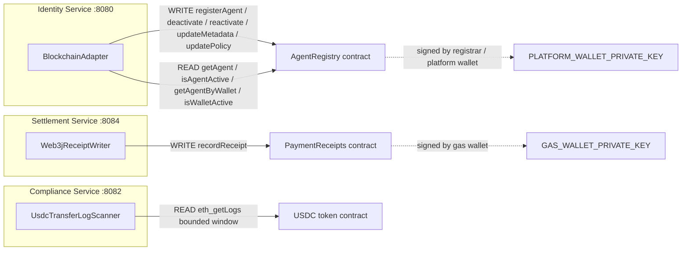
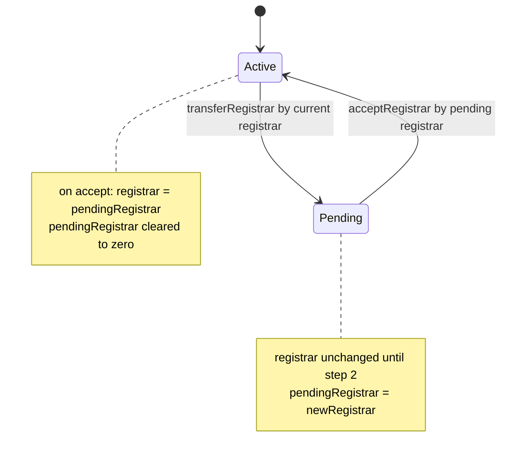
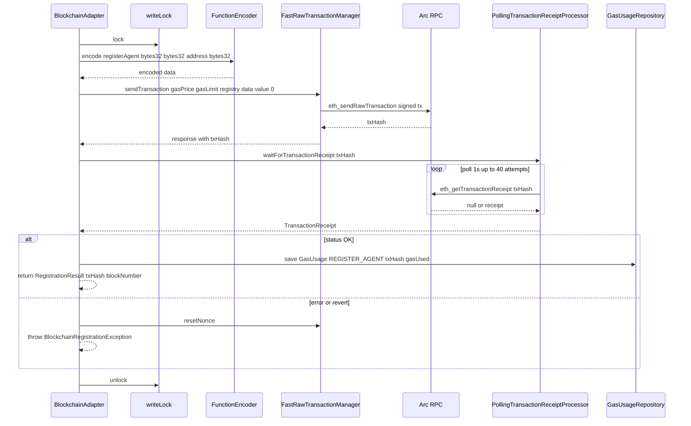
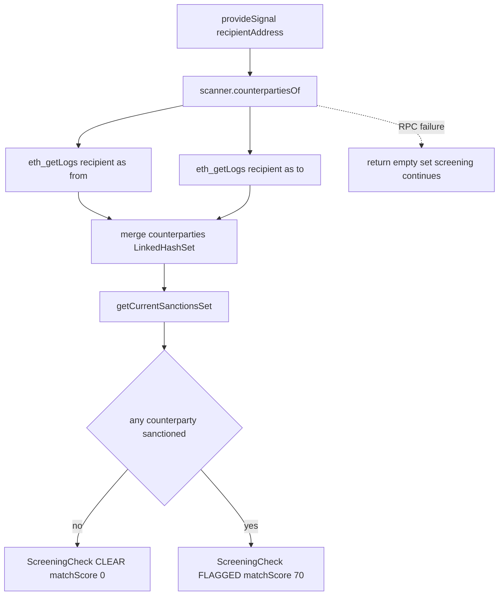
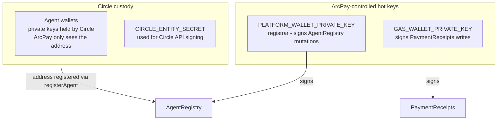

# On-Chain Integration

ArcPay treats **PostgreSQL as the source of truth and the blockchain as a verifiable, tamper-evident projection**. Off-chain databases hold the authoritative state; the chain mirrors selected facts so that any external party can independently verify them. Three services touch the chain: **Identity** writes agent identity to the `AgentRegistry` contract, **Settlement** writes payment proofs to the `PaymentReceipts` contract, and **Compliance** *reads* historical USDC transfer logs (`eth_getLogs`) to screen counterparties. Every write is signed by an ArcPay-controlled hot key; agent wallets themselves are custodied by Circle. This page documents exactly how that integration is built — the contracts, the web3j adapters, the key-custody split, and the failure semantics.

---

## Core Principle: Source of Truth vs. Verifiable Projection

The `AgentRegistry` contract states the contract's role in its own NatSpec:

> "PostgreSQL is the source of truth; this contract is the independently verifiable record. The platform gas wallet is the sole signer (custodial model), so all state changes are registrar-gated. Timestamps are taken from `block.timestamp` so they are trustless, not caller-asserted."
> — `identity/identity/contracts/AgentRegistry.sol:5-12`

Consequences of this design, all visible in code:

- **Writes flow one way:** application logic mutates Postgres first, then projects to chain. Nothing reads chain state *back* into the database as authoritative.
- **Trustless timestamps:** the contract uses `uint64(block.timestamp)` for `createdAt` and every event timestamp (`AgentRegistry.sol:101`, `:105`, `:112`), never a caller-supplied value.
- **Custodial signing:** a single ArcPay-controlled EOA (the *registrar* / *gas wallet*) signs all mutations. There is no per-agent on-chain signing by ArcPay.

---

## On-Chain Writes and Reads at a Glance



| Direction | Service | Adapter | Contract / RPC | Operation |
|-----------|---------|---------|----------------|-----------|
| Write | Identity | `BlockchainAdapter` | `AgentRegistry` | `registerAgent`, `deactivateAgent`, `reactivateAgent`, `updateMetadata`, `updatePolicy` |
| Read | Identity | `BlockchainAdapter` | `AgentRegistry` | `getAgent`, `isAgentActive`, `getAgentByWallet`, `isWalletActive` |
| Write | Settlement | `Web3jReceiptWriter` | `PaymentReceipts` | `recordReceipt` |
| Read | Compliance | `UsdcTransferLogScanner` | USDC token (`eth_getLogs`) | scan `Transfer` events |

---

## AgentRegistry Contract

**Source:** `identity/identity/contracts/AgentRegistry.sol` (Solidity `0.8.24`)

The registry is the verifiable projection of agent identity. Each agent is bound to its on-chain wallet address and indexed by it, so an external party who sees an on-chain payment can resolve the wallet back to a registered, active agent.

### Storage and Data Model

The `Agent` struct (`AgentRegistry.sol:14-22`) holds: `bytes32 owner`, `bytes32 metadataHash`, `bytes32 policyHash`, `address wallet`, `bool active`, `bool exists`, and `uint64 createdAt`. Three mappings index it (`:26-28`):

| Mapping | Purpose |
|---------|---------|
| `agents[bytes32 => Agent]` | primary store keyed by agentId |
| `ownerAgents[bytes32 => bytes32[]]` | owner → list of agentIds |
| `walletToAgent[address => bytes32]` | wallet → agentId (enforces 1 wallet ↔ 1 agent) |

### Registrar-Gated Authorization

The `registrar` is set to `msg.sender` at deploy time (`AgentRegistry.sol:62-64`) and is the **sole** address allowed to mutate state. The `onlyRegistrar` modifier (`:55-60`) reverts with the custom error `NotRegistrar()` for any other caller. All five mutating functions carry this modifier; view functions are unauthenticated.

### Functions

| Function | Auth | Purpose |
|----------|------|---------|
| `registerAgent(bytes32 agentId, bytes32 owner, address wallet, bytes32 metadataHash)` | registrar | Register agent, bind wallet, set `active = true` (`:74-106`) |
| `deactivateAgent(bytes32 agentId)` | registrar | Set `active = false` (`:109-113`) |
| `reactivateAgent(bytes32 agentId)` | registrar | Set `active = true` (`:116-120`) |
| `updateMetadata(bytes32 agentId, bytes32 metadataHash)` | registrar | Update metadata hash (`:123-127`) |
| `updatePolicy(bytes32 agentId, bytes32 policyHash)` | registrar | Update policy hash (`:130-134`) |
| `getAgent(bytes32 agentId)` | view | Full record; reverts `UnknownAgent` if absent (`:137-147`) |
| `isAgentActive(bytes32 agentId)` | view | Active flag; unknown agents return `false` (`:150-152`) |
| `getAgentByWallet(address wallet)` | view | Wallet → agentId, or `bytes32(0)` if unregistered (`:155-157`) |
| `isWalletActive(address wallet)` | view | True iff wallet is registered **and** agent active (`:160-163`) |
| `getAgentsByOwner(bytes32 owner)` | view | All agentIds under an owner (`:166-168`) |
| `transferRegistrar(address newRegistrar)` | registrar | Step 1 of registrar rotation (`:172-178`) |
| `acceptRegistrar()` | pendingRegistrar | Step 2 of registrar rotation (`:181-188`) |

**Idempotent registration.** `registerAgent` is a no-op success when re-submitting the same `(agentId, owner, wallet)` tuple (`:82-87`), so a workflow retry after a mined-but-unacknowledged transaction does not fail an already-registered agent. Re-registering the same `agentId` with a *different* owner or wallet reverts `AgentAlreadyRegistered`. A wallet already bound to another agent reverts `WalletAlreadyRegistered` (`:91-93`).

### Two-Step Registrar Rotation

Rotation is intentionally a two-step handshake so a typo cannot strand the contract:



`transferRegistrar` rejects the zero address (`ZeroAddress`) and emits `RegistrarTransferStarted` (`:172-178`). Only the nominated `pendingRegistrar` may call `acceptRegistrar`, which promotes it to `registrar`, clears `pendingRegistrar`, and emits `RegistrarTransferred` (`:181-188`). Until step 2 completes, the original registrar remains in control.

### Events

| Event | Indexed fields | Source |
|-------|---------------|--------|
| `AgentRegistered` | agentId, owner, wallet | `AgentRegistry.sol:31-33` |
| `AgentDeactivated` | agentId | `:35` |
| `AgentReactivated` | agentId | `:37` |
| `MetadataUpdated` | agentId | `:39` |
| `PolicyUpdated` | agentId | `:41` |
| `RegistrarTransferStarted` | currentRegistrar, pendingRegistrar | `:43` |
| `RegistrarTransferred` | previousRegistrar, newRegistrar | `:45` |

### Custom Errors

`NotRegistrar`, `NotPendingRegistrar`, `ZeroAddress`, `ZeroAgentId`, `AgentAlreadyRegistered(bytes32)`, `WalletAlreadyRegistered(address)`, `UnknownAgent(bytes32)` (`AgentRegistry.sol:47-53`).

### Deployed Address (Arc Testnet)

From `identity/identity/contracts/DEPLOY.md:54-59`:

| Network | Contract address | Registrar | Deployment tx |
|---------|------------------|-----------|---------------|
| Arc testnet | `0x8A3A6E9825A2b7A6fAe65ebcC8cD95C33327f3Ba` | `0xeaE1E22C917412dC5142305d5ae151668Bd7E8B1` | `0x1d19a8eed774f30e0b7fb04f46e70cea321f096596e62f6c72937c1e5ca85851` |

The service reads this address from `AGENT_REGISTRY_ADDRESS` (`arcpay.contract.agent-registry-address`, `application.yml:66-67`); there is no built-in default, so the variable must be supplied. The contract must be deployed by the **same** wallet whose key the Identity service runs as (`PLATFORM_WALLET_PRIVATE_KEY`), since the deployer becomes the immutable initial registrar (`DEPLOY.md:5-8`). The adapter hand-encodes against the ABI — there is no web3j code generation (`DEPLOY.md:13`).

---

## PaymentReceipts Contract

**Source:** `settlement/settlement/contracts/PaymentReceipts.sol` (Solidity `^0.8.24`)

A deliberately minimal contract: an immutable, tamper-evident proof that a payment completed. It has **no access control** — any caller may record a receipt — and relies solely on per-`paymentId` idempotency.

```solidity
mapping(bytes32 => bool) public recorded;

function recordReceipt(
    bytes32 paymentId, address payer, address payee,
    uint256 amount, bytes32 memoHash, uint64 timestamp
) external {
    require(!recorded[paymentId], "receipt already recorded");
    recorded[paymentId] = true;
    emit ReceiptRecorded(paymentId, payer, payee, amount, memoHash, timestamp);
}
```
— `PaymentReceipts.sol:14-27`

| Event | Indexed fields | Other fields |
|-------|---------------|--------------|
| `ReceiptRecorded` | paymentId, payer, payee | amount (uint256), memoHash (bytes32), timestamp (uint64) |

— `PaymentReceipts.sol:5-12`

Once `recorded[paymentId]` is set true it can never be unset, so a second submission for the same payment reverts with `"receipt already recorded"` — replay-proof by construction.

---

## How web3j Is Used

Both writer adapters follow the same pattern: build a web3j `Function`, hand-encode it with `FunctionEncoder.encode`, send via a `FastRawTransactionManager` that manages the gas-wallet nonce, and serialize all submissions behind a fair `ReentrantLock` so concurrent calls never race the in-memory nonce.

### Identity: BlockchainAdapter

**Source:** `identity/identity/.../infrastructure/client/blockchain/BlockchainAdapter.java` — a package-private `@Component` implementing the `BlockchainService` domain port.

**Writes** (`registerAgent` at `BlockchainAdapter.java:60-78`, the four mutations at `:80-112`):
1. Build a `Function` with hand-constructed parameter types — e.g. `registerAgent` encodes `Bytes32(agentId)`, `Bytes32(ownerId)`, `Address(wallet)`, `Bytes32(metadataHash)` (`:66-73`).
2. `submit(...)` acquires the `writeLock` (`:168`), then `FunctionEncoder.encode(function)` (`:170`).
3. `transactionManager.sendTransaction(gasPrice, gasLimit, agentRegistryAddress, data, BigInteger.ZERO)` (`:171-176`) — zero ETH value.
4. If the JSON-RPC response `hasError()`, throw `BlockchainRegistrationException` (`:177-181`).
5. **Poll for the receipt** via `receiptProcessor.waitForTransactionReceipt(txHash)` (`:182`).
6. If `!receipt.isStatusOK()` (on-chain revert), throw (`:183-187`).
7. On the `registerAgent` path, record gas usage to Postgres and return `RegistrationResult(txHash, blockNumber)` (`:74-77`).

On **any** exception the adapter calls `resetNonceQuietly()` → `transactionManager.resetNonce()` (`:196-205`, `:234-240`) to resync the nonce from the RPC, then releases the lock in `finally`.

**Reads** use `callView` (`:208-232`): encode → `web3j.ethCall(Transaction.createEthCallTransaction(from, contract, data), LATEST)` → `FunctionReturnDecoder.decode(...)`. `getAgent` decodes the six-tuple return into an `OnChainAgentView` (`:131-150`); `getAgentByWallet` returns `Optional.empty()` when the returned bytes32 is all-zero (`:152-158`).

**UUID ↔ bytes32.** Agent and owner UUIDs are encoded into a 32-byte word via `UuidConversionUtil.uuidToBytes32` (called at `:69-70`); the metadata/policy string is either parsed as a 0x-prefixed 64-hex value or hashed with `Hash.sha3(...)` if it is not in canonical bytes32 form (`hashToBytes32`, `:251-256`).

**Gas accounting.** Every successful mutation calls `recordGasUsage(...)` (`:258-270`) saving a `GasUsage` row with operation name (`REGISTER_AGENT`, or the `OnChainOperation` enum name for the others), txHash, and `gasUsed`. Note `gasCostUsdc` is currently hardcoded to `BigDecimal.ZERO` (`:266`).

**Configuration** (`BlockchainClientConfig.java`, gated on `@ConditionalOnProperty(prefix = "arcpay.blockchain", name = "rpc-url")`, `:16`):
- `Web3j.build(new HttpService(rpcUrl))` (`:22-25`)
- `Credentials.create(platformWalletPrivateKey)` (`:27-30`)
- `FastRawTransactionManager(web3j, credentials, chainId)` (`:32-36`)
- `PollingTransactionReceiptProcessor(web3j, 1_000ms, 40 attempts)` (`:19-20`, `:38-41`) → ~40-second receipt timeout

### Settlement: Web3jReceiptWriter

**Source:** `settlement/settlement/.../infrastructure/web3j/Web3jReceiptWriter.java` — implements the `ReceiptWriter` domain port.

`writeReceipt(ReceiptCommand)` (`:52-67`) is **best-effort and fire-and-forget**:
1. Acquire `writeLock` (`:54`), call `submit(...)` (`:56`).
2. `submit` first warns if the gas-wallet balance is below threshold (`warnOnLowGasBalance`, `:131-147`, increments the Micrometer counter `settlement.receipt.gas_wallet.low_balance`).
3. Build the `recordReceipt` `Function` (`buildFunction`, `:94-105`): `Bytes32(paymentId)`, `Address(payerAgent)`, `Address(payee)`, `Uint256(toBaseUnits(amount))`, `Bytes32(memoHash(memo))`, `Uint64(clock.instant().getEpochSecond())`.
4. `FunctionEncoder.encode` → `transactionManager.sendTransaction(gasPrice, gasLimit, paymentReceiptsAddress, data, BigInteger.ZERO)` (`:79-85`).
5. If `hasError()`, throw `ReceiptSubmissionException` (`:86-88`); otherwise **return the tx hash immediately without waiting for a receipt** (`:89-91`).

On **any failure**, it logs a warning, calls `resetNonceQuietly()`, and **returns `null`** — the payment stays `COMPLETED`, only the on-chain reference is absent (`:57-66`). There is no retry.

Encoding helpers: `paymentIdToBytes32` writes the UUID into the low 16 bytes (`:107-118`); `memoHash` is `Hash.sha3(memo)` or a 32-byte zero hash when memo is null (`:120-125`); `toBaseUnits` shifts the decimal right by 6 for USDC base units (`:127-129`).

**Configuration** (`Web3jReceiptConfig.java`, gated on `@ConditionalOnProperty(prefix = "arcpay.gas-wallet", name = "private-key")`, `:18`): the writer is only instantiated when a gas-wallet key is configured. The RPC client is built from `web3j.client-address` (bean `receiptWeb3j`, `:21-24`), credentials from `gasWalletProperties.privateKey()` (`:26-29`), and a dedicated `FastRawTransactionManager` (`:31-35`).

### Nonce Serialization (both writers)

Both adapters share the same hardening:
- A fair `ReentrantLock(true)` serializes submissions (`BlockchainAdapter.java:58`, `Web3jReceiptWriter.java:37`).
- The `FastRawTransactionManager` tracks the nonce **in memory** across calls from one gas wallet.
- On any submission failure, `transactionManager.resetNonce()` re-fetches the nonce from the RPC before the next attempt.

This prevents the duplicate/invalid-nonce errors that concurrent submissions from a single EOA would otherwise produce.

---

## registerAgent On-Chain Submission Sequence



---

## Compliance: On-Chain Read Screening (eth_getLogs)

**Source:** `compliance/compliance/.../infrastructure/onchain/UsdcTransferLogScanner.java` and `OnChainInteractionSignalProvider.java`. Both are package-private `@Component`s gated on `@ConditionalOnBean(Web3j.class)` (`UsdcTransferLogScanner.java:24`, `OnChainInteractionSignalProvider.java:15`) — on-chain screening is enabled only when a Web3j bean exists. That bean (`complianceWeb3j`) is itself created only when `compliance.onchain.rpc-url` is set (`OnChainConfig.java:14-18`).

### What it does

`UsdcTransferLogScanner.counterpartiesOf(recipientAddress)` (`:38-54`) discovers every address the recipient has historically transacted with in USDC, within a **bounded block window**:

1. Read the latest block: `web3j.ethBlockNumber()` (`:40`).
2. `fromBlock = latest - scanBlockWindow`, clamped to `0` (`:41-44`). The default window is 50,000 blocks.
3. Run **two** `eth_getLogs` queries (`:47-48`): once filtering the recipient as the `from` topic, once as the `to` topic.
4. Merge results into a `LinkedHashSet` (deduplicated, insertion-ordered).
5. On **any** exception, log a warning and return an **empty set** (`:50-53`) — screening is never blocked by chain unavailability.

The `query` method (`:56-90`) builds an `EthFilter` over `properties.usdcContract()` with topic[0] = `EventEncoder.encode(TRANSFER_EVENT)` and the recipient's left-padded address in topic[1] or topic[2] (`:63-74`). The `TRANSFER_EVENT` definition declares the ERC-20 `Transfer(address indexed, address indexed, uint256)` signature (`:28-33`). For each log with ≥3 topics, it extracts the counterparty (the address that is *not* the recipient) and skips self-transfers (`:77-87`). `paddedTopic` left-pads to 32 bytes; `addressOf` takes the rightmost 40 hex chars (`:92-100`).

### The risk signal it produces

`OnChainInteractionSignalProvider.provideSignal(recipientAddress)` (`:25-50`) cross-references the scanned counterparties against the current sanctions set:

| Outcome | CheckType | Result | matchScore | details |
|---------|-----------|--------|-----------|---------|
| No sanctioned counterparty | `ONCHAIN_INTERACTION` | `CLEAR` | `0` | `{counterparties: <count>}` |
| Sanctioned counterparty found | `ONCHAIN_INTERACTION` | `FLAGGED` | `70` | `{counterparty: <addr>, txCount: <count>}` |

The flagged score `70` is the constant `INTERACTION_SCORE` (`:19`). When the sanctions set is null or contains no match, the check is `CLEAR` (`:28-42`).



---

## Key-Custody Model

ArcPay splits custody cleanly between **its own hot EVM keys** and **Circle-custodied agent wallets**.



| Key | Owner | Used for | Source |
|-----|-------|----------|--------|
| Registrar / platform wallet | ArcPay (hot) | Signs all `AgentRegistry` mutations | `PLATFORM_WALLET_PRIVATE_KEY` → `Credentials.create(...)` in `BlockchainClientConfig.java:27-30` |
| Gas wallet | ArcPay (hot) | Signs `PaymentReceipts` writes | `GAS_WALLET_PRIVATE_KEY` → `Credentials.create(...)` in `Web3jReceiptConfig.java:26-29` |
| Agent wallet | Circle (custodial) | The agent's on-chain identity; address registered on-chain | created via Circle, only the address is bound on-chain via `registerAgent` |
| Entity secret | Circle integration | Circle API request signing | `circle.entity-secret` (`CIRCLE_ENTITY_SECRET`, identity `application.yml:58`) |

Key points:
- ArcPay's two keys are **EOAs loaded from configuration at startup** via `Credentials.create(privateKeyString)`. There is no HSM or external signer in the code path, and no multi-sig — the registrar is a single EOA.
- Agent wallets are **custodied by Circle**; ArcPay never holds their private keys. From the chain's perspective an agent's wallet is registered into `AgentRegistry` purely by *address* (the `wallet` parameter of `registerAgent`).
- The only on-chain administrative safeguard is the **two-step registrar rotation** described above (`DEPLOY.md:61-80`).

---

## Configuration Reference

| Config key | Service | Env var | Default / Notes |
|------------|---------|---------|-----------------|
| `arcpay.blockchain.rpc-url` | Identity | `ARC_TESTNET_RPC_URL` | required — gates the whole blockchain config (`application.yml:69`) |
| `arcpay.blockchain.chain-id` | Identity | — | `5042002` (`application.yml:70`) |
| `arcpay.blockchain.platform-wallet-private-key` | Identity | `PLATFORM_WALLET_PRIVATE_KEY` | required (`application.yml:71`) |
| `arcpay.contract.agent-registry-address` | Identity | `AGENT_REGISTRY_ADDRESS` | required — no yml default (`application.yml:67`) |
| `web3j.client-address` | Settlement | `ARC_TESTNET_RPC_URL` | required (`application.yml:56`) |
| `arcpay.contract.payment-receipts-address` | Settlement | `PAYMENT_RECEIPTS_ADDRESS` | required (`application.yml:60`) |
| `arcpay.contract.chain-id` | Settlement | — | default `999` (`ReceiptContractProperties.java:14`); not set in yml |
| `arcpay.gas-wallet.private-key` | Settlement | `GAS_WALLET_PRIVATE_KEY` | conditional — if absent, the receipt writer bean is not created (`application.yml:62`) |
| `compliance.onchain.rpc-url` | Compliance | `ARC_RPC_URL` | optional — if absent, the Web3j bean and on-chain screening are off (`application.yml:75`) |
| `compliance.onchain.usdc-contract` | Compliance | `ARC_USDC_ADDRESS` | no yml default (`application.yml:76`) |
| `compliance.onchain.scan-block-window` | Compliance | — | `50000` (`application.yml:77`); defaults to `50000` if ≤ 0 |

Receipt polling in Identity is hardcoded: 1,000 ms interval × 40 attempts (`BlockchainClientConfig.java:19-20`). The Identity registrar gas price/limit default to `1_000_000_000` wei / `300_000` (`AgentRegistryProperties.java:9-16`); the Settlement receipt write defaults to `1_000_000_000` wei / `150_000` (`ReceiptContractProperties.java:15-16`).

---

## Failure Semantics and Notable Gaps

These behaviors are intentional and visible in code — call them out so operators are not surprised:

- **Identity registration is fail-hard.** Any RPC error, on-chain revert, or 40-second polling timeout throws `BlockchainRegistrationException`, resets the nonce, and fails the provisioning step (`BlockchainAdapter.java:177-205`).
- **Settlement receipts are fire-and-forget.** `Web3jReceiptWriter` returns the tx hash *before* the receipt is mined and never polls (`Web3jReceiptWriter.java:89-91`). On failure it returns `null` and the payment **stays `COMPLETED`** with no on-chain reference and no retry (`:57-66`).
- **Compliance reads are non-blocking.** A failed `eth_getLogs` scan returns an empty counterparty set; screening always completes (`UsdcTransferLogScanner.java:50-53`).
- **No PaymentReceipts access control.** Any caller may record a receipt; replay protection is per-`paymentId` only (`PaymentReceipts.sol:14-27`).
- **Gas cost in USDC is not computed.** `GasUsage.gasCostUsdc` is hardcoded to `ZERO` (`BlockchainAdapter.java:266`); only raw `gasUsed` is persisted.
- **Static gas pricing.** A fixed legacy `gasPrice`/`gasLimit` is used for every write — no EIP-1559 priority fee and no congestion-based adjustment.
- **Single chain, single registrar.** One `AgentRegistry`, one RPC URL per service, one registrar EOA — no multi-chain or multi-sig support.

---

## Related pages

- [[Agent-Identity-Service]]
- [[Settlement-Service]]
- [[Compliance-Shield]]
- [[Temporal-Workflows]]
- [[Key-Management-and-Custody]]
- [[Architecture-Overview]]
