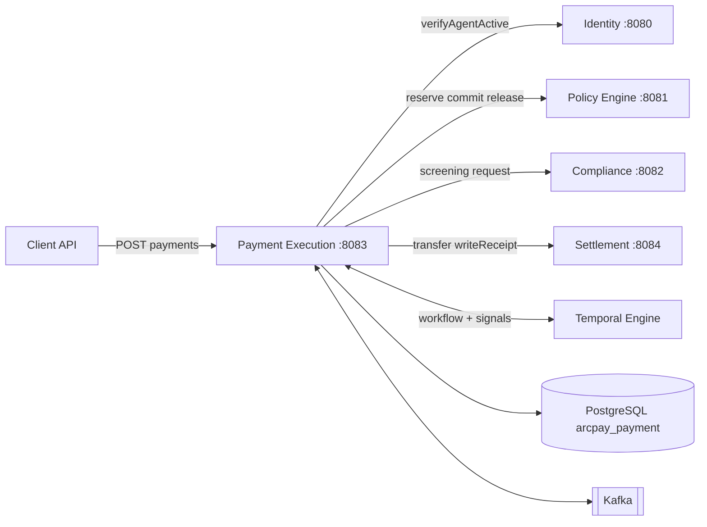
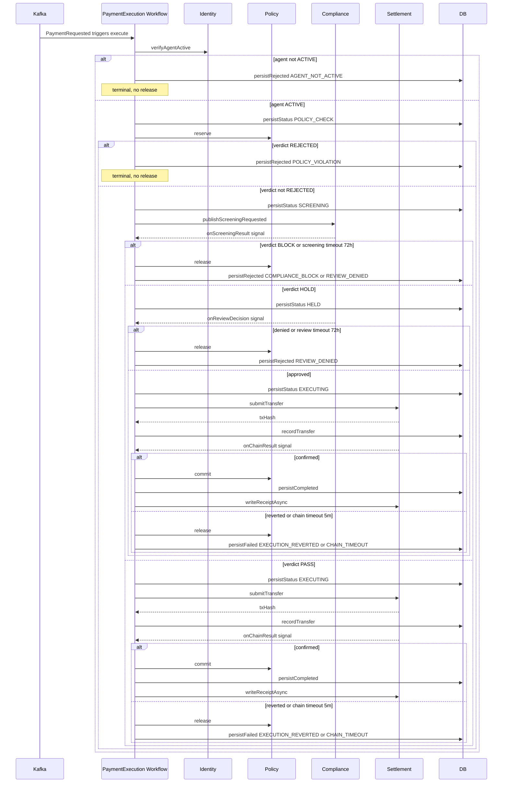
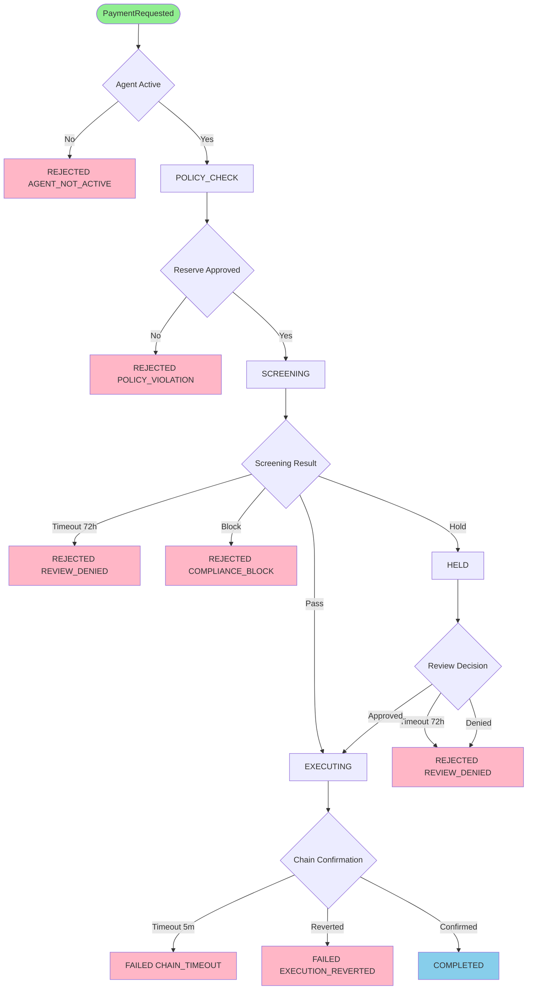

# Payment Execution Service

The **Payment Execution Service** (`payment-execution`, port `:8083`) is the **orchestrator** at the heart of ArcPay. When an agent wants to move USDC, this service runs a long-lived, fault-tolerant **distributed saga** that walks the request through the services that own each decision — *is the agent active?* (Identity), *does policy allow it?* (Policy Engine), *is it compliant?* (Compliance), *settle it on-chain* (Settlement) — using a Temporal workflow to guarantee compensation, idempotency, and exactly-once signal handling across failures and restarts.

---

## Responsibility: The Orchestrator

This service owns **no business decision** of its own — it coordinates the services that do. Its job is to sequence the saga, persist each state transition, hold the payment open while waiting for asynchronous verdicts (screening, manual review, on-chain confirmation), and run the **compensating action** (release the policy reservation) whenever a post-reservation gate fails.

Key architectural facts:
- **PostgreSQL (`arcpay_payment`) is the source of truth** for payment state; on-chain settlement is a downstream effect confirmed back via Kafka.
- **Temporal** runs the saga as a durable workflow keyed on `PaymentExecution_{paymentId}`; signals carry async results back into the running workflow.
- The REST API is **fire-and-acknowledge** — `POST` returns `202 ACCEPTED` immediately, then clients poll `GET` for the terminal status.

---

## REST API

| Method | Path | Auth | Purpose |
|--------|------|------|---------|
| `POST` | `/api/v1/payments` | Owner principal | Create a payment; returns `202 ACCEPTED` (new) or `200 OK` (idempotent replay) — `PaymentController:40-47` |
| `GET` | `/api/v1/payments/{paymentId}` | Owner principal (ownerId must match) | Fetch a single payment — `PaymentController:49-53` |
| `GET` | `/api/v1/payments` | Owner principal | List payments, filterable by `agentId` and `status` (default page size 20) — `PaymentController:55-63` |

### Create request — `CreatePaymentRequest`
`payment-execution-api/.../CreatePaymentRequest.java:14-37`

| Field | Type | Bean-validation constraint |
|-------|------|----------------------------|
| `agentId` | UUID | required (`@NotNull`) |
| `idempotencyKey` | String | required, max 255 |
| `recipientAddress` | String | required (`@NotBlank`) — `0x...` format checked in the domain layer |
| `amount` | BigDecimal | required, min `0.000001`, max 6 fractional digits |
| `currency` | String | required (`@NotBlank`) — **`USDC`-only** rule enforced in the domain layer, not by annotation |
| `memo` | String | optional, max 256 |
| `metadata` | Map<String,String> | optional |

Domain-level validation (`PaymentOrchestrationService.validate()`, `:79-97`) additionally enforces: currency must equal `USDC`, recipient must match `^0x[a-fA-F0-9]{40}$`, amount ≥ `0.000001` with ≤ 6 decimal places, and memo ≤ 256 chars.

### Creation flow — `PaymentCreationService`
`PaymentCreationService:31-53`
1. Resolve `ownerId` from the principal.
2. `agentAuthorization.verifyOwnershipAndActive(agentId, ownerId)` — throws `AgentNotFoundException` / `AgentNotOwnedException` / `AgentNotActiveException` (`AgentAuthorization:20-29`).
3. Reject self-payment (agent wallet address == recipient, case-insensitive) → `InvalidPaymentRequestException`.
4. `paymentOrchestrationService.newPayment()` validates and builds the `PENDING` payment with a SHA3 `requestFingerprint`.
5. Save (idempotent — see below).
6. **If newly created**, publish `PaymentRequested` via the outbox; otherwise log and return the existing payment.

---

## Persistence

### `payment` table — `V1__142_create_payment.sql`

| Column | Type | Notes |
|--------|------|-------|
| `payment_id` | VARCHAR(36) PK | UUID |
| `agent_id` / `owner_id` | VARCHAR(36) | UUID |
| `idempotency_key` | VARCHAR(255) | unique per agent |
| `request_fingerprint` | VARCHAR(66) | SHA3 hash |
| `recipient_address` | VARCHAR(42) | Ethereum address |
| `amount` | NUMERIC(18,6) | |
| `currency` | VARCHAR(10) | |
| `memo` | VARCHAR(256) | nullable |
| `status` | VARCHAR(20) | enum string |
| `rejection_reason` / `failure_reason` | VARCHAR(30) | enum string, nullable |
| `tx_hash` / `on_chain_ref` | VARCHAR(66) | nullable until settlement |
| `policy_evaluation_id` | VARCHAR(36) | nullable (see Notes) |
| `compliance_risk_score` | INT | nullable (see Notes) |
| `metadata` | JSONB | |
| `created_at` / `updated_at` / `completed_at` | TIMESTAMPTZ | |

Constraints: `uq_payment_idem UNIQUE (agent_id, idempotency_key)` for idempotency; index `idx_payment_agent_status (agent_id, status)`.

A second migration, `V2__142_create_outbox_tables.sql`, creates the Namastack outbox tables (`paymentexecution_outbox_record`, `paymentexecution_outbox_instance`, `paymentexecution_outbox_partition`) so events publish transactionally with the payment write.

### Idempotency & deduplication
`PaymentRepositoryAdapter:21-37` — on `save`, the adapter looks up the existing row by `(agent_id, idempotency_key)`:
1. If an existing row with a **different** `payment_id` is found, resolve as an idempotent replay.
2. If `requestFingerprint` differs → `IdempotencyConflictException`.
3. If it matches → return the existing payment (idempotent replay).
4. Otherwise → `saveAndFlush` the new payment.

The fingerprint is a SHA3 hash of the canonical string `agentId|recipientAddress(lower-case)|amount(stripped)|currency|memo` (`PaymentOrchestrationService:52-61`).

---

## The PaymentExecution Saga

The saga is a Temporal workflow (`PaymentExecutionWorkflow`, task queue `PaymentExecutionTaskQueue`, workflow id `PaymentExecution_{paymentId}`) driven by three signal methods (`onScreeningResult`, `onReviewDecision`, `onChainResult`). It is started by the `PaymentExecutionTrigger` Kafka listener and runs with a **145-hour** execution timeout (`PaymentExecutionTrigger:21`).

### Saga ordering (`PaymentExecutionWorkflowImpl.execute`, `:74-143`)

| Step | Activity | On success | On failure |
|------|----------|-----------|-----------|
| 1. Precondition | `verifyAgentActive(agentId)` (Identity) | continue | `persistRejected(AGENT_NOT_ACTIVE)` — **no release** |
| 2. Reserve | `persistStatus(POLICY_CHECK)` → `reserve(...)` (Policy) | verdict not `REJECTED` → continue | verdict `REJECTED` → `persistRejected(POLICY_VIOLATION)` — **no release** |
| 3. Screen | `persistStatus(SCREENING)` → `publishScreeningRequested()` (Compliance), await `onScreeningResult` (72h) | `PASS` → execute; `HOLD` → review | `BLOCK` → `releaseAndReject(COMPLIANCE_BLOCK)`; timeout → `releaseAndReject(REVIEW_DENIED)` |
| 3a. Review (HOLD only) | `persistStatus(HELD)`, await `onReviewDecision` (72h) | `approved=true` → execute | `approved=false` / timeout → `releaseAndReject(REVIEW_DENIED)` |
| 4. Transfer | `persistStatus(EXECUTING)` → `submitTransfer(...)` (Settlement) → `recordTransfer(txHash)`, await `onChainResult` (5m) | confirmed → commit | timeout → `release()` + `persistFailed(CHAIN_TIMEOUT)` |
| 5. Commit | `recordOnChainRef()` → `commit()` (Policy) → `persistCompleted()` → `writeReceiptAsync()` | `COMPLETED` | `confirmed=false` → `release()` + `persistFailed(EXECUTION_REVERTED)` |

Note the asymmetry in compensation — **steps 1 and 2 never call `release()`** because no policy reservation exists yet; every later failure path **must** release the reservation before rejecting/failing via `releaseAndReject` (`PaymentExecutionWorkflowImpl:169-173`).

### Idempotency inside the workflow
- The trigger sets `WorkflowIdReusePolicy.WORKFLOW_ID_REUSE_POLICY_REJECT_DUPLICATE`; a duplicate `PaymentRequested` event catches `WorkflowExecutionAlreadyStarted` and is skipped (`PaymentExecutionTrigger:25-44`).
- Each signal handler is guarded: once `terminal == true` or the signal of that type already arrived, the signal is ignored (`PaymentExecutionWorkflowImpl:145-167`). Late screening approvals after a timeout are dropped — exactly-once per signal type.
- `PaymentStatusService` transitions are themselves idempotent (no-op if already at the target state), so retried activities are safe (`PaymentStatusService:28-83`).

### Activity stubs & retry policy
`PaymentExecutionWorkflowImpl:38-67` — three stubs with distinct SLAs:

| Stub | Start-to-close | Schedule-to-close | Retry |
|------|----------------|-------------------|-------|
| `decisionActivities` (identity / policy / screening / status) | 10s | 5m | exp backoff 1s→30s, coefficient 2.0 |
| `ledgerActivities` (commit / release / persist) | 5s | 24h | exp backoff 1s→1m, coefficient 2.0 |
| `receiptActivities` (receipt write) | 10s | 10m | default (no explicit retry options) |

### Saga — happy path and compensating branches

---

## Payment Status Lifecycle

Statuses (`PaymentStatus.java:3-12`): `PENDING`, `POLICY_CHECK`, `SCREENING`, `HELD`, `EXECUTING`, `COMPLETED`, `FAILED`, `REJECTED`. Transitions are enforced by `PaymentStateMachine` (`ALLOWED_TRANSITIONS`, `:27-34`); illegal moves throw `IllegalPaymentTransitionException`. Transitions into terminal states (`COMPLETED`, `FAILED`, `REJECTED`) cannot use `transition()` — they go through `reject()` / `fail()` / `complete()`.

### Rejection reasons (pre-settlement)
`RejectionReason.java:3-8` — `POLICY_VIOLATION`, `COMPLIANCE_BLOCK`, `REVIEW_DENIED`, `AGENT_NOT_ACTIVE`.

### Failure reasons (post-settlement)
`FailureReason.java:3-10` — `CHAIN_TIMEOUT` (no confirmation within 5m) and `EXECUTION_REVERTED` (on-chain failure) are the only ones reached by the saga. `POLICY_UNAVAILABLE`, `INSUFFICIENT_BALANCE`, `EXECUTION_ERROR`, and `SCREENING_UNAVAILABLE` are defined but not currently produced.

---

## Events

### Consumed (Kafka listeners)

All consumers share base group `payment-execution` (`application.yml:23`) with a per-listener suffix. `application.yml:28` trusts payload packages from the `paymentexecution`, `compliance`, and `settlement` domain-event namespaces.

| Topic | Listener | Consumer group | Action |
|-------|----------|----------------|--------|
| `payment.requested` (`PaymentRequested.TOPIC`) | `PaymentExecutionTrigger:25-44` | `payment-execution-payment-trigger` | Start the saga workflow (reject-duplicate id policy) |
| `screening.completed` (`ScreeningCompleted.TOPIC`) | `PaymentSignalListener:30-34` | `payment-execution-screening-result` | Signal `onScreeningResult` (Verdict→ScreeningVerdict: PASS/HOLD/BLOCK) |
| `screening.approved` (`ScreeningApproved.TOPIC`) | `PaymentSignalListener:36-40` | `payment-execution-review-approved` | Signal `onReviewDecision(true)` |
| `screening.rejected` (`ScreeningRejected.TOPIC`) | `PaymentSignalListener:42-46` | `payment-execution-review-rejected` | Signal `onReviewDecision(false)` |
| `transfer.confirmed` (`TransferConfirmed.TOPIC`) | `PaymentSignalListener:48-52` | `payment-execution-transfer-confirmed` | Signal `onChainResult(confirmed=true, onChainRef=txHash)` |
| `transfer.reverted` (`TransferReverted.TOPIC`) | `PaymentSignalListener:54-58` | `payment-execution-transfer-reverted` | Signal `onChainResult(confirmed=false)` |

Signals are delivered by stubbing the workflow on `PaymentExecution_{paymentId}`; if no workflow is running, `WorkflowNotFoundException` is caught and the signal is dropped with a warning (`PaymentSignalListener:60-68`).

### Produced (via Namastack outbox)

| Topic | Event | Published by | Key fields |
|-------|-------|--------------|-----------|
| `payment.requested` | `PaymentRequested` | `PaymentCreationService:78-92` | paymentId, agentId, ownerId, walletId, idempotencyKey, recipientAddress, amount, currency, memo, metadata, requestedAt |
| `payment.status-changed` | `PaymentStatusChanged` | `PaymentStateMachine:66-75` / published by `PaymentStatusService:85-90` | paymentId, agentId, status, previousStatus, transactionHash, changedAt |
| `screening.requested` | `PaymentScreeningRequested` (`com.arcpay.compliance.domain.event`) | `CompliancePortAdapter:22-37` (from the `publishScreeningRequested` saga activity) | paymentId, agentId, recipientAddress, amount, currency, requestedAt |

The outbox polls every 2000ms in batches of 20 with exponential retry (1s→60s, 5 retries); table prefix `paymentexecution_` (`application.yml:36-50`).

---

## Domain Ports & Clients

| Port | Operations | Backing service / adapter |
|------|------------|---------------------------|
| `PolicyPort` (`:7-14`) | `reserve` / `commit` / `release` | Policy Engine `:8081` via `PolicyServiceAdapter` |
| `CompliancePort` (`:5-8`) | `publishScreeningRequest` | Compliance via `CompliancePortAdapter` (Kafka outbox) |
| `SettlementPort` (`:8-15`) | `transfer` / `balance` / `writeReceipt` | Settlement `:8084` via `SettlementServiceAdapter` |
| `AgentServiceClient` (`:7-10`) | `getAgent` | Identity `:8080` via `IdentityServiceAdapter` |
| `PaymentRepository` (`:10-25`) | save / find / paged queries | `PaymentRepositoryAdapter` |
| `EventPublisher` (`:3-6`) | `publish(Object)` | `PaymentOutboxEventPublisher` |

The 13 Temporal activities that drive these ports live in `PaymentExecutionActivitiesImpl:38-131` — notably `verifyAgentActive` (true only when `agent.status == "ACTIVE"`), `reserve`, `commit`, `release`, `publishScreeningRequested`, `submitTransfer` (resolves the agent `walletId` then calls `settlementPort.transfer`, returning the settlement `circleTxId`), and `writeReceiptAsync` (swallows and logs `RuntimeException`).

---

## Resilience & Configuration

- **Circuit breakers / time limiters** (`application.yml:59-80`): default 50% failure-rate threshold, 10-call sliding window, 30s open-state wait, 3s call timeout. Selected Feign exceptions (`BadRequest` 400, `Unauthorized` 401, `Forbidden` 403, `NotFound` 404, `MethodNotAllowed` 405, `Conflict` 409, `UnprocessableEntity` 422) are ignored so client-fault responses don't trip the breaker.
- **Client error mapping**: `IdentityServiceAdapter:26-47` maps `FeignException.NotFound`→`AgentNotFoundException` and `IdentityServiceCallException`→`IdentityServiceUnavailableException`; `PolicyServiceAdapter:60-69` and `SettlementServiceAdapter:65-74` map call exceptions to their respective `*UnavailableException`.
- **Datasource** (`application.yml:10-19`): PostgreSQL `arcpay_payment`, Hibernate `ddl-auto: validate`, `open-in-view: false`, Flyway enabled.
- **Temporal** (`application.yml:29-34`): namespace `arcpay`, worker auto-discovery package `com.arcpay.payment.paymentexecution`.
- **External URLs** (`application.yml:82-91`): policy `:8081`, identity `:8080`, settlement `:8084`.
- **Observability** (`application.yml:92-110`): actuator exposes `health, info, metrics, prometheus`; DB and Kafka health indicators enabled.

---

## Notes & Limitations (verified in source)

- The Payment Execution service contains **no Solidity contracts** (no `contracts/` directory or `.sol` files) — on-chain logic is owned by the Settlement service.
- `Payment.policyEvaluationId` and `Payment.complianceRiskScore` exist as record fields and table columns but are never populated (no builder call sets them anywhere in the service).
- `SettlementPort.balance()` is implemented in `SettlementServiceAdapter` but is called by no code in this service; `writeReceipt()` is invoked only by the fire-and-forget `writeReceiptAsync()` activity and is not on the critical commit path.
- No payment dispute/reversal, batch API, retry-of-rejected, webhook callbacks, or per-agent rate limiting exist; a rejected/failed payment requires a brand-new idempotency key.

---

## Related pages

- [[Agent-Identity-Service]]
- [[Policy-Engine-Service]]
- [[Compliance-Shield-Service]]
- [[Settlement-Service]]
- [[Temporal-Workflows]]
- [[Transactional-Outbox]]
