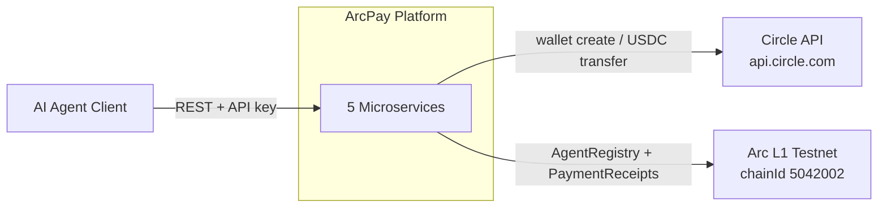
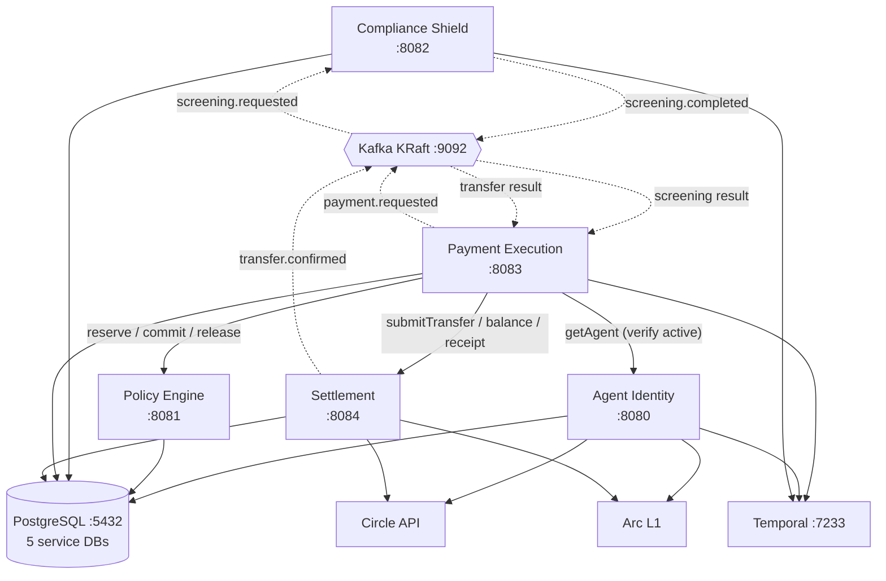
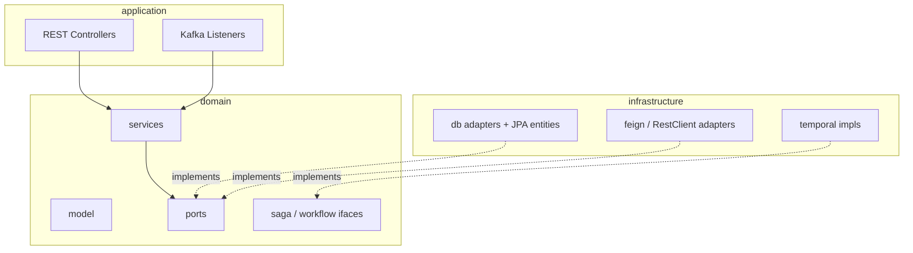
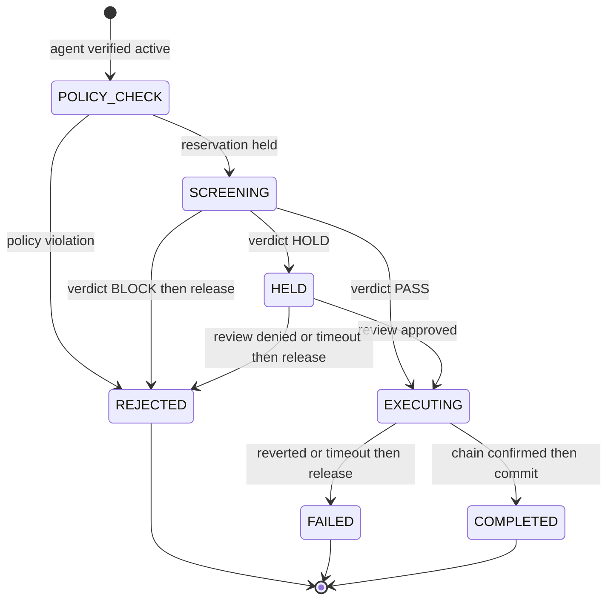
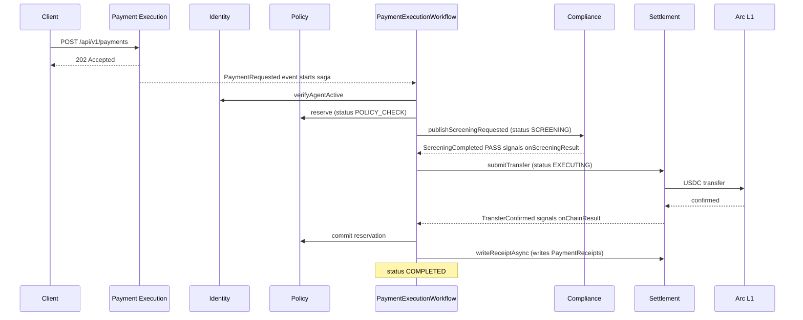
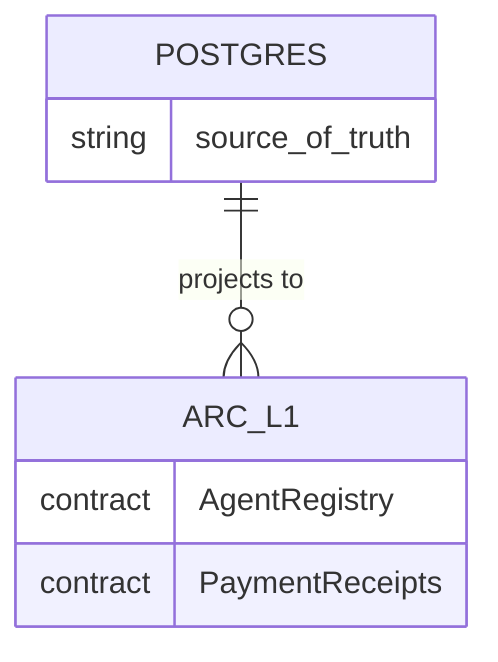

# Platform Architecture

ArcPay is a payment protocol that gives AI agents autonomous but policy-controlled access to USDC on Circle's Arc L1 blockchain. The backend is a Java 25 / Spring Boot 4 multi-module Gradle system of five independently deployable microservices — **Agent Identity**, **Policy Engine**, **Compliance Shield**, **Payment Execution**, and **Settlement** — each owning its own PostgreSQL database, communicating synchronously over authenticated internal REST and asynchronously over Kafka via a transactional outbox, with long-running money movement orchestrated as a Temporal saga and a verifiable projection of state written on-chain. This page describes that system end to end: who calls what, how the containers fit together, the hexagonal pattern the build enforces, the two communication channels, the orchestration saga, and the on-chain projection principle.

---

## System Context

ArcPay sits between AI-agent clients and two external systems: **Circle** (custodial wallets and USDC transfers) and **Arc L1** (the testnet blockchain holding the verifiable projection). Clients authenticate with API keys and drive payments through the platform; the platform reserves spend, screens for compliance, executes the transfer through Circle, and records an on-chain receipt.

**External systems**

| System | How it is reached | Evidence |
|--------|-------------------|----------|
| Circle API | Base URL `https://api.circle.com`, blockchain `ARC-TESTNET` | `identity/identity/src/main/resources/application.yml:54`, `:57`; `settlement/settlement/src/main/resources/application.yml:42`, `:45` |
| Arc L1 (Arc Testnet) | RPC via `${ARC_TESTNET_RPC_URL}`, chain id `5042002`, custodial signer `${PLATFORM_WALLET_PRIVATE_KEY}` | `identity/identity/src/main/resources/application.yml:69`, `:70`, `:71` |

The custodial model is deliberate: PostgreSQL is the source of truth, the platform wallet is the sole on-chain signer, and the on-chain contracts are an independently verifiable record rather than the authority.

---

## Container View

Five Spring Boot services run alongside three pieces of shared infrastructure: PostgreSQL (a database per service), Apache Kafka in KRaft mode (outbox event transport), and a Temporal server (saga orchestration). Each service exposes an actuator health endpoint on its own port.

Solid arrows are synchronous internal REST; dotted arrows are asynchronous Kafka events.

**Services, ports, databases, consumer groups**

| Service | Port | Database | Kafka group | Evidence |
|---------|------|----------|-------------|----------|
| Agent Identity | 8080 | `arcpay_identity` | `agent-identity-service` | `docker-compose.yml:100`, `:104`; `identity/.../application.yml:17` |
| Policy Engine | 8081 | `arcpay_policy` | `policy-engine` | `docker-compose.yml:126`, `:130`; `policy-engine/.../application.yml:26` |
| Compliance Shield | 8082 | `arcpay_compliance` | `compliance` | `docker-compose.yml:148`, `:152`; `compliance/.../application.yml:23` |
| Payment Execution | 8083 | `arcpay_payment` | `payment-execution` | `docker-compose.yml:171`, `:175`; `payment-execution/.../application.yml:23` |
| Settlement | 8084 | `arcpay_settlement` | `settlement` | `docker-compose.yml:195`, `:199`; `settlement/.../application.yml:17` |

**Shared infrastructure**

| Component | Version / mode | Port | Notes | Evidence |
|-----------|----------------|------|-------|----------|
| PostgreSQL | 16-alpine | 5432 | init via `deploy/local/postgres-init.sql`; Flyway per service | `docker-compose.yml:28`, `:34` |
| Apache Kafka | 3.8.1, KRaft, single broker node id 1 | 9092 | no Zookeeper | `docker-compose.yml:45` |
| Temporal | 1.25.2 auto-setup | 7233 | stores `temporal` + `temporal_visibility` | `docker-compose.yml:69`, `:83` |

Each service runs Flyway migrations under `<svc>/<svc>/src/main/resources/db/migration/V*.sql` against its own database, so schema ownership never crosses a service boundary.

### Module structure

The Gradle build (`settings.gradle.kts`) defines three shared modules plus three sub-modules per service:

- Shared: `platform-api`, `platform-infra`, `platform-test`
- Per service: `<svc>-api` (public DTOs and domain events), `<svc>-client` (Feign clients other services depend on), and `<svc>` (the runnable service)

This split lets one service depend on another's published API and client without ever reaching into its internals. The root `build.gradle.kts` configures a Java 25 toolchain for all subprojects (`build.gradle.kts:21`), applies Spotless with Palantir formatting (`build.gradle.kts:32`), compiles with `-parameters` (`build.gradle.kts:51`), and runs tests on JUnit Platform (`build.gradle.kts:55`).

---

## Hexagonal Architecture (Enforced)

Every service follows Ports and Adapters with a strict dependency direction — `application -> domain <- infrastructure` — and the rules are not aspirational: they are compiled into ArchUnit tests that run on every `./gradlew test`.

The architecture tests live at `payment-execution/src/test/.../architecture/HexagonalArchitectureTest.java`, `compliance/src/test/.../architecture/HexagonalArchitectureTest.java`, and `identity/identity/src/test/.../architecture/ArchitectureTest.java`. Representative enforced rules (citations from the Payment Execution test):

- **Layering**: a layered architecture across application, domain, and infrastructure with the standard hexagonal access rules (`HexagonalArchitectureTest.java:26`).
- **Domain purity**: domain must not import `jakarta.persistence..` / `org.hibernate..` (`:59`) or `org.springframework.web..` (`:67`), and may only touch the allowed Spring packages `stereotype`, `transaction`, and `data.domain` (`:75`).
- **No field injection**: production code must not use `@Autowired` (`:94`), and no field may be annotated with it (`:102`), forcing constructor injection.
- **Infrastructure isolation**: infrastructure must not depend on application (`:86`); `@Entity` lives only in `infrastructure.db..` (`:196`); web3j is confined to infrastructure and `domain.hashing` (`:203`); `RestClient` is confined to infrastructure (`:211`).
- **Naming**: repository adapters end in `Adapter` and are package-private (`:130`); Temporal `*Impl` classes are package-private (`:119`); ports end in `Port` (`:167`) and repository ports end in `Repository` (`:156`).
- **Controllers**: REST controllers must be `@RestController` + `@Validated` (`:178`) and must reside in `application..` (`:189`).
- **Events**: every record in `domain.event..` must declare a `public static final String TOPIC` (rule at `:251`, enforced by the `DECLARE_TOPIC_CONSTANT` condition at `:226`).
- **Cross-service**: Payment Execution must not depend on Settlement's internal business logic (`:219`).

Compliance additionally requires `@KafkaListener` methods to live only in `application..` (`compliance/.../HexagonalArchitectureTest.java:145`), and Identity confines `@KafkaListener` to `application.stream..` (`identity/.../ArchitectureTest.java:133`).

---

## Inter-Service Communication

ArcPay uses two channels deliberately: **synchronous internal REST** for request/response decisions that must block (reserve spend, verify an agent, submit a transfer), and **asynchronous Kafka events** for fire-and-forget facts that drive the saga forward (a payment was requested, screening completed, a transfer confirmed).

### Internal REST (Feign clients)

Internal calls target `/api/v1/internal/*` endpoints and the clients are published as `<svc>-client` modules. Circuit breaking is enabled via `spring.cloud.openfeign.circuitbreaker.enabled: true` (`policy-engine/.../application.yml:10`; `payment-execution/.../application.yml:7`).

**Policy Engine client** (`policy-engine-client/.../PolicyEngineClient.java`, base `${arcpay.policy-service.url}`, default `http://localhost:8081` per `payment-execution/.../application.yml:84`):

| Method | Path | Purpose |
|--------|------|---------|
| POST | `/api/v1/internal/policies/reservations` | Reserve spend for a payment (`PolicyEngineClient.java:18`) |
| POST | `/api/v1/internal/policies/reservations/{paymentId}/commit` | Commit a reservation (`:21`) |
| POST | `/api/v1/internal/policies/reservations/{paymentId}/release` | Release a reservation (`:24`) |
| POST | `/api/v1/internal/policies/reservations/{paymentId}/ops-release` | Ops override release (`:27`) |

These are served by `policy-engine/.../application/controller/internal/InternalReservationController.java` (a `@RestController` + `@Validated` at `:23`/`:26`; routes at `:34`, `:54`, `:60`, `:66`).

**Settlement client** (`payment-execution/.../infrastructure/client/settlement/SettlementServiceClient.java`, base `${arcpay.settlement-service.url}`, default `http://localhost:8084` per `payment-execution/.../application.yml:88`):

| Method | Path | Purpose |
|--------|------|---------|
| POST | `/api/v1/internal/transfers` | Submit a USDC transfer (`SettlementServiceClient.java:19`) |
| GET | `/api/v1/internal/wallets/{agentId}/balance` | Read agent wallet balance (`:22`) |
| POST | `/api/v1/internal/receipts` | Record a settlement receipt (`:25`) |

**Identity client** (`identity-client/.../IdentityServiceClient.java`, base `${arcpay.identity-service.url}`, default `http://localhost:8080`) exposes the internal endpoints other services use to resolve owners and agents:

| Method | Path | Purpose |
|--------|------|---------|
| GET | `/api/v1/internal/owners/by-api-key-hash/{hash}` | Resolve an owner from an API-key hash (`IdentityServiceClient.java:20`) |
| GET | `/api/v1/internal/agents/{agentId}` | Fetch an agent — used to verify it is active before any spend (`:23`) |
| PUT | `/api/v1/internal/agents/{agentId}/policy` | Update an agent's policy hash (`:26`) |

The external client-facing surface lives on Payment Execution (`payment-execution/.../application/controller/PaymentController.java`, mapped at `/api/v1/payments` (`:31`)), authenticated by API key (`@AuthenticationPrincipal OwnerPrincipal`):

| Method | Path | Purpose |
|--------|------|---------|
| POST | `/api/v1/payments` | Create a payment; 202 Accepted if new, 200 OK if idempotent (`PaymentController.java:40`, `:45`) |
| GET | `/api/v1/payments/{paymentId}` | Fetch one payment (`:49`) |
| GET | `/api/v1/payments` | List payments (`:55`) |

### Kafka events (transactional outbox)

Events are never published directly to Kafka from business code. Instead they are written to a per-service outbox table inside the same database transaction as the state change, then relayed to Kafka by a handler — the namastack transactional outbox pattern. The shared mechanics live in `platform-infra`:

- `AbstractOutboxEventPublisher.publish(...)` is annotated `@Transactional(propagation = Propagation.MANDATORY)` so it can only run inside a caller's transaction, generates a UUID `eventId`, and schedules the event onto the outbox with that id in context (`AbstractOutboxEventPublisher.java:20`, `:24`, `:25`).
- `AbstractOutboxHandler` (annotated with namastack's `@OutboxHandler`) drains the outbox and sends to Kafka via `KafkaTemplate`, propagating the event id (`AbstractOutboxHandler.java:18`, `:24`).
- `OutboxHeaders` defines `EVENT_ID_HEADER = "X-Event-Id"` and `EVENT_ID_CONTEXT_KEY = "eventId"` (`OutboxHeaders.java:5`, `:7`), giving every event a stable id for idempotent consumption.

Each service has its own outbox table prefix: `agentidentity_`, `policyengine_`, `compliance_`, `paymentexecution_`, `settlement_` (e.g. `payment-execution/.../application.yml:41`). Consumers use Spring Kafka `@KafkaListener` with a per-service JSON trust list (`payment-execution/.../application.yml:28`).

**Event catalog (topic constants, all verified in source)**

| Event record | Topic | Defining module |
|--------------|-------|-----------------|
| `PaymentRequested` | `payment.requested` | Payment Execution (`PaymentRequested.java:24`) |
| `PaymentStatusChanged` | `payment.status-changed` | Payment Execution (`PaymentStatusChanged.java:12`) |
| `PaymentScreeningRequested` | `screening.requested` | Compliance (`PaymentScreeningRequested.java:18`) |
| `ScreeningCompleted` | `screening.completed` | Compliance (`ScreeningCompleted.java:21`) |
| `ScreeningApproved` | `screening.approved` | Compliance (`ScreeningApproved.java:11`) |
| `ScreeningRejected` | `screening.rejected` | Compliance (`ScreeningRejected.java:11`) |
| `TransferConfirmed` | `transfer.confirmed` | Settlement (`TransferConfirmed.java:13`) |
| `TransferReverted` | `transfer.reverted` | Settlement (`TransferReverted.java:11`) |

> The `screening.requested` contract is defined in `compliance-api` but is *published* by Payment Execution's `CompliancePortAdapter` and *consumed* by Compliance — Payment Execution requests screening; Compliance performs it.

A `PaymentRequested` event is consumed by `PaymentExecutionTrigger` (`payment-execution/.../application/stream/PaymentExecutionTrigger.java:25`), which starts the Temporal saga. Compliance consumes `screening.requested` via `compliance/.../application/stream/ScreeningRequestedListener.java:16`. Payment Execution consumes the screening and transfer outcomes and translates each into a Temporal workflow signal in `payment-execution/.../application/stream/PaymentSignalListener.java` (`onScreeningCompleted` `:31` → `onScreeningResult`, `onScreeningApproved` `:37` / `onScreeningRejected` `:43` → `onReviewDecision`, `onTransferConfirmed` `:49` / `onTransferReverted` `:55` → `onChainResult`).

---

## Orchestration via Temporal Sagas

Long-running money movement is orchestrated by the **PaymentExecutionWorkflow**, a Temporal saga that survives restarts and waits on external events as signals. The workflow interface (`payment-execution/.../domain/saga/PaymentExecutionWorkflow.java`) declares `String TASK_QUEUE = "PaymentExecutionTaskQueue"` (`:15`), a workflow id format `PaymentExecution_<paymentId>` (`workflowId(...)` `:29`), one `@WorkflowMethod execute(...)` (`:17`), and three `@SignalMethod`s: `onScreeningResult` (`:21`), `onReviewDecision` (`:24`), `onChainResult` (`:27`). The implementation `PaymentExecutionWorkflowImpl` is annotated `@WorkflowImpl(taskQueues = "PaymentExecutionTaskQueue")` (`:28`).

Temporal task queues across the platform: `PaymentExecutionTaskQueue` (`payment-execution/.../application.yml:53`), `ComplianceTaskQueue` (`compliance/.../application.yml:55`), and `AgentIdentityTaskQueue` (`identity/.../application.yml:47`). The configured Temporal namespace defaults to `arcpay` (`spring.temporal.namespace`, e.g. `payment-execution/.../application.yml:32`) and is overridden to `default` in the local stack via `SPRING_TEMPORAL_NAMESPACE` (`docker-compose.yml:16`). Policy Engine and Settlement declare no task queue and run no workflows.

The saga is a state machine (`PaymentExecutionWorkflowImpl.execute`):

Notable behaviors and timeouts: an inactive agent rejects immediately with `AGENT_NOT_ACTIVE` (`PaymentExecutionWorkflowImpl.java:79`); a failed reservation rejects with `POLICY_VIOLATION` (`:88`); screening waits on the `screeningResult` signal with a 72-hour timeout (`:34`, `:96`); a HOLD waits on `reviewDecision`, also 72 hours (`:35`, `:108`); chain confirmation waits on `chainResult` with a 5-minute timeout (`:36`, `:122`). On completion the saga calls `recordOnChainRef`, then `commit` (releasing the policy reservation), then `persistCompleted`, then a fire-and-forget `writeReceiptAsync` (`:137`–`:141`). Activity stubs are tiered: decision activities StartToClose 10s / ScheduleToClose 5m (`:41`–`:42`), ledger activities 5s / 24h (`:53`–`:54`), receipt activity 10s / 10m (`:65`–`:66`).

The activities are implemented in `payment-execution/.../infrastructure/temporal/PaymentExecutionActivitiesImpl.java`: `verifyAgentActive` (`:39`), `reserve` (`:47`), `commit` (`:54`), `release` (`:60`), `publishScreeningRequested` (`:66`), `submitTransfer` (`:76`), `writeReceiptAsync` (`:88`), `persistStatus` (`:103`), `persistRejected` (`:108`), `persistFailed` (`:113`), `persistCompleted` (`:118`), `recordTransfer` (`:123`), and `recordOnChainRef` (`:128`).

### End-to-end payment sequence

Derived from the workflow implementation and the nine scenarios in `payment-execution/src/business-test/.../PaymentSagaE2ETest.java` (happy path `:49`, policy rejection `:84`, compliance block `:109`, HOLD+approval `:136`, review denial `:172`, chain revert `:200`, agent suspended `:230`, settlement rejects transfer `:253`, duplicate request `:284`). The happy path:

When screening returns BLOCK or HOLD-then-denied, or the chain reverts/times out, the saga calls `release` on Policy and lands in `REJECTED` or `FAILED` instead — the compensating path the E2E tests assert (e.g. one `release` and zero `commit` on compliance block, `:132`; on chain revert, `:225`–`:226`).

---

## On-Chain Projection Principle

PostgreSQL is the source of truth; the Arc L1 contracts are a verifiable, tamper-evident projection written by the custodial platform wallet. Two Solidity contracts back this:

**AgentRegistry** (`identity/identity/contracts/AgentRegistry.sol`, `pragma solidity 0.8.24` at `:2`) holds an `Agent` record of `owner`, `metadataHash`, `policyHash`, `wallet`, `active`, `exists`, and `createdAt` (`:14`). `registerAgent(agentId, owner, wallet, metadataHash)` (`:74`) is idempotent — re-submitting the same `(agentId, owner, wallet)` is a no-op success, while a re-registration with a different owner or wallet reverts (`:82`–`:83`). It emits `AgentRegistered` (`:31`), `AgentDeactivated` (`:35`), `AgentReactivated` (`:37`), `MetadataUpdated` (`:39`), `PolicyUpdated` (`:41`), and two-step registrar-transfer events `RegistrarTransferStarted` (`:43`) / `RegistrarTransferred` (`:45`). The Identity service syncs this asynchronously via `AgentOnChainSyncWorkflowImpl`.

**PaymentReceipts** (`settlement/settlement/contracts/PaymentReceipts.sol`) records finalized transfers immutably. `recordReceipt(paymentId, payer, payee, amount, memoHash, timestamp)` (`:16`) reverts with `"receipt already recorded"` if a payment id is already recorded (`:24`), then flips `recorded[paymentId]` (`:25`) and emits `ReceiptRecorded` (indexed on `paymentId`, `payer`, `payee`) (`:5`, `:26`). The Settlement service writes this as the saga's final, fire-and-forget step, so the on-chain receipt is a downstream projection of the committed database state rather than a prerequisite for it.

---

## Related pages

- [[Agent-Identity-Service]]
- [[Policy-Engine-Service]]
- [[Compliance-Shield-Service]]
- [[Payment-Execution-Service]]
- [[Settlement-Service]]
- [[Transactional-Outbox-and-Events]]
- [[Temporal-Sagas]]
- [[On-Chain-Projection]]
