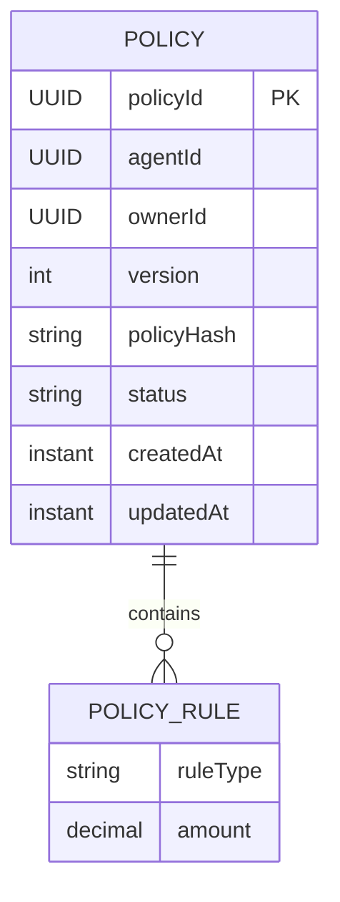
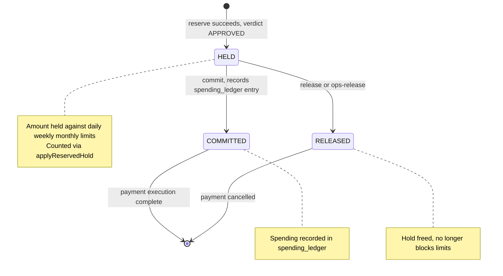
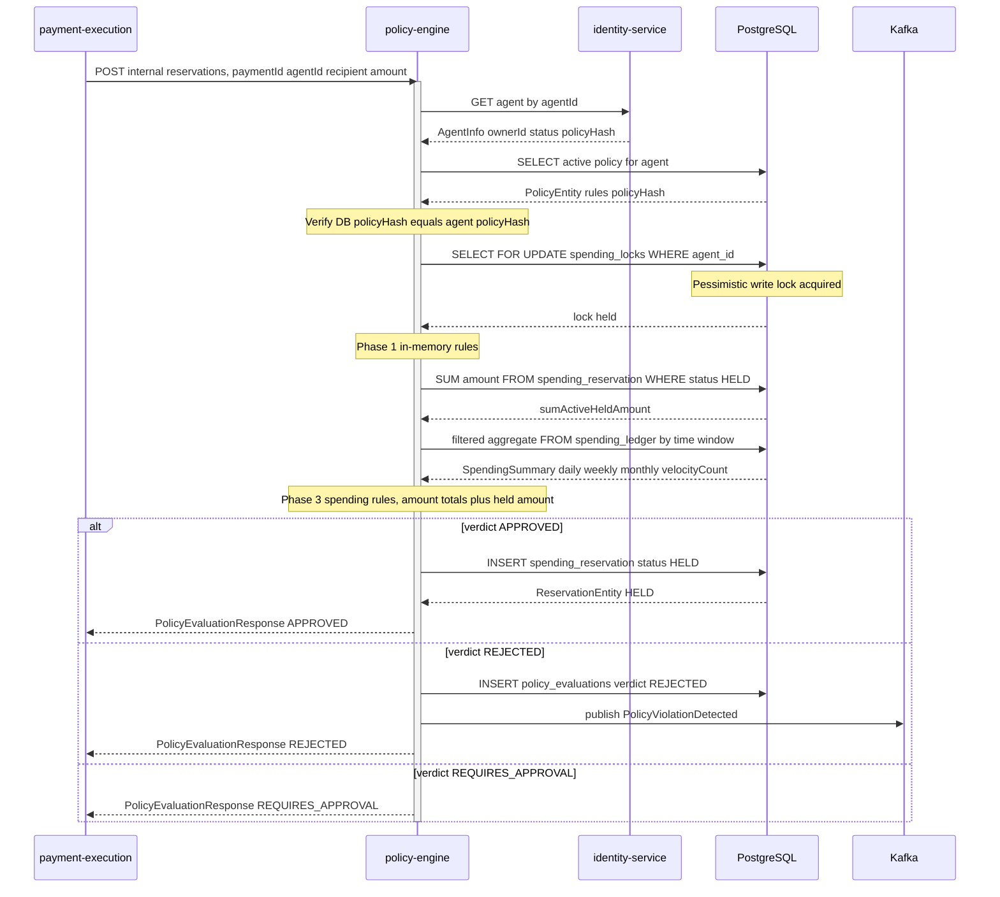

# Policy Engine Service

The **Policy Engine** is ArcPay's spending-control authority. It is the service that answers a single, high-stakes question on every payment an AI agent attempts: *"Is this transaction allowed under the agent owner's rules — right now, given everything already spent and everything currently pending?"* It owns the lifecycle of versioned spending **policies**, evaluates transactions against a rich rule set, and — critically — enforces limits **atomically** through a **spending reservation** protocol that prevents concurrent payments from collectively breaching a daily, weekly, or monthly cap. It runs on port **8081**, is purely backend business logic (no on-chain interaction, no Solidity), and publishes its decisions to the rest of ArcPay over Kafka via the transactional outbox pattern.

---

## Responsibilities

1. **Policy lifecycle & versioning** — create, supersede, and query agent policies (`PolicyCommandHandler`, `PolicyQueryHandler`).
2. **Policy evaluation** — score a transaction against a sealed set of rules and return a verdict of `APPROVED`, `REJECTED`, or `REQUIRES_APPROVAL` (`PolicyEvaluationService`).
3. **Spending reservation lifecycle** — hold quota at approval time, then `COMMITTED` (records spend) or `RELEASED` (frees the hold): `HELD` → `COMMITTED` | `RELEASED` (`ReservationService`).
4. **Spending ledger** — record committed spend and serve time-windowed spending summaries (`SpendingLedgerService`).
5. **Event publication** — emit `policy.created` and `policy.violation-detected` over Kafka through the namastack outbox.

---

## REST API

### Public (owner-authenticated)

| Method | Path | Auth | Purpose |
|---|---|---|---|
| POST | `/api/v1/agents/{agentId}/policies` | `OwnerPrincipal` | Create or update the active policy for an agent |
| GET | `/api/v1/agents/{agentId}/policies/active` | `OwnerPrincipal` | Retrieve the currently active policy |
| GET | `/api/v1/agents/{agentId}/policies/{policyId}` | `OwnerPrincipal` | Fetch a specific policy by ID |
| GET | `/api/v1/agents/{agentId}/policies` | `OwnerPrincipal` | List policy history, paginated (default size 20) |
| POST | `/api/v1/policies/evaluate` | `OwnerPrincipal` | Dry-run evaluate a transaction against the active policy |

### Internal (service-to-service, `ROLE_SERVICE`)

These endpoints are matched by `/api/v1/internal/**` and require the service role, enforced by `ServiceAuthFilter` against `arcpay.security.service-token` (`SecurityConfig.java:37-38, 54-55`; `application.yml:53-54`). They are the heart of atomic limit enforcement.

| Method | Path | Auth | Purpose |
|---|---|---|---|
| POST | `/api/v1/internal/policies/evaluate` | service token | Real (non-dry-run) evaluation; persists records |
| POST | `/api/v1/internal/policies/reservations` | service token | Reserve spending quota for a payment (holds against limits) |
| POST | `/api/v1/internal/policies/reservations/{paymentId}/commit` | service token | Commit reservation and record the spend |
| POST | `/api/v1/internal/policies/reservations/{paymentId}/release` | service token | Release a held reservation (cancellation) |
| POST | `/api/v1/internal/policies/reservations/{paymentId}/ops-release` | service token | Ops-only release for orphaned reservations |
| GET | `/api/v1/internal/agents/{agentId}/spending-summary` | service token | Get the agent's 24-hour spending summary |

---

## The Policy Model

A **`Policy`** (`domain/model/Policy.java`) is an immutable record describing the rules a single agent must obey. Policies are **versioned** and **never mutated in place** — updating a policy supersedes the old one and creates a new version.



- **Status** is `ACTIVE` or `SUPERSEDED` (`PolicyStatus`). `Policy.supersede()` flips an active policy to `SUPERSEDED` and bumps `updatedAt` (`Policy.java:37-42`).
- **`policyHash`** is a Keccak-256 (SHA-3) hash, computed by web3j `Hash.sha3String` over a JCS / RFC 8785 canonicalization of the rule set (`PolicyHashUtil.computePolicyHash`, `PolicyHashUtil.java:37-51`), stored as `VARCHAR(66)` (`0x` + 64 hex chars). The identity service holds this hash per agent; evaluation refuses to proceed if the DB policy hash and the agent's stored hash diverge (see *Policy Hash Verification* below).
- **`rules`** is an immutable, non-empty `List<PolicyRule>`, persisted as `JSONB` in the `policies` table.
- Persistence: `policies` table with unique constraint `policies_agent_version_uq (agent_id, version)` and index `idx_policies_agent_status (agent_id, status)`.

### Policy Rules

`PolicyRule` is a **sealed interface** (`policy-engine-api/PolicyRule.java`) with ten implementations. Each has a dedicated evaluator registered in the `RuleEvaluatorRegistry`, which fails fast at construction if any permitted rule subtype lacks an evaluator (`verifyAllRuleTypesCovered`, `RuleEvaluatorRegistry.java:46-52`).

| Rule | Evaluator | Verdict logic |
|---|---|---|
| `DailyLimit(amount)` | `DailyLimitEvaluator` | PASS if `dailyTotal + requested <= limit` |
| `WeeklyLimit(amount)` | `WeeklyLimitEvaluator` | PASS if `weeklyTotal + requested <= limit` |
| `MonthlyLimit(amount)` | `MonthlyLimitEvaluator` | PASS if `monthlyTotal + requested <= limit` |
| `PerTransactionLimit(amount)` | `PerTransactionLimitEvaluator` | PASS if `requested <= limit` (in-memory) |
| `RecipientAllowlist(addresses)` | `RecipientAllowlistEvaluator` | In-memory address check |
| `RecipientBlocklist(addresses)` | `RecipientBlocklistEvaluator` | In-memory address check |
| `TimeWindow(startHour, endHour, daysOfWeek)` | `TimeWindowEvaluator` | In-memory time-of-day / day-of-week check |
| `Velocity(maxTransactions, periodMinutes)` | `VelocityEvaluator` | PASS if `velocityCount < maxTransactions` |
| `ApprovalThreshold(amount)` | `ApprovalThresholdEvaluator` | PASS if `requested <= threshold`, else `REQUIRES_APPROVAL` |
| `Cooldown(seconds)` | `CooldownEvaluator` | PASS if no prior transaction, or elapsed seconds since `lastTransactionAt` ≥ `seconds`; else FAIL |

---

## Policy Evaluation

Evaluation (`PolicyEvaluationService.evaluate`, `PolicyEvaluationService.java:64-118`) runs in **three phases**, lazy-loading expensive spending data only when a spending-dependent rule is actually present.

1. **Active policy check** — no active policy → reject with a synthetic `NO_ACTIVE_POLICY` result.
2. **Hash verification** — `PolicyHashMismatchException` if the DB policy hash ≠ the agent's stored hash.
3. **Acquire spending lock** — `SpendingLockService.acquireLock(agentId)` takes a pessimistic write lock, serializing all evaluations and transitions for the agent.
4. **Phase 1 — in-memory rules** (`PerTransactionLimit`, `RecipientAllowlist`, `RecipientBlocklist`, `TimeWindow`, `ApprovalThreshold`). Short-circuits on the first FAIL when not a dry-run.
5. **Phase 2 — spending summary (lazy)** — only if a spending-dependent rule exists. Queries 1d / 7d / 30d totals plus a velocity-window count from `spending_ledger`, **then adds the sum of currently HELD reservations to the daily/weekly/monthly totals** (`applyReservedHold`, `PolicyEvaluationService.java:199-208`) so pending payments count against the amount limits. (The held sum is not added to the velocity count.)
6. **Phase 3 — spending-dependent rules** (`DailyLimit`, `WeeklyLimit`, `MonthlyLimit`, `Velocity`, `Cooldown`). Short-circuits on FAIL when not a dry-run.
7. **Verdict** (`determineVerdict`) — any FAIL → `REJECTED`; else any `REQUIRES_APPROVAL` → `REQUIRES_APPROVAL`; else `APPROVED`.
8. **Persist & publish** — write to `policy_evaluations` only if verdict ≠ APPROVED or it's a dry-run; publish `PolicyViolationDetected` only when verdict = REJECTED and not a dry-run.

The result is a `PolicyEvaluationResult` carrying `evaluationId`, `agentId`, `policyId`, `verdict`, the per-rule `ruleResults`, `requestedAmount`, `recipientAddress`, `dryRun`, `evaluatedAt`, and `durationMs`.

---

## The Spending Reservation Lifecycle

This is the mechanism that makes limit enforcement **atomic across concurrent payments**. Rather than "evaluate now, spend later" (which would let two simultaneous payments both pass a daily-limit check), the engine **holds** the requested amount the instant a payment is approved, and that hold immediately counts against the agent's amount limits for every subsequent evaluation.

A **`Reservation`** (`domain/model/Reservation.java`) is keyed by the external `paymentId` and moves through three states (`ReservationStatus`: `HELD`, `COMMITTED`, `RELEASED`).



### Transitions (all `@Transactional`, all under the per-agent lock)

| Transition | Service method | Behavior |
|---|---|---|
| **reserve** | `ReservationService.reserve` (`:37-63`) | Lock agent, idempotent on `paymentId`, run `evaluate(dryRun=false)`. On `APPROVED` → save `Reservation.held(...)`. Otherwise no record saved; the evaluation result is returned. |
| **commit** | `ReservationService.commit` (`:65-80`) | Lock & load. Idempotent if already `COMMITTED`; `IllegalReservationStateException` if `RELEASED`. Transition to `COMMITTED` and **record spend** via `SpendingLedgerService.recordSpending`. |
| **release** | `ReservationService.release` (`:82-85`) | Delegates to `releaseHeld(paymentId, "release")`. |
| **ops-release** | `ReservationService.opsRelease` (`:87-91`) | Logs an operational-orphan warning, then `releaseHeld(paymentId, "ops-release")`. |
| `releaseHeld` | (`:93-104`) | Lock & load. Idempotent if already `RELEASED`; `IllegalReservationStateException` if `COMMITTED`. Transition to `RELEASED`. **No** ledger entry is written. |

### Why it's atomic

Every transition — and every evaluation — calls `SpendingLockService.acquireLock(agentId)`, which acquires a **pessimistic write lock** via `findByAgentIdForUpdate` (`@Lock(LockModeType.PESSIMISTIC_WRITE)`, `SpendingLockJpaRepository.java:14-16`) on the `spending_locks` table (creating the row first if absent). This serializes all reservation activity for a given agent, so two concurrent payments cannot both read "under limit" and both reserve. The held amount is summed by `ReservationJpaRepository.sumActiveHeldAmount` (`COALESCE(SUM(amount), 0)` over rows with `status = HELD` for the agent) and folded into the amount-limit checks via `applyReservedHold`.

### Reserve + Evaluate sequence (from payment-execution)



---

## The Spending Ledger

The **spending ledger** is the permanent record of *committed* spend, and the source of truth for the time-windowed totals that drive `DailyLimit` / `WeeklyLimit` / `MonthlyLimit` / `Velocity` (and the last-transaction timestamp used by `Cooldown`).

- **`SpendingLedgerEntry`** (`domain/model/SpendingLedgerEntry.java`): `entryId`, `agentId`, `paymentId` (unique), `amount`, `recipient`, `executedAt`, `createdAt`.
- **Recording** (`SpendingLedgerService.recordSpending`, `:23-44`) happens only on reservation commit; it is **idempotent on `paymentId`** (returns the existing entry if already recorded).
- **Summary** (`getSpendingSummary`, `:46-48`) is computed by a single native, filtered-aggregate query (`SpendingLedgerJpaRepository.getSpendingSummary`, `:14-27`) using cutoffs `now-1d`, `now-7d`, `now-30d`, and `now-velocityMinutes` (computed in the adapter, `SpendingLedgerRepositoryAdapter.java:36-39`), returning a `SpendingSummary` of `dailyTotal`, `weeklyTotal`, `monthlyTotal`, `velocityCount`, and `lastTransactionAt`.
- Persistence: `spending_ledger` table with unique `payment_id` (`spending_ledger_payment_uq`) and index `idx_spending_agent_time (agent_id, executed_at)` tuned for window queries.

---

## Events

Policy Engine **only produces** events — it does **not consume** any Kafka topics (no `@KafkaListener` or stream consumer exists in the module). Both events are published through the namastack outbox (`policyengine_` table prefix, `application.yml:65`), guaranteeing they participate in the originating transaction.

| Event | Topic | Published by | When |
|---|---|---|---|
| `PolicyCreated` | `policy.created` | `PolicyCommandHandler.createOrUpdatePolicy` (`:67-73`) | After a new policy version is saved |
| `PolicyViolationDetected` | `policy.violation-detected` | `PolicyEvaluationService.publishViolationEvent` (`:256-271`) | After a non-dry-run evaluation returns `REJECTED` |

- **`PolicyCreated`** fields: `policyId`, `agentId`, `ownerId`, `version`, `policyHash`, `createdAt`.
- **`PolicyViolationDetected`** fields: `evaluationId`, `agentId`, `policyId`, `violatedRuleType`, `message`, `requestedAmount`, `detectedAt`.

---

## Persistence

PostgreSQL is the system of record (`jdbc:postgresql://localhost:5432/arcpay_policy`, `application.yml:14`), schema validated against seven Flyway migrations (`ddl-auto: validate`).

| Version | File | Creates |
|---|---|---|
| V1 | `V1__42_create_policies_table.sql` | `policies` + `policies_agent_version_uq` + `idx_policies_agent_status` |
| V2 | `V2__42_create_spending_ledger_table.sql` | `spending_ledger` + `payment_id` unique + `idx_spending_agent_time` |
| V3 | `V3__42_create_spending_locks_table.sql` | `spending_locks` (pessimistic lock rows, PK `agent_id`) |
| V4 | `V4__42_create_policy_evaluations_table.sql` | `policy_evaluations` + `idx_evaluations_agent` |
| V5 | `V5__42_create_outbox_tables.sql` | `policyengine_outbox_record`, `policyengine_outbox_instance`, `policyengine_outbox_partition` |
| V6 | `V6__55_create_shedlock_table.sql` | `shedlock` (distributed lock for the cleanup scheduler) |
| V7 | `V7__139_create_spending_reservation.sql` | `spending_reservation` + `idx_reservation_agent_status` |

### `spending_reservation` (V7)

```
payment_id   UUID          PK, NOT NULL
agent_id     UUID          NOT NULL
amount       NUMERIC(18,6) NOT NULL
recipient    VARCHAR(42)   NOT NULL
status       VARCHAR(16)   NOT NULL   -- HELD | COMMITTED | RELEASED
created_at   TIMESTAMPTZ   NOT NULL DEFAULT now()
INDEX idx_reservation_agent_status ON (agent_id, status)
```

**Conventions across tables:** amounts are `NUMERIC(18,6)`; addresses are `VARCHAR(42)` (Ethereum-length); `policy_hash` is `VARCHAR(66)`; timestamps are `TIMESTAMPTZ`. Domain IDs are generated via `UuidCreator.getTimeOrderedEpoch()`, except `payment_id`, which is supplied by the caller.

---

## Security & Authorization

- **Public endpoints** inject `com.arcpay.platform.api.OwnerPrincipal` via `@AuthenticationPrincipal`; the principal is established by the platform `ApiKeyAuthFilter`.
- **`AgentAuthorization`** enforces two checks against the identity service: `verifyOwnership` (agent's `ownerId` must equal the principal's, `:20-26`) and `verifyOwnershipAndActive` (additionally requires agent `status == "ACTIVE"`, `:28-34`), raising `AgentOwnershipException` / `AgentNotActiveException`.
- **Hash verification** during evaluation guarantees the policy in the DB matches the agent's stored hash, else `PolicyHashMismatchException`.
- **Internal endpoints** (`/api/v1/internal/**`) require `ROLE_SERVICE`, applied by `ServiceAuthFilter(serviceToken)` (`SecurityConfig.java:37-38, 54-55`). Sessions are stateless and unauthenticated requests fail closed with `401` via an `HttpStatusEntryPoint`.

---

## External Integrations & Resilience

- **Identity service** (`AgentServiceClient` → `IdentityServiceAdapter`): `getAgent(agentId)` returns `Optional<AgentInfo(agentId, ownerId, status, policyHash)>`; `updatePolicy(agentId, policyHash)` notifies identity of a policy change. Calls go through the shared `IdentityServiceClient` (OpenFeign) with Resilience4j — 50% failure-rate threshold, sliding window 10, minimum 10 calls, 30s open state, 3 calls in half-open, and a 3s time limiter (`application.yml:33-48`). `FeignException$NotFound` is mapped to `AgentNotFoundException` rather than tripping the breaker.
- **Kafka publishing** via `OutboxEventPublisher` (extends `AbstractOutboxEventPublisher`) and `PolicyEngineOutboxHandler` (extends `AbstractOutboxHandler`) — exponential retry, max-retries 5, initial 1s, max 60s, multiplier 2.0 (`application.yml:68-74`).

---

## Policy Lifecycle & Versioning

`PolicyCommandHandler.createOrUpdatePolicy` (`:32-82`): verify ownership + agent active → validate rules → compute hash → create-if-absent + acquire spending lock → if an active policy already has the same hash, return it idempotently (no new version); otherwise supersede the active policy, compute the next version (`maxVersion + 1`), create via `PolicyCreationService.createPolicy`, save, notify identity (`updatePolicy`), and publish `PolicyCreated`.

---

## Scheduling & Retention

`EvaluationCleanupJob` deletes `policy_evaluations` older than the retention window (default **90 days**, `arcpay.policy.evaluation.retention-days`) on a cron of `0 0 2 * * *` (2 AM daily, `arcpay.policy.evaluation.cleanup-cron`, `application.yml:55-58`). It is guarded by **ShedLock** (`@SchedulerLock(name = "evaluationCleanup", lockAtMostFor = "30m", lockAtLeastFor = "5m")`, `shedlock` table) for safe execution across instances, calling `PolicyEvaluationRepository.deleteOlderThan(cutoff)`.

---

## What This Service Is Not

- **No Solidity / no on-chain interaction** — Policy Engine is pure business logic. (web3j appears only as a hashing utility in `PolicyHashUtil`, not for blockchain calls.)
- **No Kafka consumption** — it produces events only.
- **No REST callbacks/webhooks**, **no GraphQL**, **no reactive streams** — synchronous `@Transactional` methods throughout.
- **No soft deletes** — policies use `SUPERSEDED` status; evaluations are time-retention pruned, not a permanent audit log.

---

## Related pages

- [[Agent-Identity-Service]]
- [[Payment-Execution-Service]]
- [[Compliance-Shield-Service]]
- [[Settlement-Service]]
- [[Transactional-Outbox-Pattern]]
- [[Service-Topology-and-Ports]]
