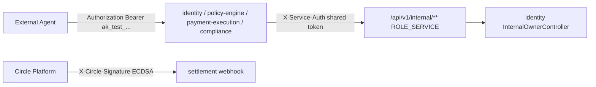
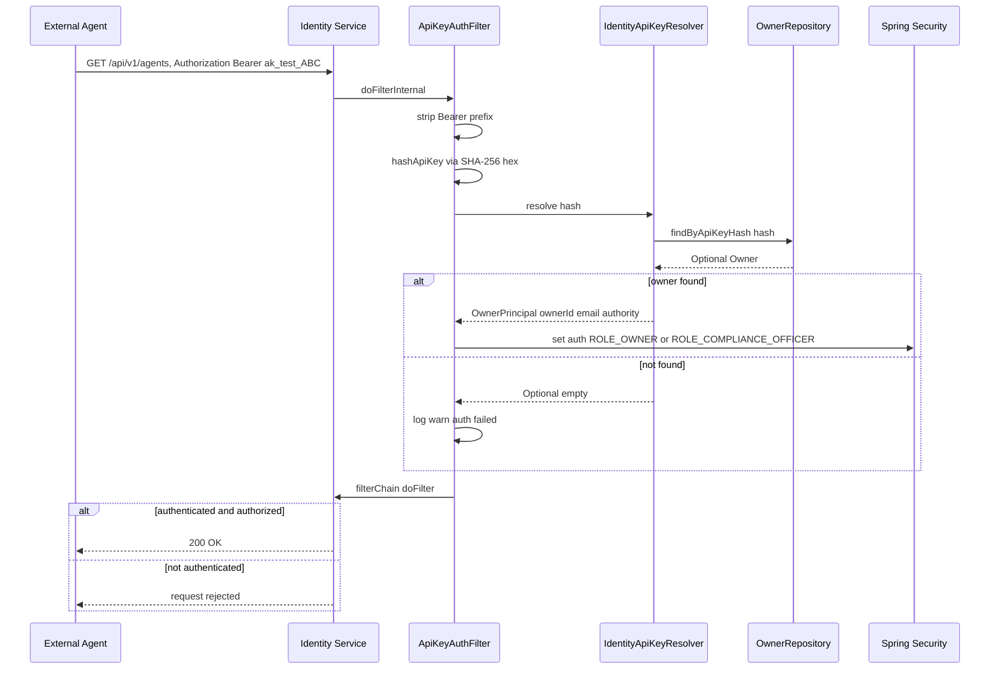
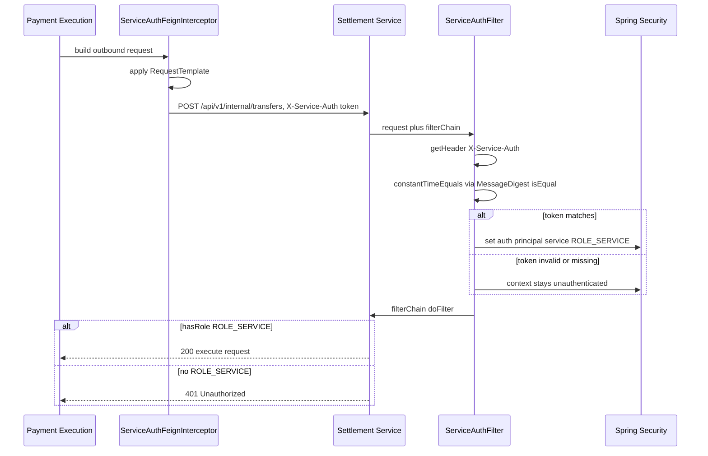
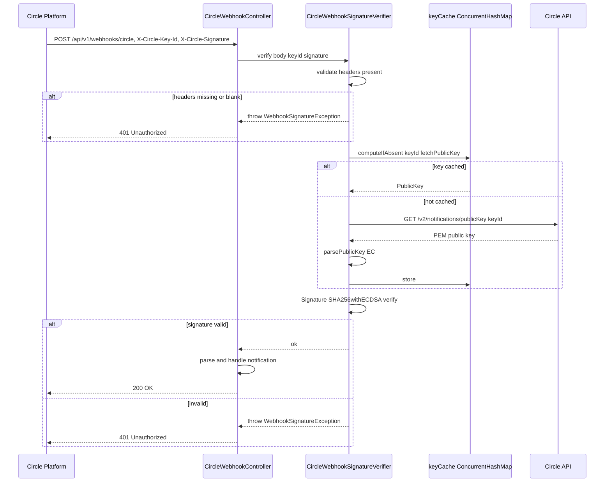

# Security

ArcPay's security model is built on three independent authentication planes, each guarding a different trust boundary. External agents authenticate with a **Bearer API key** that the platform only ever stores as a SHA-256 hash. Internal microservices talk to each other over a **shared service token** that grants the `ROLE_SERVICE` authority on `/api/v1/internal/**` endpoints. Inbound notifications from Circle are authenticated by **ECDSA signature verification** rather than by Spring Security. All five services run stateless (no sessions, CSRF disabled) and treat PostgreSQL as the source of truth for credentials. This page documents what is actually wired up in the source today — and is explicit about what is *not*.

---

## Trust boundaries at a glance



| Plane | Who authenticates | Mechanism | Authority granted |
|-------|-------------------|-----------|-------------------|
| Agent API key | External agents | `Authorization: Bearer <key>`, SHA-256 hash lookup | `ROLE_OWNER` or `ROLE_COMPLIANCE_OFFICER` |
| Service-to-service | Internal services | `X-Service-Auth: <token>`, constant-time compare | `ROLE_SERVICE` |
| Circle webhook | Circle Platform | `X-Circle-Key-Id` + `X-Circle-Signature`, `SHA256withECDSA` | none (bypasses Spring auth, `permitAll`) |

---

## Layer 1 — Agent API key authentication

External agents authenticate to **identity**, **policy-engine**, **payment-execution**, and **compliance** with a Bearer token in the `Authorization` header. The shared `ApiKeyAuthFilter` (in `platform-infra`) extracts the token, hashes it, and resolves it to an authenticated principal.

### How a key is verified

`ApiKeyAuthFilter` strips the `"Bearer "` prefix (`platform-infra/src/main/java/com/arcpay/platform/infrastructure/security/ApiKeyAuthFilter.java:32-33`), hashes the raw key with SHA-256 over UTF-8 and renders it as hex via `HexFormat.of().formatHex()` (`ApiKeyAuthFilter.java:48-56`), then calls `ApiKeyResolver.resolve(hash)` (`ApiKeyAuthFilter.java:35`). On a hit it installs a `UsernamePasswordAuthenticationToken` carrying the `OwnerPrincipal` and the authority `"ROLE_" + principal.authority()` (`ApiKeyAuthFilter.java:38-40`); a miss is logged as a warning (`ApiKeyAuthFilter.java:42`) and the request proceeds unauthenticated.

The `ApiKeyResolver` interface (`platform-infra/src/main/java/com/arcpay/platform/infrastructure/security/ApiKeyResolver.java:10-12`) returns `Optional<OwnerPrincipal>` and is implemented per service:

| Service | Resolver | Strategy |
|---------|----------|----------|
| identity | `IdentityApiKeyResolver` | Direct DB lookup `OwnerRepository.findByApiKeyHash(hash)` (`identity/identity/src/main/java/com/arcpay/identity/agentidentity/application/security/IdentityApiKeyResolver.java:19-22`), authority from `OwnerAuthorities.forApiKeyHash(hash)` (`IdentityApiKeyResolver.java:22`) |
| compliance | `FeignApiKeyResolver` | Delegates to identity over Feign (`compliance/compliance/src/main/java/com/arcpay/compliance/application/security/FeignApiKeyResolver.java:22-23`), `@Cacheable(value = "apiKeyResolution", key = "#apiKeyHash")` (`FeignApiKeyResolver.java:19`) |
| policy-engine | `FeignApiKeyResolver` | Delegates to identity over Feign (`policy-engine/policy-engine/src/main/java/com/arcpay/policy/policyengine/application/security/FeignApiKeyResolver.java:22-23`), `@Cacheable(value = "apiKeyResolution", key = "#apiKeyHash")` (`FeignApiKeyResolver.java:19`) |
| payment-execution | `FeignApiKeyResolver` | Delegates to identity over Feign (`payment-execution/payment-execution/src/main/java/com/arcpay/payment/paymentexecution/application/security/FeignApiKeyResolver.java:20-21`), `@Cacheable(value = "apiKeyResolution", key = "#apiKeyHash")` (`FeignApiKeyResolver.java:17`) |

The Feign path calls `IdentityServiceClient.resolveApiKey(apiKeyHash)`, which maps to `GET /api/v1/internal/owners/by-api-key-hash/{hash}` (`IdentityServiceClient.java:20-21`).

`OwnerPrincipal` is the shared principal record in `platform-api` with fields `ownerId` (UUID), `email`, and `authority`, defaulting to `"OWNER"` (`platform-api/src/main/java/com/arcpay/platform/api/OwnerPrincipal.java:6-20`).

### Inbound agent request flow



### Key generation and storage

API keys are minted by `OwnerCreationService` in identity: prefix `"ak_test_"` (`identity/identity/src/main/java/com/arcpay/identity/agentidentity/domain/owner/OwnerCreationService.java:19`), 32 random characters from `A-Za-z0-9` (`OwnerCreationService.java:20-21`) drawn from a static `SecureRandom` (`OwnerCreationService.java:22`). The **raw key is never persisted** — only its SHA-256 hex hash is stored (`OwnerCreationService.java:27`, hash at `OwnerCreationService.java:52-60`).

The hash lives in the `owners` table (`identity/identity/src/main/resources/db/migration/V1__create_owners_table.sql`):

| Column | Type | Notes |
|--------|------|-------|
| `owner_id` | UUID | primary key |
| `email` | VARCHAR(255) | unique index on `LOWER(email)` |
| `wallet_address` | VARCHAR(42) | unique index on `LOWER(wallet_address)` |
| `api_key_hash` | VARCHAR(64) | indexed — 64 hex chars = SHA-256 output |
| `status` | VARCHAR(20) | `ACTIVE` default |
| `created_at`, `updated_at` | TIMESTAMPTZ | `DEFAULT now()` |

Indexes: `idx_owners_email`, `idx_owners_wallet` (both unique), `idx_owners_api_key_hash` (non-unique) (`V1__create_owners_table.sql:12-14`). The JPA mapping pins the column as non-updatable: `@Column(name = "api_key_hash", nullable = false, updatable = false, length = 64)` (`identity/identity/src/main/java/com/arcpay/identity/agentidentity/infrastructure/db/owner/OwnerEntity.java:42-43`).

---

## Layer 2 — Service-to-service authentication

Internal endpoints (`/api/v1/internal/**`) are reachable only with the `ROLE_SERVICE` authority, which is granted by presenting the shared service token in the `X-Service-Auth` header.

### Inbound: ServiceAuthFilter

`ServiceAuthFilter` reads the `X-Service-Auth` header (`platform-infra/src/main/java/com/arcpay/platform/infrastructure/security/ServiceAuthFilter.java:20,30`) and compares it to the configured `serviceToken` using `constantTimeEquals()`, which delegates to `MessageDigest.isEqual()` for timing-attack resistance (`ServiceAuthFilter.java:31,40-42`). On a match it installs an authentication with principal `"service"` and authority `"ROLE_" + Roles.SERVICE` (`ServiceAuthFilter.java:32-33`). The filter only acts when no authentication is already present and the configured token is non-blank (`ServiceAuthFilter.java:27-29`).

The token is bound from `arcpay.security.service-token` with an empty-string fallback in every service: `@Value("${arcpay.security.service-token:}")` (identity `SecurityConfig.java:27`, settlement `:22`, policy-engine `:26`, payment-execution `:26`, compliance `:35`).

### Outbound: ServiceAuthFeignInterceptor

`ServiceAuthFeignInterceptor` implements Feign's `RequestInterceptor` and attaches the `X-Service-Auth` header to every outbound request — but only when the token is non-blank (`platform-infra/src/main/java/com/arcpay/platform/infrastructure/security/ServiceAuthFeignInterceptor.java:14-27`, guard at `:23`, header at `:24`). It is wired as a Feign bean in the three services that make outbound internal calls: compliance (`compliance/.../application/config/FeignConfig.java:15`), policy-engine (`policy-engine/.../application/config/FeignConfig.java:17`), and payment-execution (`payment-execution/.../application/config/FeignConfig.java:23`).

### Authorization rule

Every service declares the same matcher in its `SecurityFilterChain`:

```java
.requestMatchers("/api/v1/internal/**").hasRole(Roles.SERVICE)
```

| Service | Location |
|---------|----------|
| identity | `identity/.../application/security/SecurityConfig.java:40-41` |
| settlement | `settlement/.../application/security/SecurityConfig.java:37-38` |
| compliance | `compliance/.../application/security/SecurityConfig.java:48-49` |
| policy-engine | `policy-engine/.../application/security/SecurityConfig.java:37-38` |
| payment-execution | `payment-execution/.../application/security/SecurityConfig.java:37-38` |

### Internal endpoints

| Method | Path | Auth | Purpose |
|--------|------|------|---------|
| `POST` | `/api/v1/internal/transfers` | `ROLE_SERVICE` | Settlement accepts a transfer from payment-execution (`settlement/.../application/transfer/InternalTransferController.java:19,28-33`) |
| `GET` | `/api/v1/internal/owners/by-api-key-hash/{hash}` | `ROLE_SERVICE` | Identity resolves an API-key hash to an owner principal for downstream services (`identity/.../application/controller/internal/InternalOwnerController.java:16,23-32`) |

Neither controller carries an explicit `@PreAuthorize` — authorization is enforced entirely by the `hasRole(Roles.SERVICE)` matcher in the filter chain.

### Authenticated internal call flow



---

## Layer 3 — Circle webhook signature verification

The settlement service receives transfer notifications from Circle on a `permitAll()` endpoint. There is no Spring Security credential here — the **ECDSA signature is the sole authenticator**.

### Endpoint and headers

| Method | Path | Auth | Purpose |
|--------|------|------|---------|
| `POST` | `/api/v1/webhooks/circle` | `permitAll()` + ECDSA signature | Receive Circle transfer notifications (`settlement/.../application/webhook/CircleWebhookController.java:17,29`) |

The controller reads the raw body as a `String` plus the optional `X-Circle-Key-Id` and `X-Circle-Signature` headers (`CircleWebhookController.java:22-23,31-33`), then calls `signatureVerifier.verify(body, keyId, signature)` before parsing and handling (`CircleWebhookController.java:35-38`). The webhook path is explicitly opened in security config (`settlement/.../application/security/SecurityConfig.java:35-36`, `permitAll()` at `:36`).

### Verification logic

`CircleWebhookSignatureVerifier` (`settlement/.../infrastructure/circle/CircleWebhookSignatureVerifier.java`):

1. Validates that `keyId` and `signature` are present, throwing `WebhookSignatureException` otherwise (`:29-34`).
2. Looks up the EC public key with `keyCache.computeIfAbsent(keyId, this::fetchPublicKey)` — a `ConcurrentHashMap` keyed by `keyId` (`:25,36`).
3. Verifies using `SHA256withECDSA` (`:22,45`): initializes the `Signature` with the public key, updates with UTF-8 body bytes, and verifies the Base64-decoded signature (`:46-48`). Any failure is wrapped as `WebhookSignatureException` (`:50`).

Public keys are fetched from Circle via `GET /v2/notifications/publicKey/{keyId}` (`:58`), parsed from PEM by stripping headers, Base64-decoding into an `X509EncodedKeySpec`, and generating the key with `KeyFactory.getInstance("EC")` (`:73-83`).

`WebhookSignatureException` is a plain `RuntimeException` (`settlement/.../domain/WebhookSignatureException.java`). It is handled by settlement's `GlobalExceptionHandler`, which returns **HTTP 401 (UNAUTHORIZED)** with error code `ErrorCodes.INVALID_WEBHOOK_SIGNATURE` (`ARCPAY-SETTLEMENT-0005`) and logs the rejection at WARN (`settlement/.../application/controller/GlobalExceptionHandler.java:32-36`).

### Webhook verification flow



---

## Role model

The three authorities are defined centrally in `platform-infra/src/main/java/com/arcpay/platform/infrastructure/security/Roles.java`:

| Role | Constant | Granted to | Used for |
|------|----------|-----------|----------|
| `OWNER` | `Roles.OWNER` (`:5`) | Standard agent API-key holders | Authenticated agent-facing endpoints |
| `COMPLIANCE_OFFICER` | `Roles.COMPLIANCE_OFFICER` (`:6`) | API keys present in the configured set | Compliance watchlist, screenings, holds operations |
| `SERVICE` | `Roles.SERVICE` (`:7`) | The shared service token | All `/api/v1/internal/**` endpoints |

Authority for an agent key is decided by `OwnerAuthorities`, which reads `arcpay.security.compliance-officer-key-hashes` into an immutable set and returns `COMPLIANCE_OFFICER` when the hash is a member, otherwise `OWNER` (`identity/.../application/security/OwnerAuthorities.java:12-20`, lookup at `:18-19`). The property is bound via `IdentitySecurityProperties` (`identity/.../application/security/IdentitySecurityProperties.java:7`).

### Compliance officer endpoints

The compliance service maps elevated routes to `ROLE_COMPLIANCE_OFFICER` and falls back to "any authenticated key" for everything else (`compliance/.../application/security/SecurityConfig.java`):

| Path | Auth |
|------|------|
| `/compliance/watchlist`, `/compliance/watchlist/**` (any method) | `ROLE_COMPLIANCE_OFFICER` (`:50-51`) |
| `GET /compliance/screenings/**` | `ROLE_COMPLIANCE_OFFICER` (`:52-53`) |
| `GET /compliance/holds`, `GET /compliance/holds/**` | `ROLE_COMPLIANCE_OFFICER` (`:54-55`) |
| `/api/v1/internal/**` (any method) | `ROLE_SERVICE` (`:48-49`) |
| all other paths | `authenticated()` (`:56-57`) |

---

## Cryptographic material

| Material | Algorithm | Custody | Code reference |
|----------|-----------|---------|----------------|
| Agent API-key hash | SHA-256 hex (64 chars) | PostgreSQL `owners.api_key_hash` | `ApiKeyAuthFilter.java:48-56`, `OwnerCreationService.java:52-60` |
| Service token | plaintext shared secret | env `arcpay.security.service-token` | `ServiceAuthFilter.java:31,40-42` (constant-time compare) |
| Circle webhook key | EC public key, `SHA256withECDSA` | fetched + cached from Circle | `CircleWebhookSignatureVerifier.java:22,45` |
| Circle entity-secret ciphertext | `RSA/ECB/OAEPWithSHA-256AndMGF1Padding` | env entity secret, RSA-encrypted to Circle | `platform-infra/.../circle/EntitySecretCiphertextProvider.java:17,36-38` |

The agent API-key path uses SHA-256 over UTF-8 with hex output, and the service-token comparison is constant-time via `MessageDigest.isEqual()`. The entity-secret provider hex-decodes a 32-byte secret (`EntitySecretCiphertextProvider.java:47,51`) and encrypts it under Circle's RSA public key (fetched from `/v1/w3s/config/entity/publicKey`, `:70`) before any wallet operation.

---

## Key custody summary

ArcPay holds three categories of private key material, all sourced from environment configuration. The on-chain mechanics are detailed in [[On-Chain-Integration]].

| Key | Property | Custody | Use |
|-----|----------|---------|-----|
| Platform wallet private key | `arcpay.blockchain.platform-wallet-private-key` (env `PLATFORM_WALLET_PRIVATE_KEY`) | Platform-held | Signs AgentRegistry transactions (`identity/.../infrastructure/client/blockchain/BlockchainProperties.java:6`, used in `BlockchainClientConfig.java:28-30`) |
| Gas wallet private key | `arcpay.gas-wallet.private-key` (env `GAS_WALLET_PRIVATE_KEY`) | Platform-held | Signs on-chain payment-receipt writes (`settlement/.../infrastructure/web3j/GasWalletProperties.java:6`, used in `Web3jReceiptConfig.java:27-28`) |
| Circle entity secret | `circle.api.entity-secret` (env `CIRCLE_ENTITY_SECRET`) | Platform-held secret, RSA-encrypted to Circle | RSA-encrypted per call for Circle W3S wallet operations (`platform-infra/.../circle/EntitySecretCiphertextProvider.java:36-38`) |

Identity targets ARC testnet (chain ID `5042002`, `identity/identity/src/main/resources/application.yml:70`) over the RPC URL `arcpay.blockchain.rpc-url` supplied by `ARC_TESTNET_RPC_URL` (`application.yml:69`). Settlement's receipt writer uses the RPC URL from `web3j.client-address` (`settlement/.../application.yml:56`). Circle operations target `circle.api.blockchain = "ARC-TESTNET"` (`identity/.../application.yml:57`, `settlement/.../application.yml:45`) alongside the API key (`CIRCLE_API_KEY`) and wallet set (`CIRCLE_WALLET_SET_ID`).

---

## Filter chain, session, and CSRF posture

All services run **stateless** (`SessionCreationPolicy.STATELESS`) with **CSRF disabled** — appropriate for token-authenticated APIs with no browser clients.

| Service | STATELESS | CSRF disabled |
|---------|-----------|---------------|
| identity | `SecurityConfig.java:35` | `:34` |
| settlement | `:31` | `:28` |
| compliance | `:44` | `:43` |
| policy-engine | `:34` | `:33` |
| payment-execution | `:34` | `:33` |

Settlement additionally disables form login and HTTP Basic (`settlement/.../application/security/SecurityConfig.java:29-30`).

**Filter ordering.** Identity inserts a `RateLimitFilter` and `ApiKeyAuthFilter` before `UsernamePasswordAuthenticationFilter`, then `ServiceAuthFilter` after `ApiKeyAuthFilter` (`identity/.../application/security/SecurityConfig.java:44-46`). Compliance, policy-engine, and payment-execution run `ApiKeyAuthFilter` before the username/password filter and `ServiceAuthFilter` after it (compliance `:60-61`, policy-engine `:43-44`, payment-execution `:42-43`). Settlement runs only `ServiceAuthFilter` before the username/password filter (`settlement/.../application/security/SecurityConfig.java:42`).

**Auth failure responses.** Settlement, policy-engine, and payment-execution set a `HttpStatusEntryPoint(HttpStatus.UNAUTHORIZED)` for unauthenticated access (settlement `:41`, policy-engine `:42`, payment-execution `:41`). Compliance sets the same `UNAUTHORIZED` entry point (`:58`) and additionally installs an access-denied handler returning HTTP 403 as a JSON `ApiError` with code `ErrorCodes.NOT_AUTHORIZED` (`compliance/.../application/security/SecurityConfig.java:58-59,66-76`). Identity declares no custom entry point.

---

## Rate limiting

Only one route is rate limited: owner registration on identity. `RateLimitFilter` allows **10 requests per hour** per client IP over a 3600-second window, tracked in an in-memory `ConcurrentHashMap` with time-based eviction (`identity/.../application/security/RateLimitFilter.java:20-24,29-31`). The limited path is `POST /api/v1/owners/register` (`RateLimitFilter.java:22,29`). Exceeding the limit returns HTTP 429 with error code `ARCPAY-IDENTITY-0007` (`RateLimitFilter.java:38-44`). Internal service-to-service endpoints have **no** rate limiting.

---

## Actuator and health exposure

Every service opens its health and info actuators without authentication. Identity, policy-engine, and payment-execution open `/actuator/health` and `/actuator/info`; settlement and compliance additionally open `/actuator/health/**`:

| Service | Permitted actuator matchers |
|---------|------------------------------|
| identity | `/actuator/health`, `/actuator/info` (`SecurityConfig.java:38-39`) |
| policy-engine | `/actuator/health`, `/actuator/info` (`:35-36`) |
| payment-execution | `/actuator/health`, `/actuator/info` (`:35-36`) |
| settlement | `/actuator/health`, `/actuator/health/**`, `/actuator/info` (`:33-34`) |
| compliance | `/actuator/health`, `/actuator/health/**`, `/actuator/info` (`:46-47`) |

The `management.endpoints.web.exposure.include` config exposes `health, info, metrics, prometheus`, and health detail is gated by `management.endpoint.health.show-details: when-authorized` — anonymous callers see only the basic status (identity `application.yml:77,80`; mirrored in settlement, compliance, policy-engine, and payment-execution).

---

## What is and isn't secured

**Secured:** agent requests (Bearer API key, hashed lookup), internal endpoints (`ROLE_SERVICE` shared token, constant-time compare), Circle webhooks (ECDSA signature → 401 on failure), compliance-officer operations (dedicated role), and owner registration (per-IP rate limit). API keys are stored only as SHA-256 hashes; the raw key is never persisted.

**Not implemented (honest gaps, per source):**

- **No MFA** for API-key holders or compliance officers.
- **No API-key rotation or revocation** flow in source.
- **No key expiry** — there is no expiry field on the `owners` table.
- **No JWT/OAuth2** — authentication is a custom Bearer scheme over SHA-256 hashes.
- **No per-key scoping** — every `OWNER` carries the same authority.
- **No rate limiting on internal endpoints** — only `POST /api/v1/owners/register` is throttled.
- **No webhook replay protection** — there is no nonce or timestamp check beyond the ECDSA signature.
- **No TTL/invalidation on cached Circle webhook public keys** — the `keyCache` `ConcurrentHashMap` holds keys indefinitely (`CircleWebhookSignatureVerifier.java:25`).
- **No explicit CORS configuration** in any `SecurityConfig` — Spring Boot defaults apply.
- **No TLS certificate pinning** on outbound HTTP clients; API keys ride as a plaintext Bearer header relying on transport TLS.
- **No programmatic rotation** of platform-wallet, gas-wallet, or entity-secret key material — all are static environment values.

---

## Configuration reference

| Component | Property | Source |
|-----------|----------|--------|
| Service auth token | `arcpay.security.service-token` | env `SERVICE_AUTH_TOKEN` (default empty) |
| Compliance-officer key hashes | `arcpay.security.compliance-officer-key-hashes` | config list (bound via `IdentitySecurityProperties`) |
| Platform wallet key | `arcpay.blockchain.platform-wallet-private-key` | env `PLATFORM_WALLET_PRIVATE_KEY` |
| Gas wallet key | `arcpay.gas-wallet.private-key` | env `GAS_WALLET_PRIVATE_KEY` |
| Circle entity secret | `circle.api.entity-secret` | env `CIRCLE_ENTITY_SECRET` |
| Circle API key | `circle.api.api-key` | env `CIRCLE_API_KEY` |
| Blockchain RPC URL | `arcpay.blockchain.rpc-url` (identity) / `web3j.client-address` (settlement) | env `ARC_TESTNET_RPC_URL` |

---

## Related pages

[[On-Chain-Integration]] · [[Agent-Identity-Service]] · [[Settlement-Service]] · [[Compliance-Service]] · [[Platform-Infra]]
