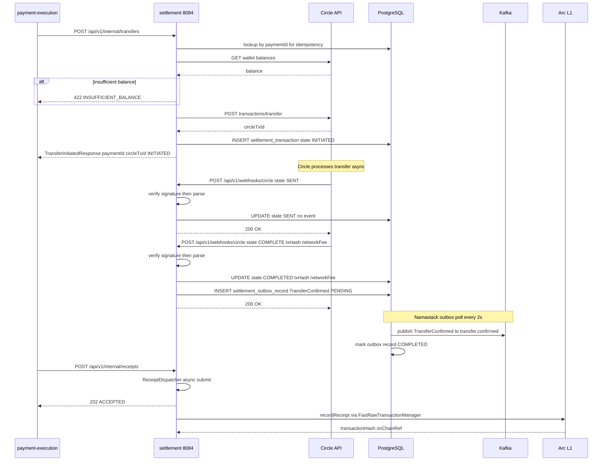
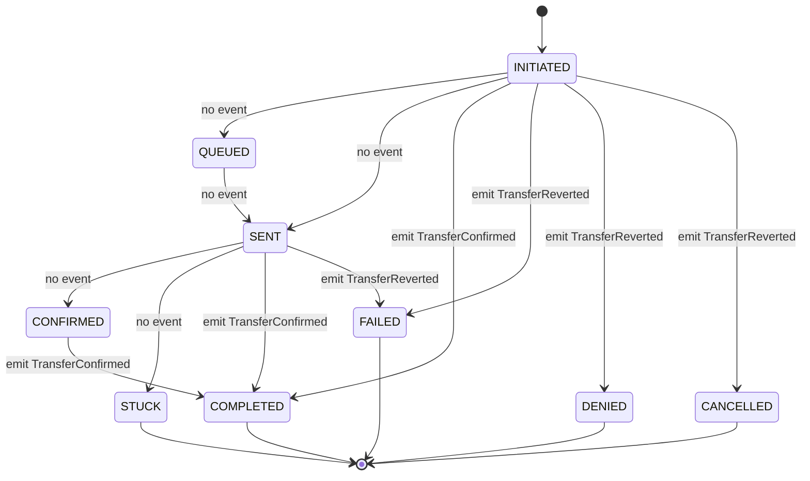
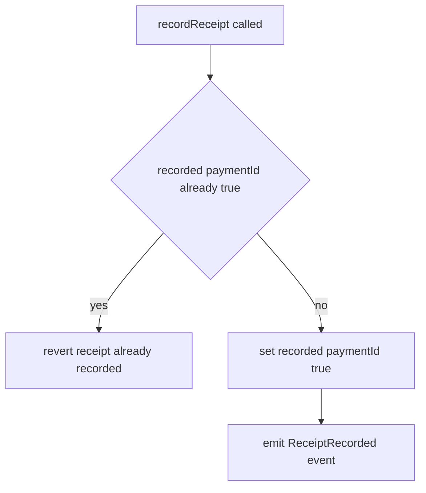
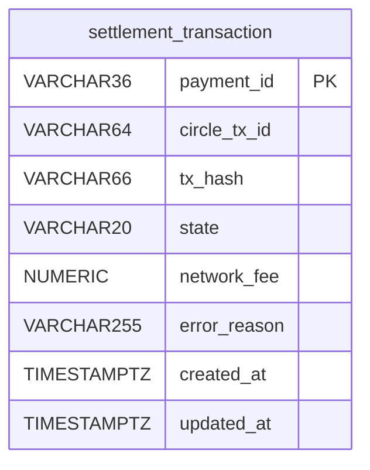

# Settlement Service

The Settlement Service (`settlement/settlement`, port **:8084**) is ArcPay's money-movement engine. It takes an internal transfer request, executes it through Circle's developer wallet API, and then reconciles the outcome **asynchronously** as Circle pushes signature-verified webhooks back to it. When a transfer reaches a terminal state, Settlement updates its ledger row and emits a domain event (`transfer.confirmed` or `transfer.reverted`) via a transactional outbox. In parallel, it can write a tamper-evident payment receipt **on-chain** to the `PaymentReceipts` Solidity contract using web3j and a dedicated gas wallet. The main application class is `com.arcpay.settlement.SettlementApplication` (`settlement/settlement/src/main/java/com/arcpay/settlement/SettlementApplication.java:9`); the `:8084` port is supplied at deploy time via `SERVER_PORT` (`docker-compose.yml:198`), not in `application.yml`.

---

## Responsibilities at a Glance

| Concern | How Settlement handles it |
|---------|---------------------------|
| **Execute transfers** | `CircleTransferAdapter` submits to Circle `POST /v1/w3s/developer/transactions/transfer`, with idempotency + balance guard |
| **Reconcile asynchronously** | `CircleWebhookController` receives Circle webhooks, verifies signature, parses, and applies state |
| **Emit lifecycle events** | `SettlementEventFactory` produces `TransferConfirmed` / `TransferReverted`, published via Namastack outbox |
| **Write on-chain receipts** | `Web3jReceiptWriter` calls `recordReceipt(...)` on `PaymentReceipts.sol` using a gas wallet |
| **Serve reads** | Wallet balance and transfer-status query endpoints for sibling services |
| **Persist truth** | `settlement_transaction` table in PostgreSQL is the source of state |

---

## REST API

All `/api/v1/internal/**` endpoints require the **SERVICE** role (`SecurityConfig.java:37-38`). The Circle webhook is intentionally permitted at the filter layer — its authenticity is proven by **signature verification inside the handler** (`SecurityConfig.java:35-36`, `CircleWebhookController.java:35`).

| Method | Path | Auth | Purpose |
|--------|------|------|---------|
| `POST` | `/api/v1/webhooks/circle` | None (signature-verified in handler) | Receive Circle transaction notifications; reconcile transfer state |
| `POST` | `/api/v1/internal/transfers` | `ROLE_SERVICE` | Submit a transfer for execution via Circle |
| `POST` | `/api/v1/internal/receipts` | `ROLE_SERVICE` | Record an on-chain payment receipt (async, returns `202 ACCEPTED`) |
| `GET` | `/api/v1/internal/wallets/{agentId}/balance` | `ROLE_SERVICE` | Read a wallet's USDC balance from Circle |
| `GET` | `/api/v1/internal/transfers/{paymentId}` | `ROLE_SERVICE` | Read current transfer status from the local ledger |

**Permitted paths** (no authentication required): `/actuator/health`, `/actuator/health/**`, `/actuator/info`, and `POST /api/v1/webhooks/circle`. All other paths require an authenticated principal (`SecurityConfig.java:33-40`).

> Note: the balance endpoint's path variable is named `agentId`, but its value is passed straight through to Circle as a `walletId` (`InternalReadController.java:30-32`, `SettlementQueryService.balanceFor`).

### Request / Response Shapes

- **`TransferRequest`** — `paymentId` (`@NotNull` UUID), `walletId` (`@NotBlank`), `recipientAddress` (`@NotBlank`), `amount` (`@NotNull`, `@DecimalMin "0.000001"`), `memo` (optional) → returns **`TransferInitiatedResponse`** (`paymentId`, `circleTxId`, `state`).
- **`ReceiptRequest`** — `paymentId` (`@NotNull` UUID), `payerAgent` (`@NotBlank`), `payee` (`@NotBlank`), `amount` (`@NotNull`), `memo` (optional) → dispatched async via `ReceiptDispatcher`, returns `202`.
- **`BalanceResponse`** — `agentId`, `walletId`, `tokenAddress`, `amount`, `currency`.
- **`TransferStatusResponse`** — `paymentId`, `circleTxId`, `txHash`, `state`, `networkFee`, `errorReason`, `createdAt`, `updatedAt`.

### Webhook Security Headers

The Circle webhook reads two optional headers (`CircleWebhookController.java:22-23, 32-33`):

| Header | Purpose |
|--------|---------|
| `X-Circle-Key-Id` | Identifies which Circle EC public key signed the payload |
| `X-Circle-Signature` | Base64 ECDSA signature over the raw request body |

If either header is missing or blank, signature verification throws `WebhookSignatureException` → HTTP 401 (`CircleWebhookSignatureVerifier.java:29-34`).

---

## How a Transfer Is Executed and Reconciled

A transfer follows a **submit-then-reconcile** model. Settlement never blocks waiting for the chain — it records `INITIATED`, returns, and lets Circle's webhooks drive the row to a terminal state.

### Submission path (`CircleTransferAdapter.submitTransfer`)

1. **Idempotency** — look up `settlement_transaction` by `paymentId`; if present, return the existing `circleTxId` + `state` (`CircleTransferAdapter.java:42-47`).
2. **Balance guard** — fetch the Circle wallet balance and verify it covers `amount` + a gas buffer (default `0.50` USDC, `settlement.gas-buffer-usdc`); otherwise throw `InsufficientBalanceException` → HTTP 422 (`CircleTransferAdapter.java:49, 102-110`).
3. **Submit to Circle** — `POST /v1/w3s/developer/transactions/transfer` with `walletId`, `destinationAddress`, `amounts`, `tokenAddress`, `blockchain`, `feeLevel=MEDIUM`, an `idempotencyKey` (name-based SHA-1 UUID under namespace `a3f1b2c4-5d6e-4f80-9a1b-2c3d4e5f6071`), `entitySecretCiphertext`, and `refId` (`CircleTransferAdapter.java:140-179`).
4. **Persist** — save `settlement_transaction` with `state=INITIATED` (`CircleTransferAdapter.java:53-60`).
5. **Return** `TransferSubmission` (`circleTxId`, `state`).

### Reconciliation path (`TransferNotificationHandler.handle`, `@Transactional`)

1. Find the row by `circleTxId`; throw `TransferNotFoundException` if absent (`TransferNotificationHandler.java:32-35`).
2. **Idempotency** — if the row is already in a terminal state, log and return (duplicate webhook ignored, `TransferNotificationHandler.java:37-44`).
3. Apply the new `state`, plus `txHash` / `networkFee` / `errorReason` when present (`TransferNotificationHandler.java:46, 52-63`).
4. `repository.update()` (`TransferNotificationHandler.java:47`).
5. `SettlementEventFactory.eventFor()` emits an event, published via the outbox in the **same transaction** (`TransferNotificationHandler.java:49`).

### Sequence: transfer → Circle → webhook → event + on-chain receipt

---

## Transfer State Machine

`TransferState` defines nine states: `INITIATED, QUEUED, SENT, CONFIRMED, COMPLETED, FAILED, DENIED, CANCELLED, STUCK` (`TransferState.java:3-13`). The handler treats `{COMPLETED, FAILED, DENIED, CANCELLED}` as **terminal** (`TransferNotificationHandler.java:24`). Event emission is decided by `SettlementEventFactory.eventFor()` (`SettlementEventFactory.java:24-30`): only `COMPLETED` emits `TransferConfirmed`; `FAILED`, `DENIED`, and `CANCELLED` emit `TransferReverted`. Intermediate states (`INITIATED`, `QUEUED`, `SENT`, `CONFIRMED`, `STUCK`) update the row but emit nothing.

> The service does **not** enforce transition rules — it stamps whatever state Circle reports (after normalizing `"COMPLETE"` → `COMPLETED`). The diagram below shows the terminal classification and event mapping that the code actually implements; the transitions between non-terminal states reflect Circle's reported lifecycle, not a code-enforced graph.

---

## Circle Webhook Signature Verification

Authenticity is enforced by `CircleWebhookSignatureVerifier` (`infrastructure/circle/CircleWebhookSignatureVerifier.java`) before any state is touched:

- Algorithm: **`SHA256withECDSA`** (`CircleWebhookSignatureVerifier.java:22`).
- Flow: validate `keyId` / `signature` are present → look up the EC public key (cached) or fetch it from Circle → verify the Base64-decoded signature against the raw body bytes (`CircleWebhookSignatureVerifier.java:28-52`).
- Public key source: `GET /v2/notifications/publicKey/{keyId}` (`CircleWebhookSignatureVerifier.java:58`).
- Caching: keys are held in a `ConcurrentHashMap` keyed by `keyId` via `computeIfAbsent` (`CircleWebhookSignatureVerifier.java:25, 36`) to avoid refetching.
- Failure mode: missing headers or a bad signature throw `WebhookSignatureException` → HTTP **401** with code `ARCPAY-SETTLEMENT-0005`.

Parsing is handled by `CircleNotificationParser`: it reads from a nested `notification` node if present, otherwise the root, extracting `id` (→ `circleTxId`) and `state` (mapped to `TransferState`, with Circle `"COMPLETE"` → `COMPLETED`, `CircleNotificationParser.java:39`), plus optional `txHash`, `networkFee`, `errorReason`. A missing or unknown `state`, or any other malformed payload, raises `CircleNotificationException` → HTTP 400.

At startup, `CircleSubscriptionBootstrap` (an `ApplicationRunner`) ensures a webhook subscription exists — checking via `GET /v2/notifications/subscriptions` and creating one with `notificationTypes: ["transactions.*"]` if absent. The bean is only active when `circle.api.webhook.subscription-endpoint` is set (`@ConditionalOnProperty`, `CircleSubscriptionBootstrap.java:18, 21-22`).

---

## Events

Events are emitted in the same transaction as the state update and delivered through the Namastack outbox to Kafka. The outbox publisher uses `@Transactional(propagation = MANDATORY)` (`platform-infra` `AbstractOutboxEventPublisher.java:20`).

| Event | Topic | Emitted when | Payload |
|-------|-------|--------------|---------|
| `TransferConfirmed` | `transfer.confirmed` | state → `COMPLETED` | `paymentId`, `txHash`, `networkFee`, `confirmedAt` |
| `TransferReverted` | `transfer.reverted` | state → `FAILED` / `DENIED` / `CANCELLED` | `paymentId`, `reason`, `revertedAt` |

For reverts, `reason` is sourced from `transaction.errorReason()` or falls back to the state name (`SettlementEventFactory.java:49-53`). Both events are keyed by `paymentId` in the outbox (`SettlementOutboxEventPublisher.java:13`). The outbox polls `settlement_outbox_record` every **2000 ms** in batches of **20**, with exponential retry (1s initial, 60s max, 2× multiplier, 5 max retries) (`application.yml:24-38`).

---

## On-Chain Receipt Writing

Receipt writing is **fire-and-forget and optional**. `InternalReceiptController` returns `202` immediately and hands off to `ReceiptDispatcher`, which runs writes on a single-threaded executor (`application/receipt/ReceiptDispatcher.java:17`). If no `ReceiptWriter` bean is present (gas wallet not configured), the dispatcher logs a warning and skips silently (`ReceiptDispatcher.java:24-28`) — allowing receipt-less deployments. The `Web3jReceiptWriter` bean is only created when `arcpay.gas-wallet.private-key` is set (`@ConditionalOnProperty`, `Web3jReceiptConfig.java:18`).

### Writing flow (`Web3jReceiptWriter.writeReceipt`, `Web3jReceiptWriter.java:52-67`)

1. Acquire a fair reentrant lock, then warn if the gas-wallet balance is below threshold (`Web3jReceiptWriter.java:54, 78, 131-147`).
2. Build the `recordReceipt` function call and encode it with web3j `FunctionEncoder` (`Web3jReceiptWriter.java:79`).
3. Submit a **raw transaction** via `FastRawTransactionManager` — which manages nonce, signing, and broadcast — to the `paymentReceiptsAddress` with value `0` (`Web3jReceiptWriter.java:80-85`).
4. On RPC error throw `ReceiptSubmissionException`; otherwise return the transaction hash (`onChainRef`) (`Web3jReceiptWriter.java:86-92`).
5. On any exception, log a warning, **reset the nonce**, and return `null` (`Web3jReceiptWriter.java:57-65, 69-75`).

### Function encoding (`buildFunction`, `Web3jReceiptWriter.java:94-105`)

The encoded call to `recordReceipt` packs:

| Arg | web3j type | Source |
|-----|-----------|--------|
| `paymentId` | `Bytes32` | UUID packed into the low 16 bytes of a 32-byte array (`paymentIdToBytes32`) |
| `payer` | `Address` | `command.payerAgent()` |
| `payee` | `Address` | `command.payee()` |
| `amount` | `Uint256` | `toBaseUnits` — `movePointRight(6)` to USDC base units |
| `memoHash` | `Bytes32` | SHA3-256 of memo UTF-8, or 32 zero bytes if null |
| `timestamp` | `Uint64` | `clock.instant().getEpochSecond()` |

### web3j wiring (`Web3jReceiptConfig`)

| Bean | Detail |
|------|--------|
| `receiptWeb3j` | HTTP `Web3j` to `${web3j.client-address}` (Arc testnet RPC) (`Web3jReceiptConfig.java:21-24`) |
| `gasWalletCredentials` | `Credentials.create(${arcpay.gas-wallet.private-key})` (`Web3jReceiptConfig.java:26-29`) |
| `receiptTransactionManager` | `FastRawTransactionManager` over web3j + credentials + chainId (`Web3jReceiptConfig.java:31-35`) |
| `receiptWriter` | `Web3jReceiptWriter`, conditional on the gas-wallet key (`Web3jReceiptConfig.java:37-45`) |

Contract defaults (`ReceiptContractProperties`): `chainId=999`, `gasLimit=150_000`, `gasPrice=1_000_000_000` (1 Gwei), `lowBalanceThresholdWei=10_000_000_000_000_000` (0.01 ETH) (`ReceiptContractProperties.java:14-17`). A low gas-wallet balance increments the Micrometer counter `settlement.receipt.gas_wallet.low_balance` (`Web3jReceiptWriter.java:30, 137`).

### `PaymentReceipts.sol`

The contract (`settlement/settlement/contracts/PaymentReceipts.sol`) is **idempotent**: a `mapping(bytes32 => bool) recorded` guards against duplicate `paymentId`s, reverting with `"receipt already recorded"` (`PaymentReceipts.sol:14, 24`). On success it emits `ReceiptRecorded(bytes32 indexed paymentId, address indexed payer, address indexed payee, uint256 amount, bytes32 memoHash, uint64 timestamp)` (`PaymentReceipts.sol:5-12, 26`). The `recordReceipt` function is `external` and callable by any EOA (no on-chain authorization) (`PaymentReceipts.sol:16-23`).

---

## Persistence

PostgreSQL is the source of truth. Flyway runs two migrations on startup.

### `settlement_transaction` (V1, `V1__151_create_settlement_transaction.sql`)

- Primary key `payment_id`; index `idx_settlement_transaction_circle_tx_id` on `circle_tx_id` for webhook lookups (`V1__151_create_settlement_transaction.sql:12-13`).
- `state` stored as `VARCHAR(20)` `NOT NULL`, `network_fee` as `NUMERIC(18,6)`; `created_at` / `updated_at` are `TIMESTAMPTZ NOT NULL`.
- Mapped by `SettlementTransactionEntity` with `@JdbcTypeCode(VARCHAR)` on the UUID PK and `@Enumerated(STRING)` on `state` (`SettlementTransactionEntity.java:32-46`).

### Outbox tables (V2, `V2__151_create_outbox_tables.sql`)

`settlement_outbox_record` (status, `record_key`, `record_type`, `payload`, retry metadata), `settlement_outbox_instance` (instance liveness/heartbeat), and `settlement_outbox_partition` (partition ownership with optimistic `version`).

### Repository (`SettlementTransactionRepositoryAdapter`)

| Port method | Implementation |
|-------------|----------------|
| `save()` | return existing-by-`paymentId` or `saveAndFlush` (`SettlementTransactionRepositoryAdapter.java:18-24`) |
| `update()` | `saveAndFlush` (`SettlementTransactionRepositoryAdapter.java:27-29`) |
| `findByPaymentId()` | JPA `findById` (`SettlementTransactionRepositoryAdapter.java:32-34`) |
| `findByCircleTxId()` | `SettlementTransactionJpaRepository.findByCircleTxId()` (`SettlementTransactionRepositoryAdapter.java:37-39`) |

---

## Domain Ports

The wired infrastructure adapters sit behind these domain ports:

| Port | Contract | Implementation |
|------|----------|----------------|
| `CustodyProvider` | `submitTransfer`, `getStatus`, `getBalance` | `CircleTransferAdapter` |
| `WebhookSignatureVerifier` | `verify(body, keyId, signature)` | `CircleWebhookSignatureVerifier` |
| `ReceiptWriter` | `writeReceipt(ReceiptCommand)` → tx hash | `Web3jReceiptWriter` |
| `EventPublisher` | `publish(event)` | `SettlementOutboxEventPublisher` |
| `SettlementTransactionRepository` | save / update / find | `SettlementTransactionRepositoryAdapter` |

> A sixth port, `ChainGateway` (`domain/port/ChainGateway.java`), exists with the same signature as `CustodyProvider` but currently has **no implementation and no references** — it is unused.

---

## Configuration & Security

- **Circle** (`circle.api.*`): `base-url=https://api.circle.com`, `api-key`, `wallet-set-id`, `blockchain=ARC-TESTNET`, `usdc-token-address`, `entity-secret`, timeouts `connect=5000ms` / `read=15000ms` (nested `Timeout` record). Client wired by `CircleClientConfig` as a Bearer-authenticated `RestClient` (`CircleClientConfig.java:18-29`); active only when `circle.api.base-url` is set.
- **Settlement**: `gas-buffer-usdc` (default `0.50`; `SettlementProperties` defaults a null value to `0`).
- **web3j / contract**: `web3j.client-address=${ARC_TESTNET_RPC_URL}`, `arcpay.contract.payment-receipts-address`, `arcpay.gas-wallet.private-key`.
- **Kafka**: consumer `group-id=settlement`, `auto-offset-reset=earliest`, JSON value deserializer, trusted package `com.arcpay.settlement.domain.event` (`application.yml:14-22`).
- **Service auth** (platform-infra `ServiceAuthFilter`): callers send the `X-Service-Auth` header, compared in constant time against `arcpay.security.service-token`; on a match the request is granted `ROLE_SERVICE` (`ServiceAuthFilter.java:20, 30-34`). When no valid token is present, protected paths are rejected by the chain's `HttpStatusEntryPoint(UNAUTHORIZED)` → 401 (`SecurityConfig.java:41`).

### Error mapping (`GlobalExceptionHandler`)

All errors return `ApiError(code, status, message, details)`. Codes follow the `ARCPAY-SETTLEMENT-{NNNN}` format (`ErrorCodes.java:5, 17-19`).

| Exception | Status | Code |
|-----------|--------|------|
| `WebhookSignatureException` | 401 | `ARCPAY-SETTLEMENT-0005` (`INVALID_WEBHOOK_SIGNATURE`) |
| `CircleNotificationException` | 400 | `ARCPAY-SETTLEMENT-0004` (`INVALID_REQUEST`) |
| `TransferNotFoundException` | 404 | `ARCPAY-SETTLEMENT-0001` (`TRANSFER_NOT_FOUND`) |
| `InsufficientBalanceException` | 422 | `ARCPAY-SETTLEMENT-0002` (`INSUFFICIENT_BALANCE`) |
| `MethodArgumentNotValidException` / `ConstraintViolationException` | 422 | `ARCPAY-SETTLEMENT-0004` (`INVALID_REQUEST`) |
| `HttpMessageNotReadableException` / `MethodArgumentTypeMismatchException` | 400 | `ARCPAY-SETTLEMENT-0004` (`INVALID_REQUEST`) |
| unhandled `Exception` | 500 | `ARCPAY-SETTLEMENT-0050` (`INTERNAL_ERROR`) |

---

## Related pages

- [[Payment-Execution-Service]]
- [[Agent-Identity-Service]]
- [[Compliance-Service]]
- [[Policy-Engine-Service]]
- [[Circle-Integration]]
- [[Transactional-Outbox]]
- [[On-Chain-Contracts]]
