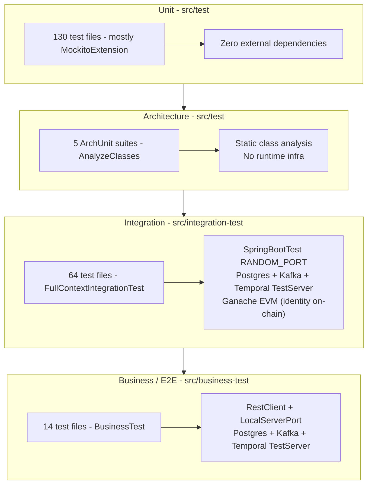
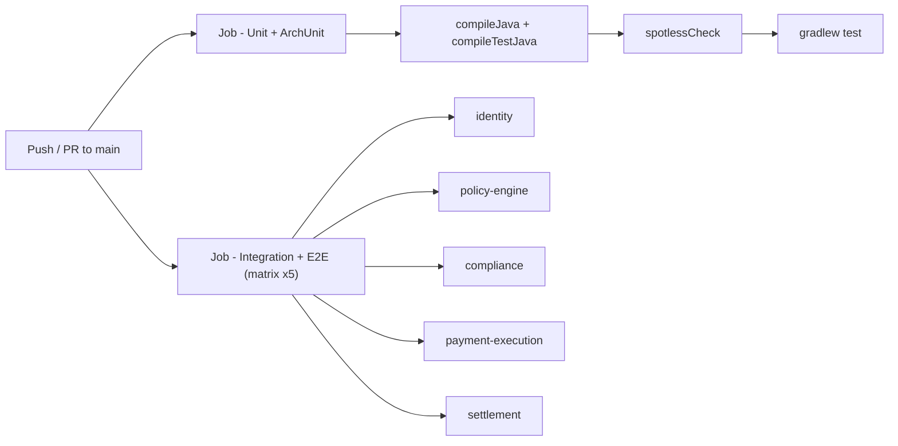

# Testing and Quality

ArcPay treats tests as the executable specification of the platform. Every service ships a four-tier pyramid — fast Mockito unit tests, ArchUnit rules that enforce the hexagonal architecture, full-context integration tests on real Testcontainers (Postgres, Kafka, an in-memory Temporal test server, and a Ganache EVM node for identity's on-chain adapter), and business/E2E tests that drive the live HTTP API. The same conventions hold across all five services because the test source sets, dependencies, and Gradle tasks are defined once in the `arcpay.service` convention plugin and inherited by every module. This page documents what is actually wired up: the layers, the infrastructure each layer touches, the assertion and mocking rules, code formatting, and how CI runs it all.

## The Test Pyramid



| Layer | Source set | Base | Infra | Gradle task |
|---|---|---|---|---|
| Unit | `src/test/` | `@ExtendWith(MockitoExtension.class)` (dominant) | None (pure mocks) | `./gradlew test` |
| Architecture | `src/test/` | `@AnalyzeClasses` (ArchUnit) | None (static analysis) | `./gradlew test` |
| Integration | `src/integration-test/` | `FullContextIntegrationTest` | Postgres + Kafka + Temporal TestServer (+ Ganache in identity) | `./gradlew :svc:svc:integrationTest` |
| Business / E2E | `src/business-test/` | `BusinessTest` | Postgres + Kafka + Temporal TestServer | `./gradlew :svc:svc:businessTest` |

The source sets and tasks are declared in the convention plugin: integration test set at `buildSrc/src/main/kotlin/arcpay.service.gradle.kts:35-51`, business test set at `buildSrc/src/main/kotlin/arcpay.service.gradle.kts:56-72`. Ordering is enforced — `integrationTest` runs after `test` (`:50`), and `businessTest` runs after `integrationTest` (`:71`).

## Unit Tests

Plain JUnit 5 tests with no Spring context. The Mockito-style handlers and services use `@ExtendWith(MockitoExtension.class)`; many others (validators, serialization, mappers, enums) are pure JUnit 5 with no extension. There are 130 unit test files (excluding the 5 ArchUnit suites) across the services.

- Run: `./gradlew test`
- Example: `identity/identity/src/test/java/com/arcpay/identity/agentidentity/domain/owner/OwnerCommandHandlerTest.java`
- Dependencies: `testImplementation(testFixtures(project(":platform-test")))`, `spring-boot-starter-test`, and ArchUnit (`buildSrc/src/main/kotlin/arcpay.service.gradle.kts:121-123`).

## Architecture Tests (ArchUnit)

ArchUnit suites run inside the unit `test` task and freeze the hexagonal architecture as compile-against rules. The identity service's pattern is `@AnalyzeClasses(packages = "com.arcpay.identity.agentidentity", importOptions = ImportOption.DoNotIncludeTests.class)` with `@ArchTest static final ArchRule` per rule — see `identity/identity/src/test/java/com/arcpay/identity/agentidentity/architecture/ArchitectureTest.java:14`. The other four services carry an equivalent `HexagonalArchitectureTest` (5 suites total).

Rules actually enforced (`ArchitectureTest.java:21-139`):

| Rule group | What it enforces | Lines |
|---|---|---|
| Layered architecture | `application -> domain`, `domain -> nothing`, `infrastructure -> domain` | 22-36 |
| Domain purity | No `jakarta.persistence.*` in domain; only Spring `stereotype`, `transaction`, `data.domain` allowed | 40-57 |
| Infrastructure isolation | Infrastructure must not depend on application | 62-67 |
| Dependency injection | No `@Autowired` in production code | 71-77 |
| Naming conventions | Controllers end `Controller`, JPA entities end `Entity`, repository adapters end `RepositoryAdapter` | 82-114 |
| Package conventions | `@Entity` only in `infrastructure.db.*`, `@RestController` only in `application.controller.*`, `@KafkaListener` only in `application.stream.*` | 119-138 |

ArchUnit is pinned to 1.4.2 (`gradle.properties:24`); the upgrade from 1.3.0 was required for the rules to evaluate real classes under Java 25 rather than passing vacuously.

## Integration Tests

Integration tests boot the full Spring context against real infrastructure in Testcontainers. The base class `FullContextIntegrationTest` carries `@SpringBootTest(webEnvironment = RANDOM_PORT)` (`identity/identity/src/testFixtures/java/com/arcpay/identity/agentidentity/test/FullContextIntegrationTest.java:17`), `@ActiveProfiles("test")` (`:18`), and wires Postgres + Kafka container properties through `@DynamicPropertySource` (`:28-32`). 64 integration test files exist across the services.

Two specialized base classes extend it:

- `RestControllerAbstractTest extends FullContextIntegrationTest` adds `@AutoConfigureMockMvc` (`identity/.../test/RestControllerAbstractTest.java:7`) and an `@Autowired MockMvc` (`:11`) for controller-layer testing. Concrete tests then mock domain services with `@MockitoBean` — e.g. `OwnerControllerIntegrationTest` drives `POST /api/v1/owners/register` via `mockMvc.perform(post(...))` with `@MockitoBean` collaborators (`OwnerControllerIntegrationTest.java:26,28-40,62`).
- Temporal workflow tests inject `@Autowired WorkflowClient` and stub external systems with `@MockitoBean CircleWalletService` / `@MockitoBean BlockchainService`, then assert post-workflow DB state via the repository (`identity/identity/src/integration-test/java/com/arcpay/identity/agentidentity/infrastructure/temporal/AgentProvisioningWorkflowIntegrationTest.java:38-45,85-95`).

### Container Infrastructure

Containers are created from shared helpers in `platform-test/src/testFixtures/java/com/arcpay/platform/test/TestContainerSupport.java`:

| Container | Helper | Image | Wiring |
|---|---|---|---|
| PostgreSQL | `postgres(databaseName)` (`:13-18`) | `postgres:16-alpine` | `registerPostgresProperties` -> `spring.datasource.{url,username,password}` |
| Kafka | `kafka()` (`:21-23`) | `apache/kafka:3.8.1` | `registerKafkaProperties` -> `spring.kafka.bootstrap-servers` |

`startAll(Startable...)` (`:25-35`) starts containers fail-fast and registers a JVM shutdown hook. Testcontainers is pinned to `1.21.4` (`gradle.properties:25`).

Temporal needs no container — the Spring Boot Temporal starter runs an in-memory test server, enabled in `identity/identity/src/integration-test/resources/application-test.yml:26-28` (`spring.temporal.test-server.enabled: true`).

Kafka/outbox tests run with the namastack outbox enabled and a per-test consumer group to avoid cross-test offset bleed: `group-id: agent-identity-service-test-${random.uuid}`, `auto-offset-reset: earliest` (`application-test.yml:15-25`), and `namastack.outbox.enabled: true` (`application-test.yml:30-32`). Spring Cloud's `spring-cloud-stream-test-binder` is on the integration classpath (`arcpay.service.gradle.kts:132`).

Flyway owns the schema in tests — `spring.jpa.hibernate.ddl-auto: validate` with `flyway` enabled (`application-test.yml:12,14`). `FlywayMigrationIntegrationTest` asserts table names, columns/types/constraints, unique indexes and foreign keys, and the `agentidentity_outbox_*` table prefix (`identity/identity/src/integration-test/java/com/arcpay/identity/agentidentity/infrastructure/db/FlywayMigrationIntegrationTest.java:28-30,175-183`).

### EVM On-Chain Round-Trip (Ganache)

Identity's blockchain adapter is verified against a real EVM node, not a mock. `AgentRegistryContractIntegrationTest` is a standalone `@Testcontainers` test (`:31`, no Spring context) with a `GenericContainer("trufflesuite/ganache:v7.9.1")` (`:51`) exposing the `8545` JSON-RPC port and `Wait.forListeningPort()` (`:59`).

- Ganache flags: `--wallet.deterministic`, `--chain.chainId 1337`, `--miner.blockGasLimit 30000000` (`:53-58`).
- Deterministic accounts `REGISTRAR_KEY` / `OUTSIDER_KEY` are fixed keys from the seeded mnemonic (`:40-41`).
- Client: `Web3j.build(new HttpService(...))` (`:66`) with a `PollingTransactionReceiptProcessor` at 200 ms poll / 60-attempt timeout (`:67`).
- Gas: price `2_000_000_000` Wei, deploy limit `6_000_000`, call limit `300_000` (`:35-37`).
- `shouldRoundTripAgentLifecycleOnChain()` (`:71`) registers, deactivates, reactivates, then updates policy/metadata on-chain.

### Connection Pool Hardening

Each full-context test class with its own `@DynamicPropertySource` gets a separately cached `ApplicationContext`, and each holds its own pool. To keep the shared Postgres container under `max_connections`, the test profile caps Hikari at `maximum-pool-size: 4`, `minimum-idle: 1` (`identity/identity/src/integration-test/resources/application-test.yml:3-9`).

## Business / E2E Tests

Business tests exercise the deployed HTTP surface end to end. The base class shape varies per service: identity's `BusinessTest` is standalone (its own `@SpringBootTest(webEnvironment = RANDOM_PORT)` at `:22`, `@ActiveProfiles("test")`, and class-level `@DirtiesContext` at `:24`, starting its own Postgres + Kafka containers), while settlement's `BusinessTest extends FullContextIntegrationTest` (`settlement/.../test/BusinessTest.java:10`) and only adds `@DirtiesContext` (`:9`). Both inject `@LocalServerPort int port` and expose a cached `RestClient` pointed at `http://localhost:{port}`. There are 14 business test files.

- Driving the API (identity example): `restClient().post().uri("/api/v1/owners/register")...toEntity(Map.class)` then AssertJ on the 201 response (`identity/identity/src/business-test/java/com/arcpay/identity/agentidentity/OwnerRegistrationBusinessTest.java:44-62`).
- Deterministic flows use `@TestMethodOrder(MethodOrderer.OrderAnnotation.class)` with `@Order(...)` so register-then-use-key sequences run in order (`OwnerRegistrationBusinessTest.java:20,40,65,101`).
- State is reset around each test: the concrete test calls `cleanDatabase()` from `@BeforeEach`/`@AfterEach` (`OwnerRegistrationBusinessTest.java:29-37`). Identity's `cleanDatabase()` issues `DELETE FROM` against `agentidentity_outbox_record`, `gas_usage`, `idempotency_keys`, `agents`, `owners` (`identity/.../test/BusinessTest.java:57-63`).

### REST endpoints exercised by tests

| Method | Path | Auth | Exercised by |
|---|---|---|---|
| POST | `/api/v1/owners/register` | `permitAll` (`SecurityConfig.java:36-37`); rate-limited 10/hour (`RateLimitFilter.java:22`) | MockMvc integration + RestClient E2E; 429 path covered |
| POST | `/api/v1/agents` | `Bearer` API key + `Idempotency-Key` header | `OwnerRegistrationBusinessTest.java:81-91` (register-then-create-agent flow) |

## TestFixtures

Each service's `src/testFixtures/java/` provides reusable base classes and fixtures (`buildSrc/src/main/kotlin/arcpay.service.gradle.kts:109-118`):

- Base classes: `FullContextIntegrationTest`, `RestControllerAbstractTest`, `BusinessTest`.
- WireMock stubs in `stubs/` subpackages stand in for cross-service HTTP calls — e.g. `PolicyServiceStubs`, `SettlementServiceStubs`, `IdentityServiceStubs` in payment-execution (`payment-execution/.../testFixtures/.../stubs/`). `wiremock-standalone` is wired into the test/integration/business classpaths of payment-execution, policy-engine, compliance, and settlement (per each service's `build.gradle.kts`).
- Custom matchers in `platform-test/src/testFixtures/java/com/arcpay/platform/test/TestUtils.java`:
  - `eqIgnoringTimestamps(...)` (`:21-23`, impl `RecursiveComparisonIgnoringTimestamps` `:29-51`) ignores `Instant`, `LocalDateTime`, `LocalDate`, `ZonedDateTime`.
  - `eqIgnoring(obj, "field"...)` (`:25-27`, impl `RecursiveComparisonIgnoringFields` `:53-76`) ignores named field paths.
- Fixture classes follow the `SOME_*` constant + builder pattern, e.g. `OwnerFixtures` with `SOME_OWNER_ID`, `SOME_EMAIL`, `SOME_OWNER`, `someOwnerEntity()` (`identity/identity/src/testFixtures/java/com/arcpay/identity/agentidentity/fixtures/OwnerFixtures.java:11-44`).

## Assertion and Mocking Conventions

These are non-negotiable house rules (CLAUDE.md testing standards):

- **AssertJ only, single recursive comparison.** Build one expected object and assert with `usingRecursiveComparison()`. Timestamps are excluded via `.ignoringFieldsOfTypes(Instant.class)` (e.g. `AgentProvisioningWorkflowIntegrationTest.java:94`) or `.ignoringFields("owner.createdAt", ...)` (e.g. `OwnerCommandHandlerTest.java:107-110`).
- **BDD Mockito only.** Use `given(...).willReturn(...)` / `willThrow(...)`; never `when(...).thenReturn(...)`. Example: `OwnerCommandHandlerTest.java:67-68`.
- **No raw matchers.** Prefer `eqIgnoringTimestamps(...)` and `eqIgnoring(...)` from `TestUtils` over `any()`/`eq()`.
- **Naming.** Test methods are `should*` camelCase; fixtures use the `SOME_*` prefix.
- `@Autowired` is allowed in test classes only; the no-`@Autowired` rule is production-only (enforced by ArchUnit on non-test classes).

## Code Formatting (Spotless)

Formatting is enforced, not advisory. Spotless applies `palantirJavaFormat("2.91.0")` to `src/**/*.java` (`build.gradle.kts:30-32`). CI fails the build on any unformatted file via `./gradlew spotlessCheck` (`.github/workflows/ci.yml:44-45`).

## Running the Suites

```bash
./gradlew test                                   # unit + ArchUnit (all modules)
./gradlew :identity:identity:integrationTest     # integration for one service
./gradlew :identity:identity:businessTest        # business/E2E for one service
./gradlew spotlessCheck                          # formatting gate
./gradlew :identity:identity:integrationTest :identity:identity:businessTest --continue --stacktrace
```

## CI Pipeline

The CI workflow (`.github/workflows/ci.yml`) runs on push/PR to `main` and on manual dispatch, under JDK 25 (temurin) with two jobs.



**Unit + ArchUnit job** (`ci.yml:23-59`): compile fail-fast (`:41-42`), Spotless check (`:44-45`), `./gradlew test` (`:47-48`), then upload `**/build/reports/tests/test/**` and `**/build/test-results/test/**` (`:50-59`).

**Integration + E2E job** (`ci.yml:61-127`): a 5-way matrix — one service per runner (identity, policy-engine, compliance, payment-execution, settlement, `:84-89`) so each service's Testcontainers stacks do not contend for memory on one runner. Each runs `./gradlew :module:integrationTest :module:businessTest --continue --stacktrace` (`:115`); `--continue` lets integration failures surface without blocking the business tests. The heavy suite is toggleable: persistently via repo variable `RUN_INTEGRATION_TESTS=false`, or ad-hoc via the `run_integration` dispatch input (`:75-77`).

CI hardening: `TESTCONTAINERS_RYUK_DISABLED: "true"` (`:68`) since ephemeral runners are discarded after the job and the Ryuk reaper image pull was timing out; an optional Docker Hub login (`:107-112`) raises anonymous pull-rate limits when `DOCKERHUB_USERNAME`/`DOCKERHUB_TOKEN` secrets are present.

## Tooling Versions

| Tool | Version | Source |
|---|---|---|
| Spring Boot | 4.0.6 | `gradle.properties:15` |
| Spring Cloud | 2025.1.1 | `gradle.properties:16` |
| Testcontainers | 1.21.4 | `gradle.properties:25` |
| JUnit | 5.14.4 | `gradle.properties:28` |
| AssertJ | 3.27.7 | `gradle.properties:27` |
| ArchUnit | 1.4.2 | `gradle.properties:24` |
| WireMock | 3.13.2 | `gradle.properties:26` |
| palantir-java-format | 2.91.0 | `build.gradle.kts:30-32` |

## Not Currently in the Suite

Verified absent from the build and test sources: code coverage (no JaCoCo plugin or thresholds — CI uploads reports but computes no coverage), mutation testing (no PIT), consumer-driven contract testing (no Pact / Spring Cloud Contract), load/performance harnesses (no JMeter/Gatling), and BDD reporting (no Serenity/Cucumber). Tests favor explicit per-scenario `@Test` methods over `@ParameterizedTest` (the latter appears in roughly ten files), and containers are instantiated programmatically rather than via a Compose DSL.

## Related pages

- [[Architecture-Overview]]
- [[Agent-Identity-Service]]
- [[CI-CD-Pipeline]]
- [[Transactional-Outbox-and-Eventing]]
- [[Temporal-Workflows]]
- [[Blockchain-Integration]]
